# HAMi 完整架构分析文档

## 目录

- [1. 项目概述](#1-项目概述)
- [2. 整体架构](#2-整体架构)
- [3. 核心组件详解](#3-核心组件详解)
  - [3.1 Device Plugin 组件](#31-device-plugin-组件)
  - [3.2 Scheduler 调度器组件](#32-scheduler-调度器组件)
  - [3.3 Device Abstraction Layer 设备抽象层](#33-device-abstraction-layer-设备抽象层)
  - [3.4 Admission Webhook 准入控制](#34-admission-webhook-准入控制)
  - [3.5 Monitor 监控组件](#35-monitor-监控组件)
  - [3.6 Node Lock 节点锁机制](#36-node-lock-节点锁机制)
  - [3.7 Quota 配额管理](#37-quota-配额管理)
- [4. 数据流与工作流程](#4-数据流与工作流程)
  - [4.1 Pod 提交到调度流程](#41-pod-提交到调度流程)
  - [4.2 设备发现与上报流程](#42-设备发现与上报流程)
  - [4.3 设备分配流程](#43-设备分配流程)
  - [4.4 Pod 生命周期管理](#44-pod-生命周期管理)
- [5. 核心数据结构](#5-核心数据结构)
- [6. 多厂商设备支持](#6-多厂商设备支持)
- [7. 部署架构](#7-部署架构)
- [8. 关键算法与策略](#8-关键算法与策略)
  - [8.1 设备匹配算法](#81-设备匹配算法)
  - [8.2 节点评分算法](#82-节点评分算法)
  - [8.3 拓扑感知调度](#83-拓扑感知调度)
- [9. 配置管理](#9-配置管理)
- [10. 安全与可靠性](#10-安全与可靠性)

---

## 1. 项目概述

HAMi (Heterogeneous AI Computing Middleware) 是一个面向 Kubernetes 的异构计算设备管理中间件，原名 `k8s-vGPU-scheduler`。作为 CNCF 沙盒项目，HAMi 专注于在 Kubernetes 环境中管理和调度不同类型的异构设备（GPU、NPU、DCU 等）。

### 1.1 设计目标

| 目标 | 说明 |
|------|------|
| **设备虚拟化** | 将物理设备虚拟化为多个虚拟设备，实现资源共享 |
| **多厂商统一管理** | 提供统一的抽象层支持 NVIDIA、AMD、华为昇腾、寒武纪等多种设备 |
| **智能调度** | 基于设备拓扑、资源利用率、NUMA 等进行智能调度 |
| **标准兼容** | 遵循 Kubernetes Device Plugin 规范和 CDI (Container Device Interface) 标准 |
| **高可用性** | 支持多副本部署、Leader 选举、故障自动恢复 |

### 1.2 核心特性

#### 1.2.1 资源共享特性

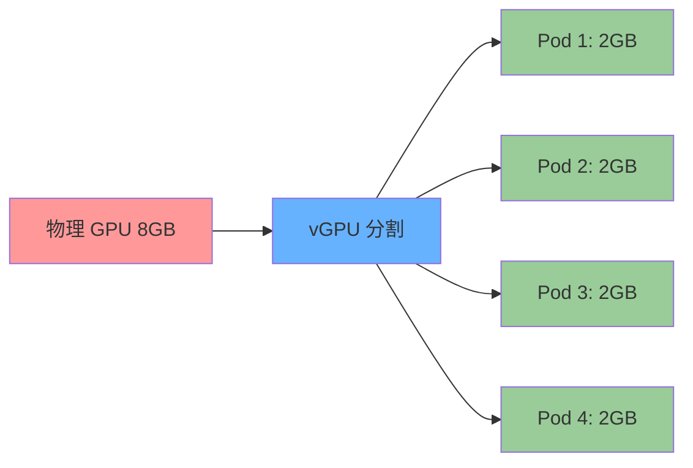

**支持的资源共享维度**:
- **GPU 数量**: 一个物理 GPU 可分割为多个虚拟 GPU
- **GPU 内存**: 可指定 MB 或百分比分配
- **GPU 核心**: 可分配 SM (Streaming Multiprocessor) 核心数
- **NUMA 节点**: 支持 NUMA 感知绑定

#### 1.2.2 多厂商设备支持

| 厂商 | 设备类型 | 资源名称 | 目录 |
|--------|----------|-----------|------|
| NVIDIA | GPU | `nvidia.com/gpu` | `pkg/device/nvidia/` |
| AMD | GPU | `amd.com/gpu` | `pkg/device/amd/` |
| 华为昇腾 | NPU | `ascend.com/npu` | `pkg/device/ascend/` |
| 寒武纪 | MLU | `cambricon.com/mlu` | `pkg/device/cambricon/` |
| AWS | Neuron | `aws.amazon.com/neuron` | `pkg/device/awsneuron/` |
| 燧原科技 | GCU | `enflame.com/gcu` | `pkg/device/enflame/` |
| 海光 | DCU | `hygon.com/dcu` | `pkg/device/hygon/` |
| 摩尔线程 | GPU | `mthreads.com/gpu` | `pkg/device/mthreads/` |
| 昆仑 | XPU | `kunlunxin.com/xpu` | `pkg/device/kunlun/` |

---

## 2. 整体架构

### 2.1 系统架构图

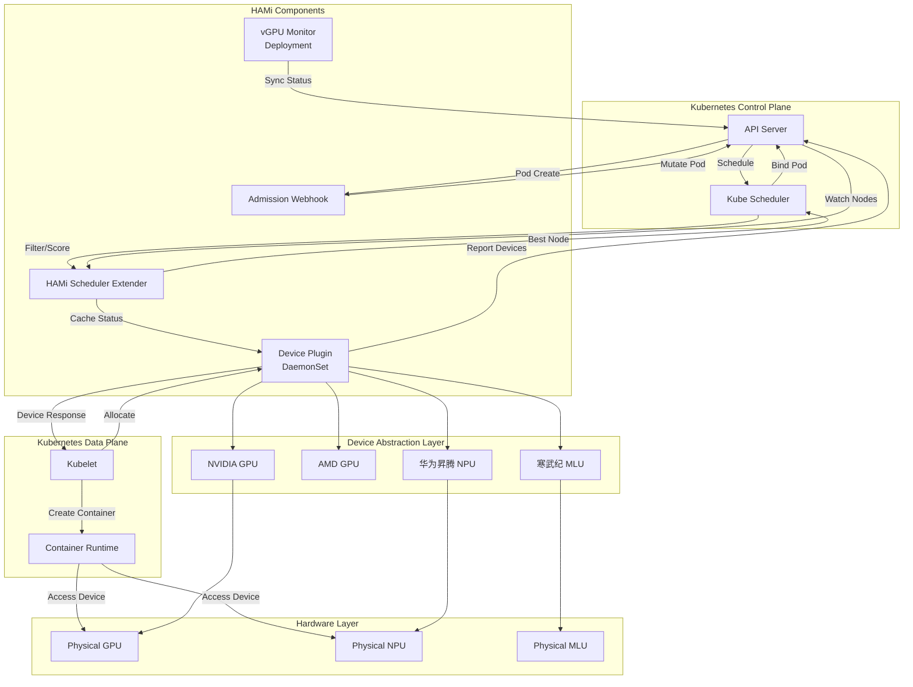

### 2.2 组件交互时序图

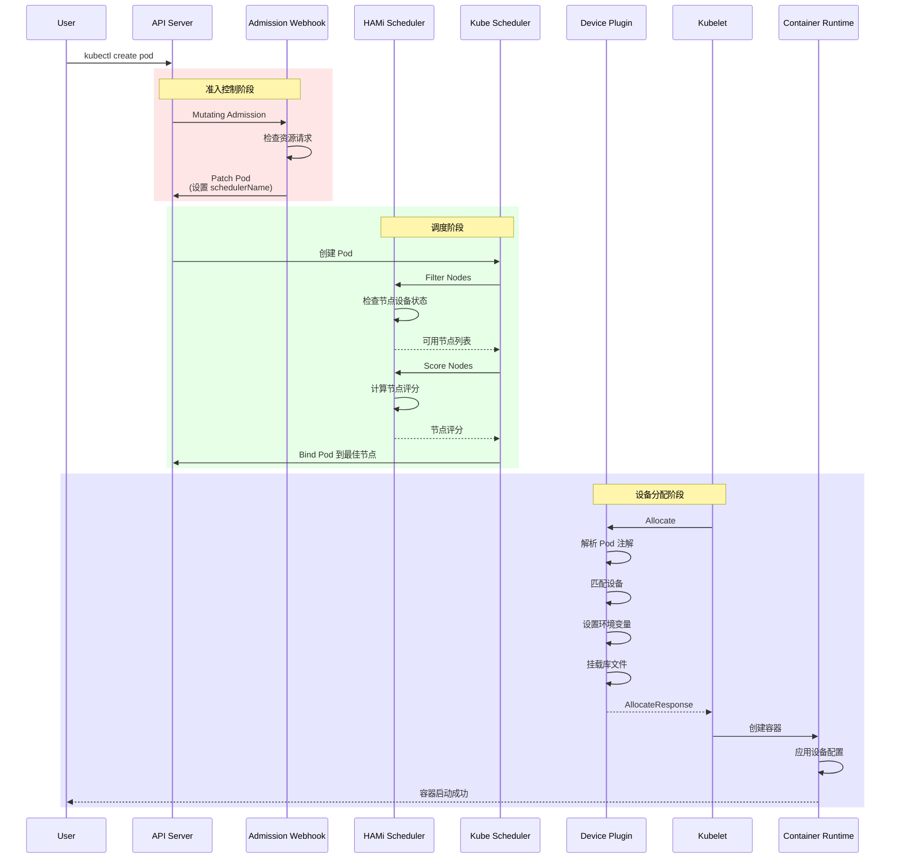

### 2.3 代码目录结构

```
HAMi/
├── cmd/                                    # 可执行程序入口
│   ├── device-plugin/                       # 设备插件
│   │   └── nvidia/
│   │       ├── main.go                     # 主入口
│   │       ├── plugin-manager.go            # 插件管理器
│   │       ├── vgpucfg.go                 # vGPU 配置
│   │       └── watchers.go                # 监视器
│   ├── scheduler/                          # 调度器入口
│   │   └── main.go
│   └── vGPUmonitor/                       # 监控组件
│       └── main.go
│
├── pkg/                                    # 核心代码包
│   ├── device-plugin/                       # 设备插件实现
│   │   └── nvidiadevice/
│   │       └── nvinternal/
│   │           ├── plugin/                 # 插件核心 ⭐
│   │           │   ├── server.go          # gRPC 服务器
│   │           │   ├── register.go        # 注册逻辑
│   │           │   ├── factory.go        # 插件工厂
│   │           │   └── util.go          # 工具函数
│   │           ├── rm/                     # 资源管理 ⭐
│   │           │   ├── rm.go             # 资源管理器接口
│   │           │   ├── devices.go        # 设备列表
│   │           │   ├── allocate.go       # 分配逻辑
│   │           │   ├── health.go         # 健康检查
│   │           │   └── nvml_devices.go  # NVML 设备
│   │           ├── cdi/                    # CDI 支持
│   │           │   ├── cdi.go            # CDI 主实现
│   │           │   └── api.go            # CDI API
│   │           └── imex/                   # IMEX 通道
│   │
│   ├── device/                              # 设备抽象层 ⭐核心
│   │   ├── devices.go                       # 设备接口定义
│   │   ├── pods.go                         # Pod 管理
│   │   ├── quota.go                        # 配额管理
│   │   ├── nvidia/
│   │   │   ├── device.go                 # NVIDIA 设备实现
│   │   │   ├── calculate_score.go        # 节点评分
│   │   │   └── links.go                 # 链接管理
│   │   ├── amd/                            # AMD 实现
│   │   ├── ascend/                         # 昇腾实现
│   │   ├── awsneuron/                      # AWS Neuron
│   │   ├── cambricon/                      # 寒武纪
│   │   ├── enflame/                        # 燧原
│   │   ├── hygon/                          # 海光
│   │   ├── iluvatar/                       # 燧原 BI-X
│   │   ├── kunlun/                         # 昆仑
│   │   ├── mthreads/                       # 摩尔线程
│   │   └── metax/                          # MetaX
│   │
│   ├── scheduler/                           # 调度器实现 ⭐核心
│   │   ├── scheduler.go                    # 调度器主逻辑
│   │   ├── nodes.go                        # 节点管理
│   │   ├── score.go                        # 评分算法
│   │   ├── event.go                        # 事件管理
│   │   ├── webhook.go                      # Admission Webhook
│   │   ├── config/                         # 配置管理
│   │   │   └── config.go
│   │   └── policy/                        # 调度策略
│   │       ├── gpu_policy.go               # GPU 调度策略
│   │       └── node_policy.go              # 节点策略
│   │
│   ├── monitor/                             # 监控组件
│   │   ├── monitor.go                      # 监控主逻辑
│   │   ├── metrics.go                      # Prometheus 指标
│   │   └── webhook.go                      # 监控 Webhook
│   │
│   └── util/                               # 工具函数
│       ├── client/                         # Kubernetes 客户端
│       ├── nodelock/                       # 节点锁
│       └── ...
│
├── charts/                                 # Helm Charts
│   └── hami/
│       ├── Chart.yaml                        # Chart 元数据
│       ├── values.yaml                       # 默认配置值
│       └── templates/                       # Kubernetes 模板
│           ├── scheduler/                    # 调度器模板
│           │   ├── deployment.yaml
│           │   ├── service.yaml
│           │   ├── configmap.yaml
│           │   └── webhook.yaml
│           ├── device-plugin/                # 设备插件模板
│           │   ├── daemonset.yaml
│           │   └── configmap.yaml
│           └── monitor/                     # 监控模板
│               ├── deployment.yaml
│               └── service.yaml
│
├── hack/                                  # 构建脚本
├── test/                                  # 测试
└── docs/                                  # 文档
```

---

## 3. 核心组件详解

### 3.1 Device Plugin 组件

Device Plugin 是 HAMi 与 Kubelet 交互的核心组件，负责设备发现、注册和分配。

#### 3.1.1 组件职责

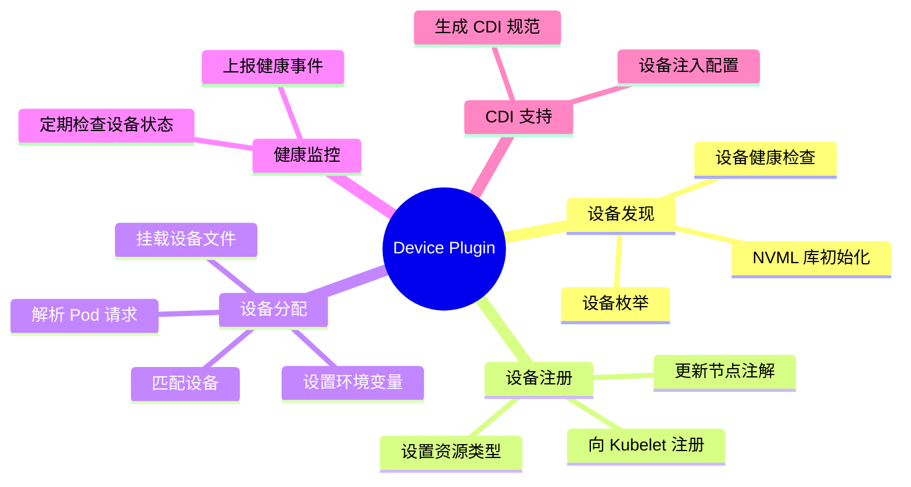

#### 3.1.2 核心结构

**NvidiaDevicePlugin** - NVIDIA 设备插件核心实现

```go
// 位置: pkg/device-plugin/nvidiadevice/nvinternal/plugin/server.go:88-115
type NvidiaDevicePlugin struct {
    // 上下文与配置
    ctx                  context.Context
    rm                   rm.ResourceManager      // 资源管理器
    config               *nvidia.DeviceConfig   // 设备配置
    
    // 设备列表策略
    deviceListEnvvar     string                  // 环境变量名
    deviceListStrategies spec.DeviceListStrategies // 策略类型
    socket               string                  // gRPC socket 路径
    schedulerConfig      nvidia.NvidiaConfig     // 调度器配置
    
    // 并发控制
    applyMutex                 sync.Mutex
    disableHealthChecks        chan bool
    ackDisableHealthChecks     chan bool
    disableWatchAndRegister    chan bool
    ackDisableWatchAndRegister chan bool
    
    // CDI 支持
    cdiHandler          cdi.Interface
    cdiAnnotationPrefix string
    
    // 运行模式
    operatingMode string        // mig/hami-core/mps
    migCurrent    nvidia.MigPartedSpec
    deviceCache   string
    
    // IMEX 通道
    imexChannels imex.Channels
    
    // gRPC 服务器
    server *grpc.Server
    health chan *rm.Device
    stop   chan any
}
```

**ResourceManager** - 资源管理器接口

```go
// 位置: pkg/device-plugin/nvidiadevice/nvinternal/rm/rm.go:56-63
type ResourceManager interface {
    Resource() spec.ResourceName                     // 获取资源名称
    Devices() Devices                                 // 获取设备列表
    GetDevicePaths([]string) []string                // 获取设备路径
    GetPreferredAllocation(available, required []string, size int) ([]string, error)
    CheckHealth(stop <-chan interface{}, unhealthy chan<- *Device,
        disableNVML <-chan bool, ackDisableHealthChecks chan<- bool) error
    ValidateRequest(AnnotatedIDs) error                // 验证请求
}
```

#### 3.1.3 核心 API 实现

**Allocate 方法** - 设备分配的核心逻辑

```go
// 位置: pkg/device-plugin/nvidiadevice/nvinternal/plugin/server.go:475-606
func (plugin *NvidiaDevicePlugin) Allocate(
    ctx context.Context,
    reqs *kubeletdevicepluginv1beta1.AllocateRequest,
) (*kubeletdevicepluginv1beta1.AllocateResponse, error) {
    
    // 1. 获取待分配的 Pod
    nodename := os.Getenv(util.NodeNameEnvName)
    current, err := util.GetPendingPod(ctx, nodename)
    
    // 2. 遍历每个容器的设备请求
    for idx, req := range reqs.ContainerRequests {
        
        // 3. 处理 MIG 设备
        if strings.Contains(req.DevicesIDs[0], "MIG") {
            response, err := plugin.getAllocateResponse(req.DevicesIDs)
            responses.ContainerResponses = append(responses.ContainerResponses, response)
            continue
        }
        
        // 4. 获取设备请求
        currentCtr, devreq, err := GetNextDeviceRequest(nvidia.NvidiaGPUDevice, *current)
        
        // 5. 生成分配响应
        response, err := plugin.getAllocateResponse(plugin.GetContainerDeviceStrArray(devreq))
        
        // 6. 设置环境变量 (hami-core 模式)
        if plugin.operatingMode != "mig" {
            for i, dev := range devreq {
                limitKey := fmt.Sprintf("CUDA_DEVICE_MEMORY_LIMIT_%v", i)
                response.Envs[limitKey] = fmt.Sprintf("%vm", dev.Usedmem)
            }
            response.Envs["CUDA_DEVICE_SM_LIMIT"] = fmt.Sprint(devreq[0].Usedcores)
            response.Envs["CUDA_DEVICE_MEMORY_SHARED_CACHE"] = 
                fmt.Sprintf("%s/vgpu/%v.cache", hostHookPath, uuid.New().String())
            
            // 7. 挂载 libvgpu.so 和缓存目录
            response.Mounts = append(response.Mounts,
                &kubeletdevicepluginv1beta1.Mount{
                    ContainerPath: fmt.Sprintf("%s/vgpu/libvgpu.so", hostHookPath),
                    HostPath: GetLibPath(),
                    ReadOnly: true},
                // ... 其他挂载
            )
        }
        
        responses.ContainerResponses = append(responses.ContainerResponses, response)
    }
    
    return &responses, nil
}
```

**ListAndWatch 方法** - 设备列表与健康监控

```go
// 位置: pkg/device-plugin/nvidiadevice/nvinternal/plugin/server.go:440-454
func (plugin *NvidiaDevicePlugin) ListAndWatch(
    e *kubeletdevicepluginv1beta1.Empty,
    s kubeletdevicepluginv1beta1.DevicePlugin_ListAndWatchServer,
) error {
    // 1. 发送初始设备列表
    s.Send(&kubeletdevicepluginv1beta1.ListAndWatchResponse{
        Devices: plugin.apiDevices(),
    })
    
    // 2. 监听健康状态变化
    for {
        select {
        case <-plugin.stop:
            return nil
        case d := <-plugin.health:
            // 3. 更新设备健康状态
            d.Health = kubeletdevicepluginv1beta1.Unhealthy
            klog.Infof("'%s' device marked unhealthy: %s", plugin.rm.Resource(), d.ID)
            s.Send(&kubeletdevicepluginv1beta1.ListAndWatchResponse{
                Devices: plugin.apiDevices(),
            })
        }
    }
}
```

---

### 3.2 Scheduler 调度器组件

Scheduler 组件作为 Kube-Scheduler 的扩展器，负责异构设备的调度决策。

#### 3.2.1 调度器架构

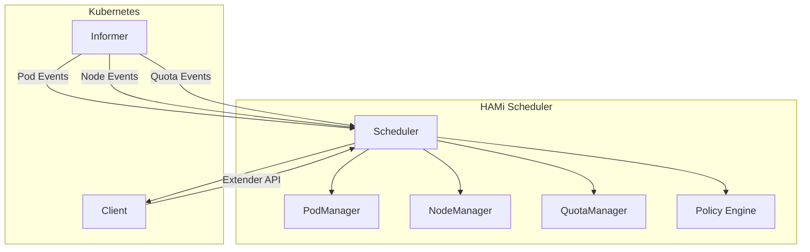

#### 3.2.2 核心结构

**Scheduler** - 调度器主结构

```go
// 位置: pkg/scheduler/scheduler.go:48-65
type Scheduler struct {
    *nodeManager                // 节点管理器
    podManager   *device.PodManager     // Pod 管理器
    
    // Kubernetes 客户端
    stopCh      chan struct{}
    kubeClient  kubernetes.Interface
    podLister   listerscorev1.PodLister
    nodeLister  listerscorev1.NodeLister
    quotaLister listerscorev1.ResourceQuotaLister
    
    // 状态缓存
    cachedstatus   map[string]*NodeUsage  // 节点过滤状态缓存
    overviewstatus map[string]*NodeUsage  // 节点概览状态
    nodeNotify    chan struct{}
    
    // 组件
    eventRecorder record.EventRecorder
    quotaManager  *device.QuotaManager
    started       uint32 // 0 = false, 1 = true
}
```

**NodeUsage** - 节点使用情况

```go
// 位置: pkg/scheduler/nodes.go:30-33
type NodeUsage struct {
    Node    *corev1.Node
    Devices policy.DeviceUsageList  // 设备使用列表
}
```

**nodeManager** - 节点管理器

```go
// 位置: pkg/scheduler/nodes.go:35-38
type nodeManager struct {
    nodes map[string]*device.NodeInfo  // 节点信息
    mutex sync.RWMutex
}
```

#### 3.2.3 核心调度流程

```go
// 位置: pkg/scheduler/scheduler.go (伪代码展示核心流程)
func (s *Scheduler) Filter(args extenderv1.ExtenderArgs) (*extenderv1.ExtenderFilterResult, error) {
    // 1. 解析 Pod 设备请求
    podDevices, err := device.DecodePodDevices(...)
    
    // 2. 遍历候选节点
    var filteredNodes []string
    for _, nodeName := range args.NodeNames {
        // 3. 获取节点设备信息
        nodeInfo, err := s.nodeManager.GetNode(nodeName)
        
        // 4. 检查配额
        if !s.quotaManager.FitQuota(...) {
            continue
        }
        
        // 5. 执行设备匹配算法
        ok, _, _ := nodeInfo.Devices[podType].Fit(...)
        if ok {
            filteredNodes = append(filteredNodes, nodeName)
        }
    }
    
    return &extenderv1.ExtenderFilterResult{
        NodeNames:   filteredNodes,
        FailedNodes: failedNodesMap,
    }, nil
}

func (s *Scheduler) Prioritize(args extenderv1.ExtenderArgs) (*extenderv1.HostPriorityList, error) {
    // 1. 初始化评分列表
    hostPriorityList := make(extenderv1.HostPriorityList, 0)
    
    // 2. 遍历节点进行评分
    for _, nodeName := range args.NodeNames {
        // 3. 计算节点评分
        score := s.scoreNode(nodeName, podDevices)
        
        hostPriorityList = append(hostPriorityList, extenderv1.HostPriority{
            Host:  nodeName,
            Score: int64(score),
        })
    }
    
    return &hostPriorityList, nil
}
```

#### 3.2.4 Pod 生命周期管理

```go
// 位置: pkg/scheduler/scheduler.go:97-154

// Pod 添加事件
func (s *Scheduler) onAddPod(obj any) {
    pod, ok := obj.(*corev1.Pod)
    if !ok {
        return
    }
    
    nodeID, ok := pod.Annotations[util.AssignedNodeAnnotations]
    if !ok {
        return
    }
    
    // 处理已终止的 Pod
    if util.IsPodInTerminatedState(pod) {
        pi, ok := s.podManager.GetPod(pod)
        if ok {
            s.quotaManager.RmUsage(pod, pi.Devices)
        }
        s.podManager.DelPod(pod)
        return
    }
    
    // 添加新 Pod
    podDev, _ := device.DecodePodDevices(device.SupportDevices, pod.Annotations)
    if s.podManager.AddPod(pod, nodeID, podDev) {
        s.quotaManager.AddUsage(pod, podDev)
    }
}

// Pod 删除事件
func (s *Scheduler) onDelPod(obj any) {
    var pod *corev1.Pod
    // ... 解析 Pod
    
    _, ok := pod.Annotations[util.AssignedNodeAnnotations]
    if !ok {
        return
    }
    
    // 释放配额
    pi, ok := s.podManager.GetPod(pod)
    if ok {
        s.quotaManager.RmUsage(pod, pi.Devices)
        s.podManager.DelPod(pod)
    }
}
```

---

### 3.3 Device Abstraction Layer 设备抽象层

设备抽象层为不同厂商的设备提供统一的接口。

#### 3.3.1 Devices 接口

```go
// 位置: pkg/device/devices.go:35-49
type Devices interface {
    CommonWord() string
    MutateAdmission(ctr *corev1.Container, pod *corev1.Pod) (bool, error)
    CheckHealth(devType string, n *corev1.Node) (bool, bool)
    NodeCleanUp(nn string) error
    GetResourceNames() ResourceNames
    GetNodeDevices(n corev1.Node) ([]*DeviceInfo, error)
    LockNode(n *corev1.Node, p *corev1.Pod) error
    ReleaseNodeLock(n *corev1.Node, p *corev1.Pod) error
    GenerateResourceRequests(ctr *corev1.Container) ContainerDeviceRequest
    PatchAnnotations(pod *corev1.Pod, annoinput *map[string]string, pd PodDevices) map[string]string
    ScoreNode(node *corev1.Node, podDevices PodSingleDevice, previous []*DeviceUsage, policy string) float32
    AddResourceUsage(pod *corev1.Pod, n *DeviceUsage, ctr *ContainerDevice) error
    Fit(devices []*DeviceUsage, request ContainerDeviceRequest, pod *corev1.Pod,
        nodeInfo *NodeInfo, allocated *PodDevices) (bool, map[string]ContainerDevices, string)
}
```

#### 3.3.2 NVIDIA 设备实现

**NvidiaGPUDevices** - NVIDIA GPU 设备实现

```go
// 位置: pkg/device/nvidia/device.go:159-163
type NvidiaGPUDevices struct {
    config         NvidiaConfig
    ReportedGPUNum map[string]int64  // nodeName -> GPU count
    mu             sync.Mutex
}
```

**GenerateResourceRequests** - 解析容器资源请求

```go
// 位置: pkg/device/nvidia/device.go:536-602
func (dev *NvidiaGPUDevices) GenerateResourceRequests(
    ctr *corev1.Container,
) device.ContainerDeviceRequest {
    
    resourceName := corev1.ResourceName(dev.config.ResourceCountName)
    resourceMem := corev1.ResourceName(dev.config.ResourceMemoryName)
    resourceCores := corev1.ResourceName(dev.config.ResourceCoreName)
    
    // 获取 GPU 数量
    v, ok := ctr.Resources.Limits[resourceName]
    if !ok {
        v, ok = ctr.Resources.Requests[resourceName]
    }
    
    if ok {
        if n, ok := v.AsInt64(); ok {
            // 解析内存请求
            memnum := 0
            mem, ok := ctr.Resources.Limits[resourceMem]
            if ok {
                if memnums, ok := mem.AsInt64(); ok {
                    memnum = int(memnums)
                }
            }
            
            // 解析核心请求
            corenum := dev.config.DefaultCores
            core, ok := ctr.Resources.Limits[resourceCores]
            if ok {
                if corenums, ok := core.AsInt64(); ok {
                    corenum = int32(corenums)
                }
            }
            
            return device.ContainerDeviceRequest{
                Nums:             int32(n),
                Type:             NvidiaGPUDevice,
                Memreq:           int32(memnum),
                MemPercentagereq: int32(mempnum),
                Coresreq:         int32(corenum),
            }
        }
    }
    
    return device.ContainerDeviceRequest{}
}
```

**Fit** - 设备匹配算法 ⭐核心

```go
// 位置: pkg/device/nvidia/device.go (简化展示核心逻辑)
func (dev *NvidiaGPUDevices) Fit(
    devices []*DeviceUsage,
    request ContainerDeviceRequest,
    pod *corev1.Pod,
    nodeInfo *NodeInfo,
    allocated *PodDevices,
) (bool, map[string]ContainerDevices, string) {
    
    // 1. 过滤可用设备
    var availableDevices []*DeviceUsage
    for _, d := range devices {
        if d.Health && d.Used < d.Count {
            availableDevices = append(availableDevices, d)
        }
    }
    
    // 2. 检查资源需求
    if len(availableDevices) < int(request.Nums) {
        return false, nil, "insufficient devices"
    }
    
    // 3. 计算最佳组合
    bestCombination := make(map[string]ContainerDevices)
    for _, device := range availableDevices {
        // 检查内存是否足够
        if device.Totalmem-device.Usedmem >= request.Memreq {
            // 检查核心是否足够
            if device.Totalcore-device.Usedcores >= request.Coresreq {
                bestCombination[NvidiaGPUDevice] = append(
                    bestCombination[NvidiaGPUDevice],
                    ContainerDevice{
                        UUID:      device.ID,
                        Type:      NvidiaGPUDevice,
                        Usedmem:    request.Memreq,
                        Usedcores:  request.Coresreq,
                    },
                )
                return true, bestCombination, ""
            }
        }
    }
    
    return false, nil, "no device fits"
}
```

---

### 3.4 Admission Webhook 准入控制

Admission Webhook 在 Pod 创建前拦截并修改 Pod 配置。

#### 3.4.1 Webhook 架构

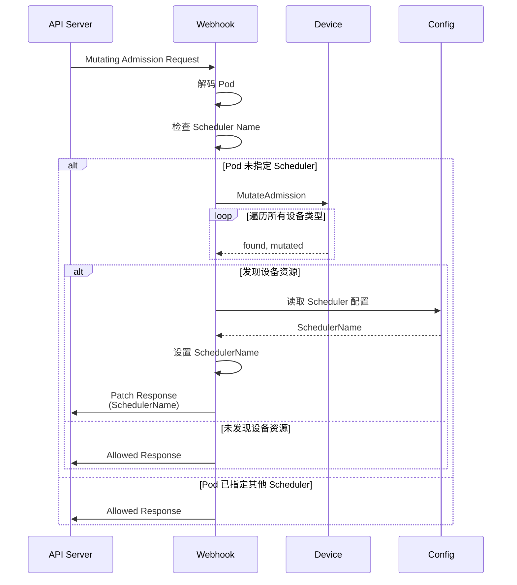

#### 3.4.2 Webhook 实现

```go
// 位置: pkg/scheduler/webhook.go:37-105
type webhook struct {
    decoder admission.Decoder
}

func (h *webhook) Handle(_ context.Context, req admission.Request) admission.Response {
    pod := &corev1.Pod{}
    err := h.decoder.Decode(req, pod)
    if err != nil {
        return admission.Errored(http.StatusBadRequest, err)
    }
    
    // 1. 检查容器
    if len(pod.Spec.Containers) == 0 {
        return admission.Denied("pod has no containers")
    }
    
    // 2. 检查 Scheduler Name
    if pod.Spec.SchedulerName != "" &&
        pod.Spec.SchedulerName != corev1.DefaultSchedulerName ||
        !config.ForceOverwriteDefaultScheduler &&
        (len(config.SchedulerName) == 0 || pod.Spec.SchedulerName != config.SchedulerName) {
        return admission.Allowed("pod already has different scheduler assigned")
    }
    
    // 3. 遍历容器并修改
    hasResource := false
    for idx, ctr := range pod.Spec.Containers {
        c := &pod.Spec.Containers[idx]
        
        // 4. 调用设备的 MutateAdmission
        for _, val := range device.GetDevices() {
            found, err := val.MutateAdmission(c, pod)
            if err != nil {
                return admission.Errored(http.StatusInternalServerError, err)
            }
            hasResource = hasResource || found
        }
    }
    
    // 5. 如果发现设备资源，设置 SchedulerName
    if hasResource && len(config.SchedulerName) > 0 {
        pod.Spec.SchedulerName = config.SchedulerName
        if pod.Spec.NodeName != "" {
            return admission.Denied("pod has node assigned")
        }
    }
    
    // 6. 返回 Patch Response
    marshaledPod, err := json.Marshal(pod)
    if err != nil {
        return admission.Errored(http.StatusInternalServerError, err)
    }
    return admission.PatchResponseFromRaw(req.Object.Raw, marshaledPod)
}
```

---

### 3.5 Monitor 监控组件

Monitor 组件负责同步设备状态并暴露 Prometheus 指标。

#### 3.5.1 监控架构

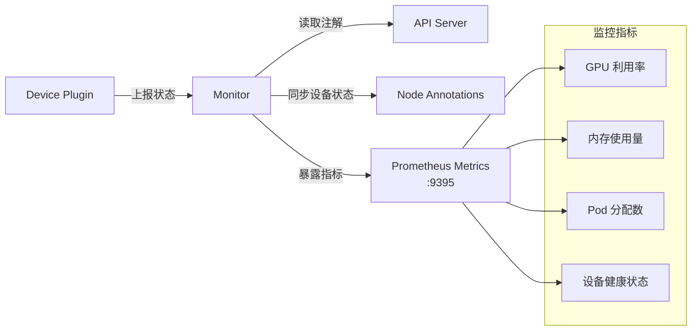

#### 3.5.2 核心功能

- **设备状态同步**: 定期从节点注解读取设备状态
- **Prometheus 指标**: 暴露 GPU 利用率、内存使用等指标
- **事件上报**: 上报设备异常事件到 Kubernetes

---

### 3.6 Node Lock 节点锁机制

节点锁机制确保并发调度的安全性。

#### 3.6.1 锁机制流程

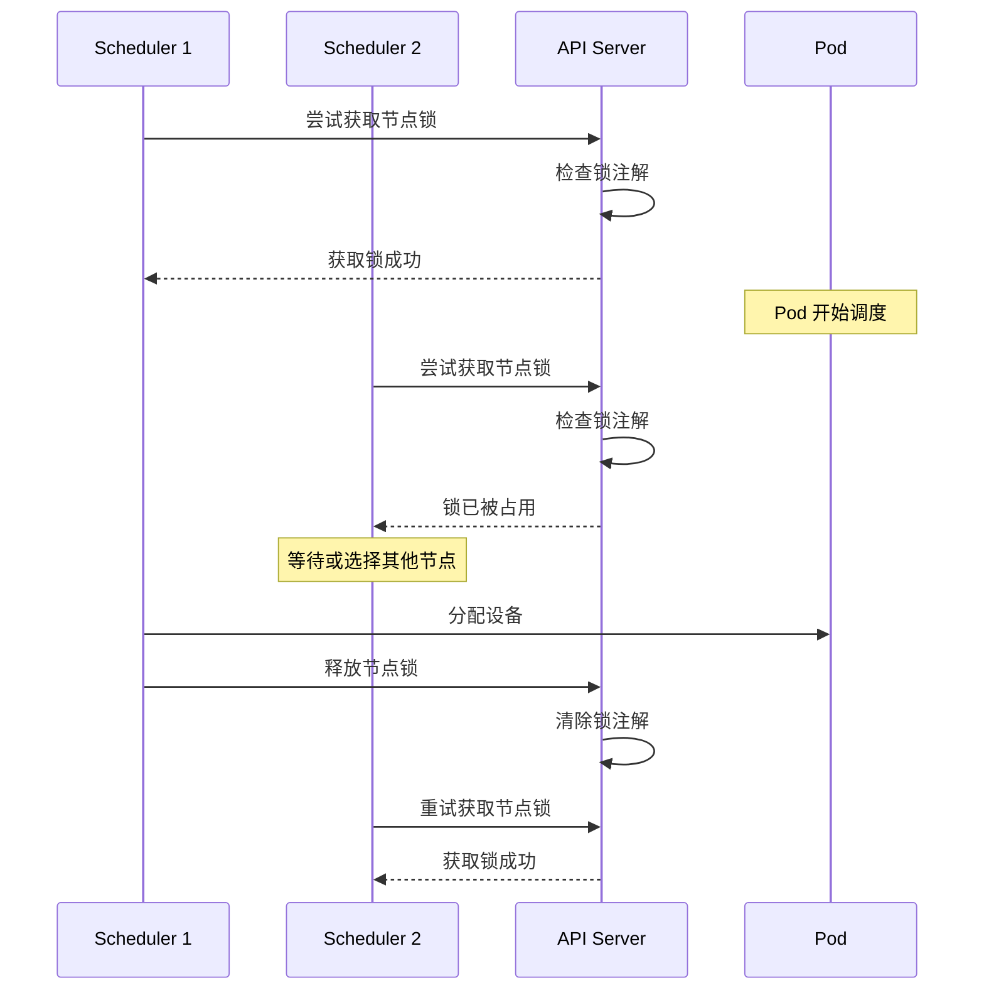

#### 3.6.2 锁机制实现

```go
// 位置: pkg/util/nodelock/ (简化展示)
const (
    NodeLockAnnotation = "hami.io/mutex.lock"
)

// 获取节点锁
func LockNode(nodeName, lockType string, pod *corev1.Pod) error {
    // 1. 获取节点
    node, err := client.CoreV1().Nodes().Get(ctx, nodeName, metav1.GetOptions{})
    
    // 2. 检查锁是否已被占用
    if lockOwner, ok := node.Annotations[NodeLockAnnotation]; ok {
        if lockOwner != getLockID(pod) {
            return fmt.Errorf("node %s is locked by %s", nodeName, lockOwner)
        }
    }
    
    // 3. 设置锁注解
    node.Annotations[NodeLockAnnotation] = getLockID(pod)
    _, err = client.CoreV1().Nodes().Update(ctx, node, metav1.UpdateOptions{})
    
    return err
}

// 释放节点锁
func ReleaseNodeLock(nodeName, lockType string, pod *corev1.Pod, force bool) error {
    node, err := client.CoreV1().Nodes().Get(ctx, nodeName, metav1.GetOptions{})
    
    // 4. 检查锁的所有者
    if lockOwner, ok := node.Annotations[NodeLockAnnotation]; ok {
        if !force && lockOwner != getLockID(pod) {
            return fmt.Errorf("not lock owner")
        }
    }
    
    // 5. 删除锁注解
    delete(node.Annotations, NodeLockAnnotation)
    _, err = client.CoreV1().Nodes().Update(ctx, node, metav1.UpdateOptions{})
    
    return err
}
```

---

### 3.7 Quota 配额管理

Quota Manager 管理命名空间的资源配额。

#### 3.7.1 配额数据结构

```go
// 位置: pkg/device/quota.go:27-37
type Quota struct {
    Used  int64
    Limit int64
}

type DeviceQuota map[string]*Quota

type QuotaManager struct {
    Quotas map[string]*DeviceQuota  // namespace -> DeviceQuota
    mutex  sync.RWMutex
}
```

#### 3.7.2 配额检查

```go
// 位置: pkg/device/quota.go:56-89
func (q *QuotaManager) FitQuota(
    ns string,
    memreq int64,
    memoryFactor int32,
    coresreq int64,
    deviceName string,
) bool {
    devs, ok := GetDevices()[deviceName]
    if !ok {
        return true
    }
    
    resourceNames := devs.GetResourceNames()
    
    q.mutex.RLock()
    defer q.mutex.RUnlock()
    
    dq := q.Quotas[ns]
    if dq == nil {
        return true
    }
    
    // 检查内存配额
    memQuota, ok := (*dq)[resourceNames.ResourceMemoryName]
    if ok {
        limit := memQuota.Limit
        if memoryFactor > 1 {
            limit = limit * int64(memoryFactor)
        }
        if limit != 0 && memQuota.Used+memreq > limit {
            klog.V(4).InfoS("resourceMem quota not fitted",
                "limit", limit, "used", memQuota.Used, "alloc", memreq)
            return false
        }
    }
    
    // 检查核心配额
    coreQuota, ok := (*dq)[resourceNames.ResourceCoreName]
    if ok && coreQuota.Limit != 0 && coreQuota.Used+coresreq > coreQuota.Limit {
        klog.V(4).InfoS("resourceCores quota not fitted",
            "limit", coreQuota.Limit, "used", coreQuota.Used, "alloc", coresreq)
        return false
    }
    
    return true
}
```

---

## 4. 数据流与工作流程

### 4.1 Pod 提交到调度流程

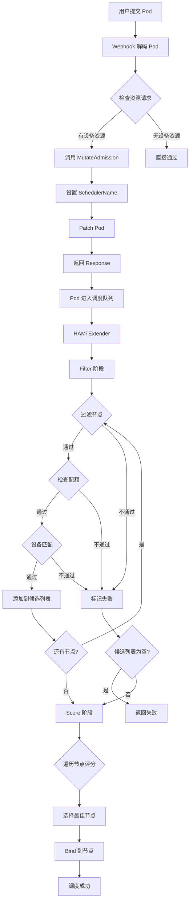

### 4.2 设备发现与上报流程

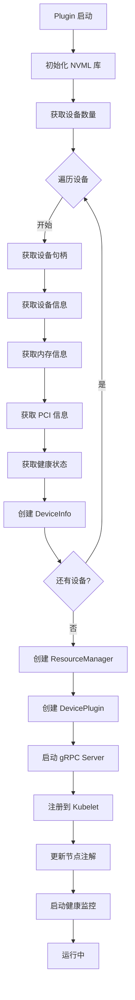

### 4.3 设备分配流程

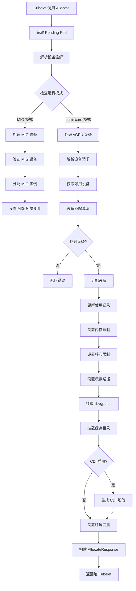

### 4.4 Pod 生命周期管理

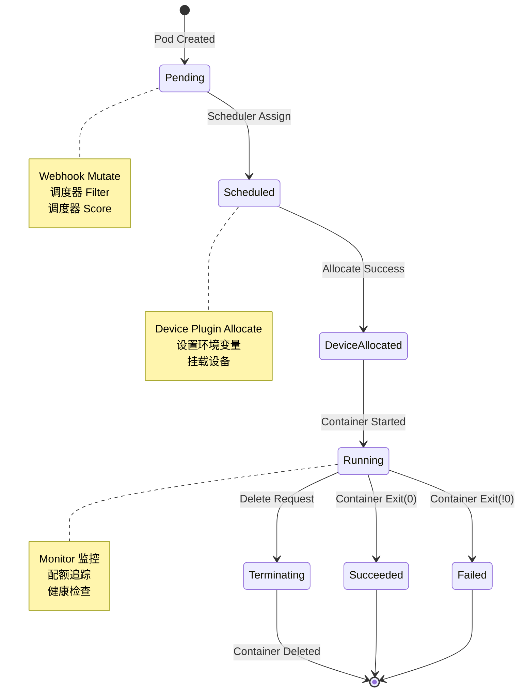

---

## 5. 核心数据结构

### 5.1 设备相关结构

```go
// DeviceInfo - 设备信息
type DeviceInfo struct {
    ID           string          // 设备唯一标识 (UUID)
    Index        uint            // 设备索引
    Count        int32           // 虚拟设备数量
    Devmem       int32           // 设备总内存 (MB)
    Devcore      int32           // 设备总核心数
    Type         string          // 设备类型
    Numa         int             // NUMA 节点
    Mode         string          // 运行模式
    MIGTemplate  []Geometry       // MIG 配置模板
    Health       bool            // 健康状态
    DeviceVendor string          // 设备厂商
    CustomInfo   map[string]any  // 自定义信息
}

// DeviceUsage - 设备使用情况
type DeviceUsage struct {
    ID          string
    Index       uint
    Used        int32           // 已使用设备数
    Count       int32           // 总设备数
    Usedmem     int32           // 已使用内存
    Totalmem    int32           // 总内存
    Totalcore   int32           // 总核心数
    Usedcores   int32           // 已使用核心
    Mode        string
    MigTemplate []Geometry
    MigUsage    MigInUse
    Numa        int
    Type        string
    Health      bool
    PodInfos    []*PodInfo
    CustomInfo  map[string]any
}
```

### 5.2 Pod 相关结构

```go
// PodInfo - Pod 信息
type PodInfo struct {
    *corev1.Pod
    NodeID  string
    Devices PodDevices
    CtrIDs  []string
}

// PodDevices - Pod 设备分配
type PodDevices map[string]PodSingleDevice

// PodSingleDevice - 单设备类型的 Pod 设备
type PodSingleDevice []ContainerDevices

// ContainerDevice - 容器设备分配
type ContainerDevice struct {
    Idx        int
    UUID       string
    Type       string
    Usedmem    int32
    Usedcores  int32
    CustomInfo map[string]any
}
```

### 5.3 调度相关结构

```go
// ContainerDeviceRequest - 容器设备请求
type ContainerDeviceRequest struct {
    Nums             int32  // 请求数量
    Type             string // 设备类型
    Memreq           int32  // 内存请求
    MemPercentagereq int32  // 内存百分比请求
    Coresreq         int32  // 核心请求
}

// NodeInfo - 节点信息
type NodeInfo struct {
    ID      string
    Node    *corev1.Node
    Devices map[string][]DeviceInfo
}
```

---

## 6. 多厂商设备支持

HAMi 通过设备抽象层支持多种异构设备。

### 6.1 设备注册机制

```go
// 位置: pkg/scheduler/config/config.go:90-150 (简化展示)
func InitDevicesWithConfig(config *Config) error {
    device.DevicesMap = make(map[string]device.Devices)
    device.DevicesToHandle = []string{}
    
    // 设备初始化器
    deviceInitializers := []struct {
        deviceType string
        commonWord string
        initFunc   func(any) (device.Devices, error)
        config     any
    }{
        {
            deviceType: nvidia.NvidiaGPUDevice,
            commonWord: nvidia.NvidiaGPUDevice,
            initFunc: func(cfg any) (device.Devices, error) {
                nvidiaConfig, ok := cfg.(nvidia.NvidiaConfig)
                if !ok {
                    return nil, fmt.Errorf("invalid config for %s", nvidia.NvidiaGPUDevice)
                }
                return nvidia.InitNvidiaDevice(nvidiaConfig), nil
            },
            config: config.NvidiaConfig,
        },
        {
            deviceType: cambricon.CambriconMLUDevice,
            commonWord: cambricon.CambriconMLUCommonWord,
            initFunc: func(cfg any) (device.Devices, error) {
                cambriconConfig, ok := cfg.(cambricon.CambriconConfig)
                if !ok {
                    return nil, fmt.Errorf("invalid config for %s", cambricon.CambriconMLUCommonWord)
                }
                return cambricon.InitMLUDevice(cambriconConfig), nil
            },
            config: config.CambriconConfig,
        },
        // ... 其他设备初始化器
    }
    
    // 初始化所有设备
    for _, initializer := range deviceInitializers {
        dev, err := initializer.initFunc(initializer.config)
        if err != nil {
            klog.Errorf("Failed to initialize %s device: %v", initializer.commonWord, err)
            continue
        }
        device.DevicesMap[dev.CommonWord()] = dev
        device.DevicesToHandle = append(device.DevicesToHandle, initializer.commonWord)
    }
    
    return nil
}
```

### 6.2 设备接口实现对比

| 方法 | NVIDIA | AMD | 昇腾 | 寒武纪 |
|------|--------|-----|-------|--------|
| `CommonWord()` | `"NVIDIA"` | `"AMD"` | `"ASCEND"` | `"MLU"` |
| `GetNodeDevices()` | NVML 查询 | ROCm 查询 | ACL 查询 | CNRT 查询 |
| `Fit()` | GPU 匹配算法 | GPU 匹配算法 | NPU 匹配算法 | MLU 匹配算法 |
| `MutateAdmission()` | 注入 GPU 配置 | 注入 GPU 配置 | 注入 NPU 配置 | 注入 MLU 配置 |

---

## 7. 部署架构

### 7.1 Kubernetes 部署组件

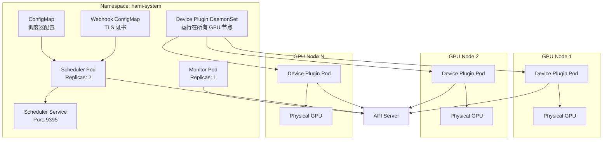

### 7.2 Helm 部署配置

```yaml
# charts/hami/values.yaml 关键配置
scheduler:
  replicas: 2                      # 调度器副本数
  leaderElect: true               # 启用 Leader 选举
  admissionWebhook:
    enabled: true                  # 启用 Admission Webhook
    failurePolicy: Ignore          # 失败策略
  kubeScheduler:
    enabled: true                 # 部署内置 Kube-Scheduler

# 资源名称配置
resourceName: "nvidia.com/gpu"
resourceMem: "nvidia.com/gpumem"
resourceCores: "nvidia.com/gpucores"

# 调度策略
defaultSchedulerPolicy:
  nodeSchedulerPolicy: binpack    # 节点调度策略: binpack/spread
  gpuSchedulerPolicy: spread       # GPU 调度策略: binpack/spread

# 节点标签选择
managedNodeSelectorEnable: false
managedNodeSelector:
  usage: "gpu"
```

---

## 8. 关键算法与策略

### 8.1 设备匹配算法

#### 8.1.1 算法流程

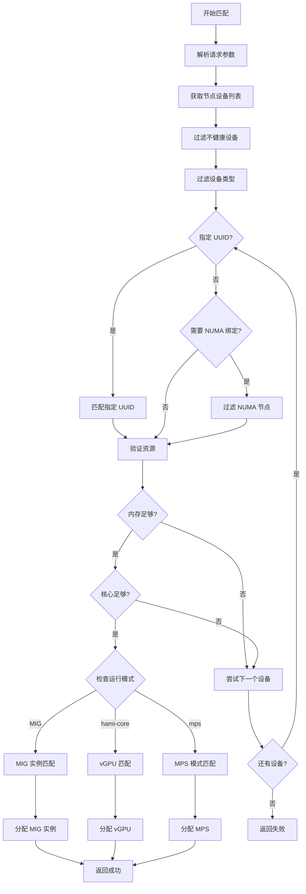

#### 8.1.2 算法实现

```go
// 位置: pkg/device/nvidia/device.go (简化版)
func (dev *NvidiaGPUDevices) Fit(
    devices []*DeviceUsage,
    request ContainerDeviceRequest,
    pod *corev1.Pod,
    nodeInfo *NodeInfo,
    allocated *PodDevices,
) (bool, map[string]ContainerDevices, string) {
    
    var candidates []*DeviceUsage
    allocatedDevices := make(map[string]ContainerDevices)
    
    // 1. 过滤可用设备
    for _, d := range devices {
        // 健康检查
        if !d.Health {
            continue
        }
        
        // NUMA 检查
        if assertNuma(pod.Annotations) {
            // TODO: 实现 NUMA 检查逻辑
        }
        
        // UUID 检查
        if !dev.checkUUID(pod.Annotations, d) {
            continue
        }
        
        // 类型检查
        if !dev.checkType(pod.Annotations, *d, request) {
            continue
        }
        
        candidates = append(candidates, d)
    }
    
    // 2. 执行自定义过滤规则
    for _, d := range candidates {
        if !dev.CustomFilterRule(allocated, request, nil, d) {
            continue
        }
    }
    
    // 3. 选择最佳设备
    if len(candidates) == 0 {
        return false, nil, "no available device"
    }
    
    // 按资源利用率排序
    sort.Slice(candidates, func(i, j int) bool {
        utilizationI := float64(candidates[i].Used) / float64(candidates[i].Count)
        utilizationJ := float64(candidates[j].Used) / float64(candidates[j].Count)
        return utilizationI < utilizationJ  // 优先选择利用率低的
    })
    
    // 4. 分配设备
    selected := candidates[0]
    allocatedDevices[NvidiaGPUDevice] = append(
        allocatedDevices[NvidiaGPUDevice],
        ContainerDevice{
            UUID:      selected.ID,
            Type:      NvidiaGPUDevice,
            Usedmem:    request.Memreq,
            Usedcores:  request.Coresreq,
        },
    )
    
    return true, allocatedDevices, ""
}
```

### 8.2 节点评分算法

#### 8.2.1 评分策略

```go
// 位置: pkg/scheduler/policy/gpu_policy.go:59-78
func (ds *DeviceListsScore) ComputeScore(requests device.ContainerDeviceRequests) {
    // 1. 计算总资源需求
    request, core, mem := int32(0), int32(0), int32(0)
    for _, container := range requests {
        request += container.Nums
        core += container.Coresreq
        if container.MemPercentagereq != 0 && container.MemPercentagereq != 101 {
            mem += ds.Device.Totalmem * (container.MemPercentagereq / 100.0)
            continue
        }
        mem += container.Memreq
    }
    
    // 2. 计算各维度评分
    usedScore := float32(request+ds.Device.Used) / float32(ds.Device.Count)
    coreScore := float32(core+ds.Device.Usedcores) / float32(ds.Device.Totalcore)
    memScore := float32(mem+ds.Device.Usedmem) / float32(ds.Device.Totalmem)
    
    // 3. 综合评分 (使用权重)
    ds.Score = float32(util.Weight) * (usedScore + coreScore + memScore)
}
```

#### 8.2.2 排序策略

```go
// 位置: pkg/scheduler/policy/gpu_policy.go:37-57
func (l DeviceUsageList) Less(i, j int) bool {
    if l.Policy == util.GPUSchedulerPolicyBinpack.String() {
        // Binpack 策略: 优先填满 NUMA 节点
        if l.DeviceLists[i].Device.Numa == l.DeviceLists[j].Device.Numa {
            return l.DeviceLists[i].Score < l.DeviceLists[j].Score
        }
        return l.DeviceLists[i].Device.Numa > l.DeviceLists[j].Device.Numa
    }
    
    // Spread 策略: 优先分散到不同 NUMA 节点
    if l.DeviceLists[i].Device.Numa == l.DeviceLists[j].Device.Numa {
        return l.DeviceLists[i].Score > l.DeviceLists[j].Score
    }
    return l.DeviceLists[i].Device.Numa < l.DeviceLists[j].Device.Numa
}
```

**策略对比**:

| 策略 | 优势 | 劣势 | 适用场景 |
|------|--------|--------|----------|
| **Binpack** | 提高资源利用率，减少碎片 | 可能导致负载不均 | 资源紧张环境 |
| **Spread** | 提高可用性，降低单点风险 | 可能增加碎片 | 高可用要求场景 |

### 8.3 拓扑感知调度

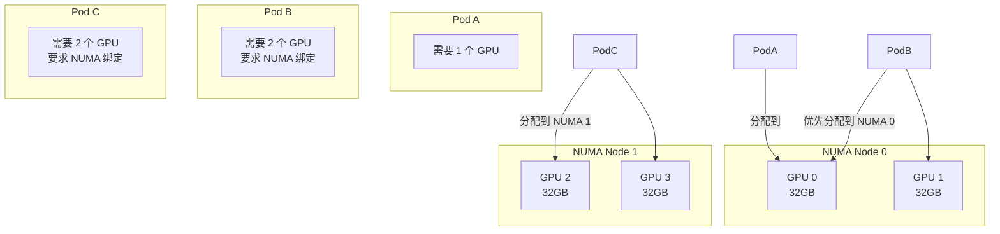

---

## 9. 配置管理

### 9.1 配置层次结构

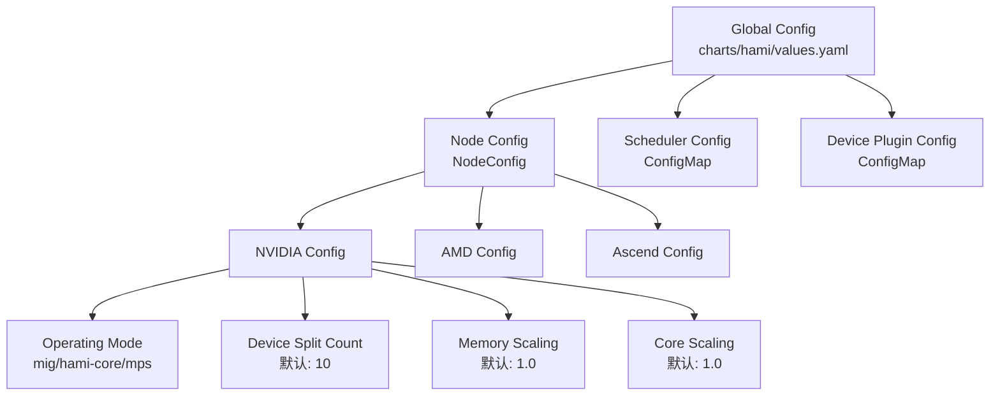

### 9.2 关键配置项

```yaml
# NVIDIA 设备配置
nvidia:
  resourceCountName: "nvidia.com/gpu"
  resourceMemoryName: "nvidia.com/gpumem"
  resourceCoreName: "nvidia.com/gpucores"
  defaultMemory: 0
  defaultCores: 0
  defaultGPUNum: 0
  memoryFactor: 1
  
  # MIG 配置
  knownMigGeometries:
    - models:
        - "Tesla T4"
      allowedGeometries:
        - name: "1g.5gb"
          core: 14
          memory: 5120
          count: 7
        - name: "2g.10gb"
          core: 28
          memory: 10240
          count: 3

# 调度器策略
defaultSchedulerPolicy:
  nodeSchedulerPolicy: binpack    # binpack/spread
  gpuSchedulerPolicy: spread       # binpack/spread

# Node 级别配置 (可覆盖全局配置)
nodeconfig:
  - name: "gpu-node-1"
    operatingmode: "hami-core"
    devicesplitcount: 10
    devicememoryscaling: 1.0
    devicecorescaling: 1.0
    filterdevices:
      uuid: []
      index: []
```

---

## 10. 安全与可靠性

### 10.1 安全机制

| 机制 | 实现 | 防护目标 |
|--------|--------|----------|
| **节点锁** | Kubernetes 注解 | 防止并发调度冲突 |
| **配额限制** | ResourceQuota | 防止资源过度分配 |
| **健康检查** | NVML/设备 SDK | 自动隔离故障设备 |
| **TLS 证书** | Webhook | 通信加密 |
| **Pod 准入控制** | Admission Webhook | 防止非法配置 |
| **Leader 选举** | Kubernetes Lease | 防止脑裂 |

### 10.2 可靠性设计

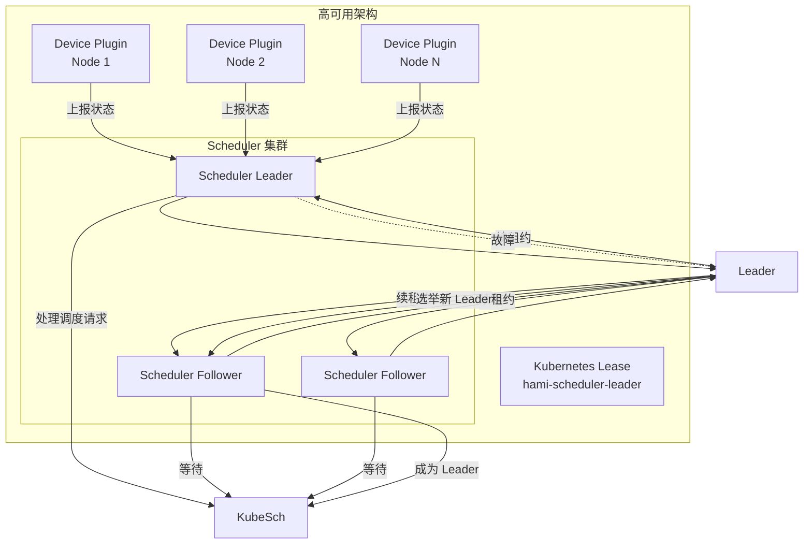

**Leader 选举流程**:
1. 调度器 Pod 启动时竞争 Leader 锁
2. Leader 定期续租约 (默认 15 秒)
3. Follower 持续监控 Leader 状态
4. Leader 故障时，Follower 竞争成为新 Leader
5. 新 Leader 接管调度职责

---

## 总结

HAMi 是一个架构设计优秀、功能完善的异构设备管理中间件，具有以下核心优势：

### 架构优势

1. **清晰的分层设计**: Device Plugin、Scheduler、设备抽象层职责明确
2. **统一抽象接口**: 支持多厂商设备的统一管理
3. **标准兼容**: 遵循 Kubernetes Device Plugin 和 CDI 规范
4. **高可用性**: 支持多副本部署和 Leader 选举
5. **可扩展性**: 易于添加新的设备类型支持

### 核心特性

- ✅ GPU 内存共享
- ✅ GPU 核心限制
- ✅ MIG 支持
- ✅ 拓扑感知调度
- ✅ NUMA 绑定
- ✅ 多厂商支持
- ✅ 配额管理
- ✅ 健康检查
- ✅ Prometheus 监控

### 适用场景

- **AI 训练**: GPU 资源共享，提高利用率
- **推理服务**: 多模型共享 GPU
- **边缘计算**: 异构设备统一管理
- **多云环境**: 跨云平台设备管理

### 参考资源

- HAMi GitHub: https://github.com/Project-HAMi/HAMi
- CNCF Sandbox: https://sandbox.cncf.io/projects/hami
- Kubernetes Device Plugin: https://kubernetes.io/docs/concepts/extend-kubernetes/compute-storage-net/device-plugins/
- CDI Specification: https://tags.cncf.io/container-device-interface/
