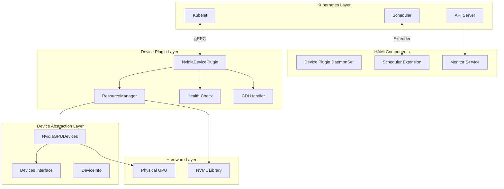
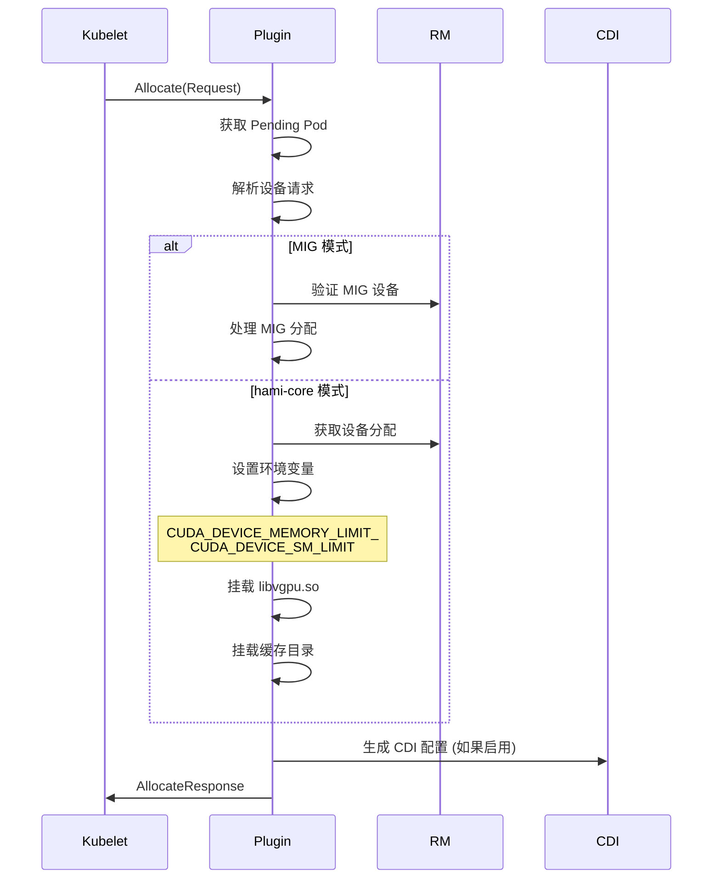
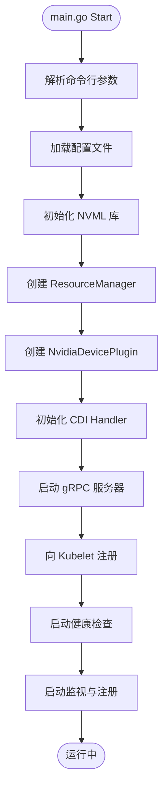
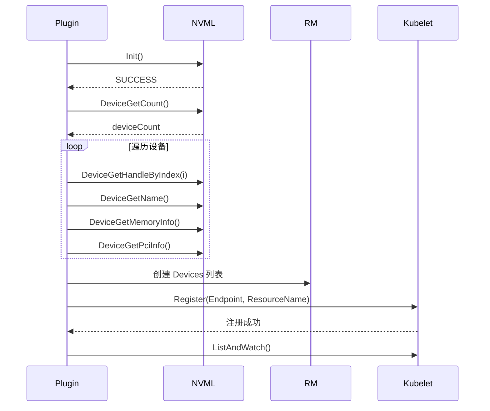
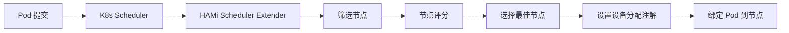
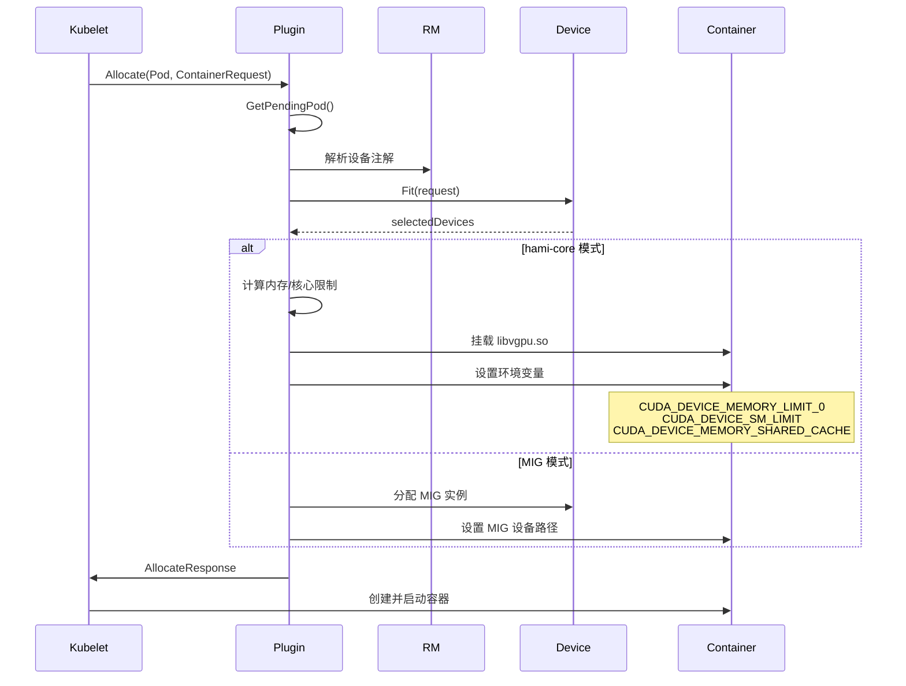
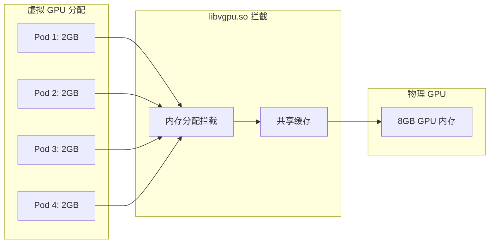
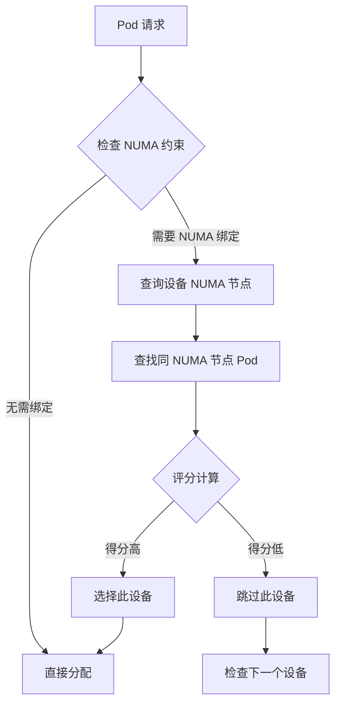

# HAMi Device Plugin 架构分析与实现

## 目录

- [1. 项目概述](#1-项目概述)
- [2. 整体架构](#2-整体架构)
- [3. 核心组件分析](#3-核心组件分析)
  - [3.1 Device Plugin 核心层](#31-device-plugin-核心层)
  - [3.2 资源管理层](#32-资源管理层)
  - [3.3 设备抽象层](#33-设备抽象层)
  - [3.4 CDI 支持层](#34-cdi-支持层)
- [4. 工作流程](#4-工作流程)
  - [4.1 设备插件启动流程](#41-设备插件启动流程)
  - [4.2 设备发现与注册](#42-设备发现与注册)
  - [4.3 Pod 调度流程](#43-pod-调度流程)
  - [4.4 设备分配流程](#44-设备分配流程)
- [5. 关键数据结构](#5-关键数据结构)
- [6. 简化实现](#6-简化实现)
  - [6.1 基础 Device Plugin 实现](#61-基础-device-plugin-实现)
  - [6.2 简化版 GPU 设备管理](#62-简化版-gpu-设备管理)
- [7. 核心特性](#7-核心特性)

---

## 1. 项目概述

HAMi (Heterogeneous AI Computing Middleware) 是一个面向 Kubernetes 的异构设备管理中间件，原名 `k8s-vGPU-scheduler`。它是一个 CNCF 沙盒项目，用于管理不同类型的异构设备（如 GPU、NPU 等），支持设备共享和基于设备拓扑的调度决策。

### 1.1 核心目标

- **设备虚拟化**: 将物理 GPU 虚拟化为多个 vGPU，实现 GPU 资源的共享
- **智能调度**: 基于设备拓扑、内存、核心等智能调度决策
- **多厂商支持**: 支持 NVIDIA、AMD、华为昇腾、寒武纪等多种异构设备
- **CDI 集成**: 支持 Container Device Interface 规范

### 1.2 关键特性

| 特性 | 说明 |
|------|------|
| GPU 内存共享 | 将物理 GPU 内存分割分配给多个容器 |
| GPU 核心限制 | 支持对 GPU 核心使用率进行限制 |
| MIG 支持 | 支持 NVIDIA Multi-Instance GPU |
| 拓扑感知调度 | 基于 NUMA 拓扑的智能调度 |
| 设备健康检查 | 实时监控设备健康状态 |

---

## 2. 整体架构

HAMi 采用清晰的分层架构设计：



### 2.1 目录结构

```
HAMi/
├── cmd/
│   └── device-plugin/
│       └── nvidia/              # 设备插件入口
│           ├── main.go         # 主入口
│           ├── plugin-manager.go
│           └── vgpucfg.go
├── pkg/
│   ├── device-plugin/
│   │   └── nvidiadevice/
│   │       └── nvinternal/
│   │           ├── plugin/      # 插件核心实现
│   │           │   ├── server.go       # gRPC 服务器
│   │           │   ├── register.go     # 注册逻辑
│   │           │   └── factory.go     # 插件工厂
│   │           ├── rm/          # 资源管理
│   │           │   ├── rm.go           # 资源管理器接口
│   │           │   ├── devices.go      # 设备列表
│   │           │   ├── allocate.go     # 分配逻辑
│   │           │   └── health.go       # 健康检查
│   │           ├── cdi/         # CDI 支持
│   │           │   ├── cdi.go          # CDI 主实现
│   │           │   └── api.go          # CDI API
│   │           └── imex/        # IMEX 通道
│   ├── device/
│   │   ├── devices.go          # 设备接口定义
│   │   ├── nvidia/
│   │   │   ├── device.go       # NVIDIA 设备实现
│   │   │   ├── calculate_score.go  # 节点评分
│   │   │   └── links.go        # 链接管理
│   │   ├── amd/               # AMD 设备实现
│   │   ├── ascend/            # 昇腾 NPU 实现
│   │   └── ...                # 其他厂商设备
│   └── scheduler/             # 调度器实现
└── charts/
    └── hami/
        └── templates/          # Helm 部署模板
```

---

## 3. 核心组件分析

### 3.1 Device Plugin 核心

#### 3.1.1 NvidiaDevicePlugin 结构

`NvidiaDevicePlugin` 是设备插件的核心实现，实现了 Kubernetes Device Plugin v1beta1 API：

```go
// 位置: pkg/device-plugin/nvidiadevice/nvinternal/plugin/server.go
type NvidiaDevicePlugin struct {
    ctx                  context.Context
    rm                   rm.ResourceManager      // 资源管理器
    config               *nvidia.DeviceConfig   // 设备配置
    deviceListEnvvar     string                  // 设备列表环境变量
    deviceListStrategies spec.DeviceListStrategies // 设备列表策略
    socket               string                  // gRPC socket 路径
    schedulerConfig      nvidia.NvidiaConfig     // 调度器配置

    // 并发控制
    applyMutex                 sync.Mutex
    disableHealthChecks        chan bool
    ackDisableHealthChecks     chan bool
    disableWatchAndRegister    chan bool
    ackDisableWatchAndRegister chan bool

    // CDI 支持
    cdiHandler          cdi.Interface
    cdiAnnotationPrefix string

    // 运行时状态
    operatingMode string        // 运行模式 (mig/hami-core/mps)
    migCurrent    nvidia.MigPartedSpec  // MIG 配置
    deviceCache   string        // 设备缓存

    // IMEX 通道
    imexChannels imex.Channels

    // gRPC 服务器
    server *grpc.Server
    health chan *rm.Device
    stop   chan any
}
```

#### 3.1.2 核心 API 实现

```go
// 位置: pkg/device-plugin/nvidiadevice/nvinternal/plugin/server.go
type NvidiaDevicePlugin struct {
    // ...
}

// 实现 DevicePluginServer 接口

// 1. GetDevicePluginOptions - 获取插件选项
func (plugin *NvidiaDevicePlugin) GetDevicePluginOptions(
    context.Context,
    *kubeletdevicepluginv1beta1.Empty,
) (*kubeletdevicepluginv1beta1.DevicePluginOptions, error)

// 2. ListAndWatch - 列出并监视设备
func (plugin *NvidiaDevicePlugin) ListAndWatch(
    e *kubeletdevicepluginv1beta1.Empty,
    s kubeletdevicepluginv1beta1.DevicePlugin_ListAndWatchServer,
) error

// 3. Allocate - 分配设备 ⭐核心方法
func (plugin *NvidiaDevicePlugin) Allocate(
    ctx context.Context,
    reqs *kubeletdevicepluginv1beta1.AllocateRequest,
) (*kubeletdevicepluginv1beta1.AllocateResponse, error)

// 4. PreStartContainer - 容器启动前预处理
func (plugin *NvidiaDevicePlugin) PreStartContainer(
    context.Context,
    *kubeletdevicepluginv1beta1.PreStartContainerRequest,
) (*kubeletdevicepluginv1beta1.PreStartContainerResponse, error)
```

**Allocate 方法核心流程**:



### 3.2 资源管理层

#### 3.2.1 ResourceManager 接口

```go
// 位置: pkg/device-plugin/nvidiadevice/nvinternal/rm/rm.go
type ResourceManager interface {
    Resource() spec.ResourceName                     // 获取资源名称
    Devices() Devices                                 // 获取设备列表
    GetDevicePaths([]string) []string                // 获取设备路径
    GetPreferredAllocation(available, required []string, size int) ([]string, error)
    CheckHealth(stop <-chan interface{}, unhealthy chan<- *Device,
        disableNVML <-chan bool, ackDisableHealthChecks chan<- bool) error
    ValidateRequest(AnnotatedIDs) error                // 验证请求
}
```

#### 3.2.2 资源管理器实现

```go
// 位置: pkg/device-plugin/nvidiadevice/nvinternal/rm/rm.go
type resourceManager struct {
    config   *spec.Config
    resource spec.ResourceName
    devices  Devices
}
```

**核心职责**:
- 设备发现与枚举
- 设备健康检查
- 设备分配验证
- 设备路径管理

### 3.3 设备抽象层

#### 3.3.1 Devices 接口

```go
// 位置: pkg/device/devices.go
type Devices interface {
    CommonWord() string
    MutateAdmission(ctr *corev1.Container, pod *corev1.Pod) (bool, error)
    CheckHealth(devType string, n *corev1.Node) (bool, bool)
    NodeCleanUp(nn string) error
    GetResourceNames() ResourceNames
    GetNodeDevices(n corev1.Node) ([]*DeviceInfo, error)
    LockNode(n *corev1.Node, p *corev1.Pod) error
    ReleaseNodeLock(n *corev1.Node, p *corev1.Pod) error
    GenerateResourceRequests(ctr *corev1.Container) ContainerDeviceRequest
    PatchAnnotations(pod *corev1.Pod, annoinput *map[string]string,
        pd PodDevices) map[string]string
    ScoreNode(node *corev1.Node, podDevices PodSingleDevice,
        previous []*DeviceUsage, policy string) float32
    AddResourceUsage(pod *corev1.Pod, n *DeviceUsage,
        ctr *ContainerDevice) error
    Fit(devices []*DeviceUsage, request ContainerDeviceRequest,
        pod *corev1.Pod, nodeInfo *NodeInfo,
        allocated *PodDevices) (bool, map[string]ContainerDevices, string)
}
```

#### 3.3.2 NvidiaGPUDevices 实现

```go
// 位置: pkg/device/nvidia/device.go
type NvidiaGPUDevices struct {
    config         NvidiaConfig
    ReportedGPUNum map[string]int64 // key: nodeName, value: reported GPU count
    mu             sync.Mutex       // protects concurrent access
}
```

**核心方法**:

```go
// 生成资源请求
func (dev *NvidiaGPUDevices) GenerateResourceRequests(
    ctr *corev1.Container,
) device.ContainerDeviceRequest {
    // 解析资源请求
    // - nvidia.com/gpu: GPU 数量
    // - nvidia.com/gpumem: GPU 内存
    // - nvidia.com/gpucores: GPU 核心
}

// 设备匹配与分配 ⭐核心
func (dev *NvidiaGPUDevices) Fit(
    devices []*DeviceUsage,
    request ContainerDeviceRequest,
    pod *corev1.Pod,
    nodeInfo *NodeInfo,
    allocated *PodDevices,
) (bool, map[string]ContainerDevices, string)

// 添加资源使用记录
func (dev *NvidiaGPUDevices) AddResourceUsage(
    pod *corev1.Pod,
    n *DeviceUsage,
    ctr *ContainerDevice,
) error
```

### 3.4 CDI 支持层

Container Device Interface (CDI) 是容器设备接口规范，用于标准化设备发现和配置。

#### 3.4.1 CDI Handler

```go
// 位置: pkg/device-plugin/nvidiadevice/nvinternal/cdi/cdi.go
type cdiHandler struct {
    infolib   info.Interface
    nvmllib   nvml.Interface
    devicelib device.Interface

    driverRoot       string
    devRoot          string
    targetDriverRoot string
    targetDevRoot    string
    nvidiaCTKPath    string

    deviceListStrategies spec.DeviceListStrategies
    cdilibs            map[string]nvcdi.SpecGenerator
}
```

#### 3.4.2 CDI 规范生成

```go
// 创建 CDI 规范文件
func (cdi *cdiHandler) CreateSpecFile() error

// 更新 CDI 响应
func (plugin *NvidiaDevicePlugin) updateResponseForCDI(
    response *kubeletdevicepluginv1beta1.ContainerAllocateResponse,
    responseID string,
    deviceIDs ...string,
) error
```

---

## 4. 工作流程

### 4.1 设备插件启动流程



**关键代码**:

```go
// 位置: cmd/device-plugin/nvidia/main.go
func start(ctx *cli.Context, o *options) error {
    // 1. 加载配置
    sConfig, mode, err := plugin.LoadNvidiaDevicePluginConfig()
    if err != nil {
        return err
    }

    // 2. 初始化 NVML
    nvmlInstance := nvml.New()
    ret := nvmlInstance.Init()
    if ret != nvml.SUCCESS {
        return fmt.Errorf("failed to initialize NVML: %v", ret)
    }
    defer nvmlInstance.Shutdown()

    // 3. 创建资源管理器
    resourceManager, err := rm.NewResourceManagement(
        nvmlInstance,
        devicelib,
        nvconfig,
    )

    // 4. 创建设备插件
    devicePlugin, err := o.devicePluginForResource(
        ctx,
        nvconfig,
        resourceManager,
        sConfig,
        mode,
    )

    // 5. 启动插件
    err = devicePlugin.Start(o.kubeletSocket)

    // 6. 等待退出信号
    <-ctx.Done()
    return nil
}
```

### 4.2 设备发现与注册



**设备信息收集**:

```go
// 位置: pkg/device-plugin/nvidiadevice/nvinternal/rm/nvml_devices.go
func buildDevice(device nvml.Device) (*rm.Device, error) {
    deviceInfo := &rm.Device{
        ID: uuid.New().String(),
        // 从 NVML 获取设备信息
        Health: rm.Healthy,
    }

    // 获取设备名称
    name, ret := device.GetName()
    if ret == nvml.SUCCESS {
        deviceInfo.Name = name
    }

    // 获取内存信息
    memInfo, ret := device.GetMemoryInfo()
    if ret == nvml.SUCCESS {
        deviceInfo.Total = uint64(memInfo.Total)
    }

    // 获取 PCI 信息
    pciInfo, ret := device.GetPciInfo()
    if ret == nvml.SUCCESS {
        deviceInfo.PciBusID = pciInfo.BusId
    }

    return deviceInfo, nil
}
```

### 4.3 Pod 调度流程



**关键注解**:

```yaml
# Pod 注解
apiVersion: v1
kind: Pod
metadata:
  name: gpu-pod
  annotations:
    hami.io/node-handshake: "true"
    hami.io/vgpu-devices-allocated: |
      0-0-1000,7,100:GPU-0
    nvidia.com/vgpu-mode: "hami-core"
spec:
  containers:
  - name: gpu-container
    resources:
      limits:
        nvidia.com/gpu: 1
        nvidia.com/gpumem: 4096
        nvidia.com/gpucores: 10
```

### 4.4 设备分配流程



**关键环境变量**:

| 环境变量 | 说明 | 示例 |
|---------|------|------|
| `CUDA_DEVICE_MEMORY_LIMIT_<n>` | 第 n 个设备的内存限制 | `CUDA_DEVICE_MEMORY_LIMIT_0=4096m` |
| `CUDA_DEVICE_SM_LIMIT` | GPU 核心限制 | `CUDA_DEVICE_SM_LIMIT=10` |
| `NVIDIA_VISIBLE_DEVICES` | 可见设备列表 | `GPU-0,GPU-1` |
| `CUDA_DEVICE_MEMORY_SHARED_CACHE` | 共享缓存路径 | `/var/run/vgpu/cache_xxx` |

---

## 5. 关键数据结构

### 5.1 DeviceInfo

```go
// 位置: pkg/device/devices.go
type DeviceInfo struct {
    ID              string          // 设备唯一标识 (UUID)
    Index           uint            // 设备索引
    Count           int32           // 虚拟设备数量
    Devmem          int32           // 设备总内存 (MB)
    Devcore         int32           // 设备总核心数
    Type            string          // 设备类型
    Numa            int             // NUMA 节点
    Mode            string          // 运行模式 (mig/hami-core/mps)
    MIGTemplate     []Geometry      // MIG 配置模板
    Health          bool            // 健康状态
    DeviceVendor    string          // 设备厂商
    CustomInfo      map[string]any  // 自定义信息
    DevicePairScore DevicePairScore // 设备配对评分
}
```

### 5.2 DeviceUsage

```go
// 位置: pkg/device/devices.go
type DeviceUsage struct {
    ID          string         // 设备 ID
    Index       uint           // 设备索引
    Used        int32          // 已使用设备数
    Count       int32          // 总设备数
    Usedmem     int32          // 已使用内存
    Totalmem    int32          // 总内存
    Totalcore   int32          // 总核心数
    Usedcores   int32          // 已使用核心
    Mode        string         // 运行模式
    MigTemplate []Geometry     // MIG 模板
    MigUsage    MigInUse       // MIG 使用情况
    Numa        int            // NUMA 节点
    Type        string         // 设备类型
    Health      bool           // 健康状态
    PodInfos    []*PodInfo     // 使用此设备的 Pod 列表
    CustomInfo  map[string]any // 自定义信息
}
```

### 5.3 ContainerDeviceRequest

```go
// 位置: pkg/device/devices.go
type ContainerDeviceRequest struct {
    Nums             int32  // 请求数量
    Type             string // 设备类型
    Memreq           int32  // 内存请求
    MemPercentagereq int32  // 内存百分比请求
    Coresreq         int32  // 核心请求
}
```

### 5.4 AllocateResponse

```go
// Kubernetes Device Plugin API
type AllocateResponse struct {
    ContainerResponses []*ContainerAllocateResponse
}

type ContainerAllocateResponse struct {
    Envs       map[string]string      // 环境变量
    Mounts     []*Mount               // 挂载点
    Devices    []*DeviceSpec          // 设备规格
    Annotations map[string]string     // CDI 注解
    CDIDevices []*CDIDevice          // CDI 设备
}
```

---

## 6. 简化实现

### 6.1 基础 Device Plugin 实现

下面是一个简化版的 GPU Device Plugin 实现，展示核心概念：

```go
// simple_gpu_device_plugin.go
package main

import (
    "context"
    "fmt"
    "net"
    "os"
    "time"

    "google.golang.org/grpc"
    kubeletdevicepluginv1beta1 "k8s.io/kubelet/pkg/apis/deviceplugin/v1beta1"
)

// SimpleGPUDevicePlugin 简化的 GPU 设备插件
type SimpleGPUDevicePlugin struct {
    socket     string
    devices    []*SimpleGPUDevice
    server     *grpc.Server
    stop       chan struct{}
    healthChan chan string
}

type SimpleGPUDevice struct {
    ID     string
    Health string
    Memory uint64
}

func NewSimpleGPUDevicePlugin() *SimpleGPUDevicePlugin {
    return &SimpleGPUDevicePlugin{
        socket:     "/var/lib/kubelet/device-plugins/so-gpu.sock",
        devices:    []*SimpleGPUDevice{},
        stop:       make(chan struct{}),
        healthChan: make(chan string),
    }
}

// Server 实现 DevicePluginServer 接口

func (p *SimpleGPUDevicePlugin) GetDevicePluginOptions(
    ctx context.Context,
    empty *kubeletdevicepluginv1beta1.Empty,
) (*kubeletdevicepluginv1beta1.DevicePluginOptions, error) {
    return &kubeletdevicepluginv1beta1.DevicePluginOptions{
        GetPreferredAllocationAvailable: false,
    }, nil
}

func (p *SimpleGPUDevicePlugin) ListAndWatch(
    empty *kubeletdevicepluginv1beta1.Empty,
    stream kubeletdevicepluginv1beta1.DevicePlugin_ListAndWatchServer,
) error {
    // 发送初始设备列表
    stream.Send(&kubeletdevicepluginv1beta1.ListAndWatchResponse{
        Devices: p.getDevices(),
    })

    for {
        select {
        case <-p.stop:
            return nil
        case unhealthy := <-p.healthChan:
            // 更新设备健康状态
            for _, dev := range p.devices {
                if dev.ID == unhealthy {
                    dev.Health = "Unhealthy"
                }
            }
            stream.Send(&kubeletdevicepluginv1beta1.ListAndWatchResponse{
                Devices: p.getDevices(),
            })
        }
    }
}

func (p *SimpleGPUDevicePlugin) Allocate(
    ctx context.Context,
    reqs *kubeletdevicepluginv1beta1.AllocateRequest,
) (*kubeletdevicepluginv1beta1.AllocateResponse, error) {
    responses := &kubeletdevicepluginv1beta1.AllocateResponse{}

    for _, req := range reqs.ContainerRequests {
        containerResp := &kubeletdevicepluginv1beta1.ContainerAllocateResponse{
            Envs:   make(map[string]string),
            Mounts: []*kubeletdevicepluginv1beta1.Mount{},
        }

        // 设置环境变量
        if len(req.DevicesIDs) > 0 {
            containerResp.Envs["NVIDIA_VISIBLE_DEVICES"] =
                fmt.Sprintf("%s", req.DevicesIDs[0])

            // 设置内存限制 (简化版)
            containerResp.Envs["CUDA_DEVICE_MEMORY_LIMIT_0"] = "4096m"
        }

        // 挂载 GPU 设备
        for _, deviceID := range req.DevicesIDs {
            containerResp.Devices = append(containerResp.Devices,
                &kubeletdevicepluginv1beta1.DeviceSpec{
                    ContainerPath: "/dev/nvidia0",
                    HostPath:      "/dev/nvidia0",
                    Permissions:   "rw",
                },
            )
        }

        responses.ContainerResponses = append(responses.ContainerResponses, containerResp)
    }

    return responses, nil
}

func (p *SimpleGPUDevicePlugin) PreStartContainer(
    ctx context.Context,
    req *kubeletdevicepluginv1beta1.PreStartContainerRequest,
) (*kubeletdevicepluginv1beta1.PreStartContainerResponse, error) {
    return &kubeletdevicepluginv1beta1.PreStartContainerResponse{}, nil
}

// 辅助方法

func (p *SimpleGPUDevicePlugin) getDevices() []*kubeletdevicepluginv1beta1.Device {
    var devices []*kubeletdevicepluginv1beta1.Device
    for _, dev := range p.devices {
        health := kubeletdevicepluginv1beta1.Healthy
        if dev.Health == "Unhealthy" {
            health = kubeletdevicepluginv1beta1.Unhealthy
        }
        devices = append(devices, &kubeletdevicepluginv1beta1.Device{
            ID:     dev.ID,
            Health: health,
        })
    }
    return devices
}

func (p *SimpleGPUDevicePlugin) Start() error {
    // 创建 gRPC 服务器
    p.server = grpc.NewServer()
    kubeletdevicepluginv1beta1.RegisterDevicePluginServer(p.server, p)

    // 创建 socket 并监听
    os.Remove(p.socket)
    sock, err := net.Listen("unix", p.socket)
    if err != nil {
        return fmt.Errorf("failed to listen on socket: %v", err)
    }

    // 启动服务器
    go func() {
        if err := p.server.Serve(sock); err != nil {
            fmt.Printf("server error: %v\n", err)
        }
    }()

    // 等待服务器启动
    time.Sleep(1 * time.Second)
    return nil
}

func (p *SimpleGPUDevicePlugin) Register() error {
    // 向 Kubelet 注册插件
    conn, err := net.Dial("unix", kubeletdevicepluginv1beta1.KubeletSocket)
    if err != nil {
        return fmt.Errorf("failed to connect to kubelet: %v", err)
    }
    defer conn.Close()

    client := kubeletdevicepluginv1beta1.NewRegistrationClient(conn)
    req := &kubeletdevicepluginv1beta1.RegisterRequest{
        Version:      kubeletdevicepluginv1beta1.Version,
        Endpoint:     "so-gpu.sock",
        ResourceName: "simple.com/gpu",
        Options: &kubeletdevicepluginv1beta1.DevicePluginOptions{
            GetPreferredAllocationAvailable: false,
        },
    }

    if _, err := client.Register(context.Background(), req); err != nil {
        return fmt.Errorf("failed to register: %v", err)
    }

    fmt.Println("Successfully registered device plugin with Kubelet")
    return nil
}

func (p *SimpleGPUDevicePlugin) Stop() {
    close(p.stop)
    if p.server != nil {
        p.server.Stop()
    }
    os.Remove(p.socket)
}

func main() {
    plugin := NewSimpleGPUDevicePlugin()

    // 模拟发现设备
    plugin.devices = []*SimpleGPUDevice{
        {ID: "gpu-0", Health: "Healthy", Memory: 8192},
        {ID: "gpu-1", Health: "Healthy", Memory: 8192},
    }

    // 启动插件
    if err := plugin.Start(); err != nil {
        fmt.Printf("Failed to start plugin: %v\n", err)
        os.Exit(1)
    }

    // 注册插件
    if err := plugin.Register(); err != nil {
        fmt.Printf("Failed to register plugin: %v\n", err)
        plugin.Stop()
        os.Exit(1)
    }

    fmt.Println("Device plugin running...")
    select {}
}
```

### 6.2 简化版 GPU 设备管理

展示设备分配的核心逻辑：

```go
// simple_gpu_allocator.go
package main

import (
    "fmt"
    "sort"
)

// GPUDeviceInfo GPU 设备信息
type GPUDeviceInfo struct {
    ID          string
    TotalMemory uint64 // MB
    UsedMemory  uint64 // MB
    Health      bool
}

// GPUAllocationRequest GPU 分配请求
type GPUAllocationRequest struct {
    DeviceType string
    Memory     uint64 // MB
    Cores      uint32
}

// GPUAllocator GPU 分配器
type GPUAllocator struct {
    devices map[string]*GPUDeviceInfo
}

func NewGPUAllocator() *GPUAllocator {
    return &GPUAllocator{
        devices: make(map[string]*GPUDeviceInfo),
    }
}

// AddDevice 添加设备
func (a *GPUAllocator) AddDevice(id string, totalMemory uint64) {
    a.devices[id] = &GPUDeviceInfo{
        ID:          id,
        TotalMemory: totalMemory,
        UsedMemory:  0,
        Health:      true,
    }
}

// Fit 设备匹配算法 ⭐核心
func (a *GPUAllocator) Fit(
    request *GPUAllocationRequest,
    allocatedDevice string,
) (string, error) {
    var candidates []string

    // 收集可用设备
    for id, dev := range a.devices {
        if !dev.Health {
            continue
        }
        // 检查内存是否足够
        if dev.TotalMemory-dev.UsedMemory >= request.Memory {
            candidates = append(candidates, id)
        }
    }

    if len(candidates) == 0 {
        return "", fmt.Errorf("no available device for request: %+v", request)
    }

    // 按可用内存排序 (优先选择剩余内存多的设备)
    sort.Slice(candidates, func(i, j int) bool {
        iAvailable := a.devices[candidates[i]].TotalMemory -
            a.devices[candidates[i]].UsedMemory
        jAvailable := a.devices[candidates[j]].TotalMemory -
            a.devices[candidates[j]].UsedMemory
        return iAvailable > jAvailable
    })

    // 如果指定了设备，直接返回
    if allocatedDevice != "" {
        for _, candidate := range candidates {
            if candidate == allocatedDevice {
                return candidate, nil
            }
        }
        return "", fmt.Errorf("specified device %s not available", allocatedDevice)
    }

    // 返回最佳匹配
    return candidates[0], nil
}

// Allocate 分配设备
func (a *GPUAllocator) Allocate(
    deviceID string,
    request *GPUAllocationRequest,
) error {
    dev, exists := a.devices[deviceID]
    if !exists {
        return fmt.Errorf("device %s not found", deviceID)
    }

    if !dev.Health {
        return fmt.Errorf("device %s is unhealthy", deviceID)
    }

    if dev.TotalMemory-dev.UsedMemory < request.Memory {
        return fmt.Errorf("not enough memory on device %s", deviceID)
    }

    dev.UsedMemory += request.Memory
    return nil
}

// Release 释放设备
func (a *GPUAllocator) Release(deviceID string, memory uint64) {
    if dev, exists := a.devices[deviceID]; exists {
        if dev.UsedMemory >= memory {
            dev.UsedMemory -= memory
        } else {
            dev.UsedMemory = 0
        }
    }
}

// GetDeviceStats 获取设备状态
func (a *GPUAllocator) GetDeviceStats() map[string]GPUStats {
    stats := make(map[string]GPUStats)
    for id, dev := range a.devices {
        stats[id] = GPUStats{
            ID:              id,
            TotalMemory:     dev.TotalMemory,
            UsedMemory:      dev.UsedMemory,
            AvailableMemory: dev.TotalMemory - dev.UsedMemory,
            Health:          dev.Health,
            Utilization:     float64(dev.UsedMemory) / float64(dev.TotalMemory) * 100,
        }
    }
    return stats
}

type GPUStats struct {
    ID              string
    TotalMemory     uint64
    UsedMemory      uint64
    AvailableMemory uint64
    Health          bool
    Utilization     float64
}

func main() {
    // 创建分配器
    allocator := NewGPUAllocator()

    // 添加设备
    allocator.AddDevice("gpu-0", 8192)  // 8GB
    allocator.AddDevice("gpu-1", 16384) // 16GB

    // 模拟分配请求
    requests := []*GPUAllocationRequest{
        {DeviceType: "NVIDIA", Memory: 4096, Cores: 20},
        {DeviceType: "NVIDIA", Memory: 8192, Cores: 40},
        {DeviceType: "NVIDIA", Memory: 2048, Cores: 10},
    }

    for i, req := range requests {
        deviceID, err := allocator.Fit(req, "")
        if err != nil {
            fmt.Printf("Request %d failed: %v\n", i+1, err)
            continue
        }

        fmt.Printf("Request %d allocated to %s\n", i+1, deviceID)
        if err := allocator.Allocate(deviceID, req); err != nil {
            fmt.Printf("Failed to allocate %s: %v\n", deviceID, err)
        }
    }

    // 打印设备状态
    fmt.Println("\nDevice Statistics:")
    for id, stats := range allocator.GetDeviceStats() {
        fmt.Printf("  %s: %d/%d MB used (%.1f%%)\n",
            id, stats.UsedMemory, stats.TotalMemory, stats.Utilization)
    }
}
```

**输出示例**:

```
Request 1 allocated to gpu-1
Request 2 allocated to gpu-1
Request 3 allocated to gpu-0

Device Statistics:
  gpu-0: 2048/8192 MB used (25.0%)
  gpu-1: 12288/16384 MB used (75.0%)
```

---

## 7. 核心特性

### 7.1 GPU 内存共享

GPU 内存共享是 HAMi 的核心特性，通过以下机制实现：

```go
// 位置: pkg/device-plugin/nvidiadevice/nvinternal/plugin/server.go:534-542
if plugin.operatingMode != "mig" {
    for i, dev := range devreq {
        // 设置每个设备的内存限制
        limitKey := fmt.Sprintf("CUDA_DEVICE_MEMORY_LIMIT_%v", i)
        response.Envs[limitKey] = fmt.Sprintf("%vm", dev.Usedmem)
    }
    // 设置核心限制
    response.Envs["CUDA_DEVICE_SM_LIMIT"] = fmt.Sprint(devreq[0].Usedcores)
    // 设置共享缓存
    response.Envs["CUDA_DEVICE_MEMORY_SHARED_CACHE"] =
        fmt.Sprintf("%s/vgpu/%v.cache", hostHookPath, uuid.New().String())
}
```

**内存共享机制**:



### 7.2 MIG 支持

MIG (Multi-Instance GPU) 允许将一个物理 GPU 分割成多个实例：

```go
// 位置: pkg/device-plugin/nvidiadevice/nvinternal/plugin/server.go:275-316
if deviceSupportMig {
    // 导出当前 MIG 配置
    cmd := exec.Command("nvidia-mig-parted", "export")
    // ... 解析配置
    yaml.Unmarshal(outStr, &plugin.migCurrent)

    if plugin.operatingMode == "mig" {
        // 处理 MIG 配置
        HamiInitMigConfig, err := plugin.processMigConfigs(
            plugin.migCurrent.MigConfigs,
            deviceNumbers,
        )
        plugin.migCurrent.MigConfigs["current"] = HamiInitMigConfig
    }
}
```

**MIG 分割示例**:

```yaml
# MIG 配置模板
mig-configs:
  - devices: [0]
    mig-enabled: true
    mig-devices:
      1g.5gb: 3   # 3 个 1 GPU, 5GB 内存的实例
      2g.10gb: 1  # 1 个 2 GPU, 10GB 内存的实例
```

### 7.3 拓扑感知调度

基于 NUMA 拓扑的智能调度，优化性能：

```go
// 位置: pkg/device/nvidia/device.go:481-490
func assertNuma(annos map[string]string) bool {
    numabind, ok := annos[NumaBind]
    if ok {
        enforce, err := strconv.ParseBool(numabind)
        if err == nil && enforce {
            return true
        }
    }
    return false
}
```

**拓扑感知流程**:



### 7.4 健康检查

实时监控设备健康状态：

```go
// 位置: pkg/device-plugin/nvidiadevice/nvinternal/plugin/server.go:318-323
go func() {
    err := plugin.rm.CheckHealth(
        plugin.stop,
        plugin.health,
        plugin.disableHealthChecks,
        plugin.ackDisableHealthChecks,
    )
    if err != nil {
        klog.Infof("Failed to start health check: %v", err)
    }
}()
```

**健康检查机制**:

```go
// 位置: pkg/device-plugin/nvidiadevice/nvinternal/rm/health.go
func (r *resourceManager) CheckHealth(
    stop <-chan interface{},
    unhealthy chan<- *Device,
    disableNVML <-chan bool,
    ackDisableHealthChecks chan<- bool,
) error {
    // 定期检查设备健康状态
    ticker := time.NewTicker(time.Second * 5)
    defer ticker.Stop()

    for {
        select {
        case <-stop:
            return nil
        case <-ticker.C:
            // 使用 NVML 检查设备状态
            for _, device := range r.devices {
                ret := device.nvmlDevice.GetStatus()
                if ret != nvml.SUCCESS {
                    unhealthy <- device
                }
            }
        }
    }
}
```

---

## 总结

HAMi Device Plugin 是一个功能强大、架构清晰的 Kubernetes 异构设备管理中间件。本文档从架构设计、核心组件、工作流程、关键数据结构和简化实现等多个维度进行了详细分析。

**核心亮点**:

1. **分层架构**: 清晰的分层设计，易于扩展和维护
2. **设备虚拟化**: 突破传统 GPU 独占限制，实现资源共享
3. **多厂商支持**: 统一抽象层支持多种异构设备
4. **智能调度**: 基于拓扑、内存、核心的智能调度决策
5. **CDI 集成**: 遵循标准，提升兼容性

**适用场景**:

- AI 训练和推理场景的 GPU 资源共享
- 大语言模型训练的多 GPU 协同
- 边缘计算场景的设备管理
- 多云环境下的异构设备统一管理

**参考资源**:

- HAMi GitHub: https://github.com/Project-HAMi/HAMi
- Kubernetes Device Plugin: https://kubernetes.io/docs/concepts/extend-kubernetes/compute-storage-net/device-plugins/
- CDI Specification: https://tags.cncf.io/container-device-interface/
