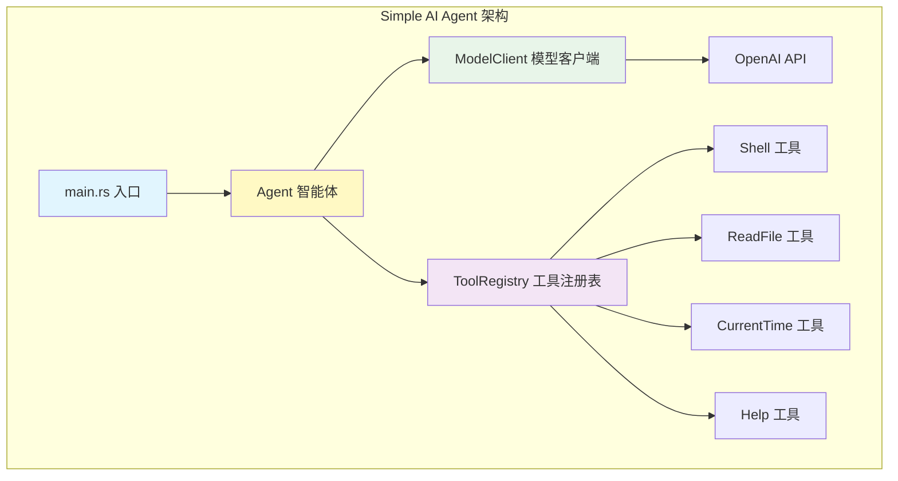
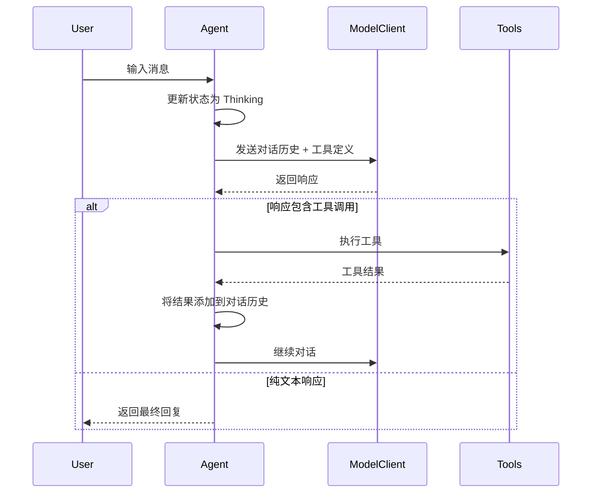
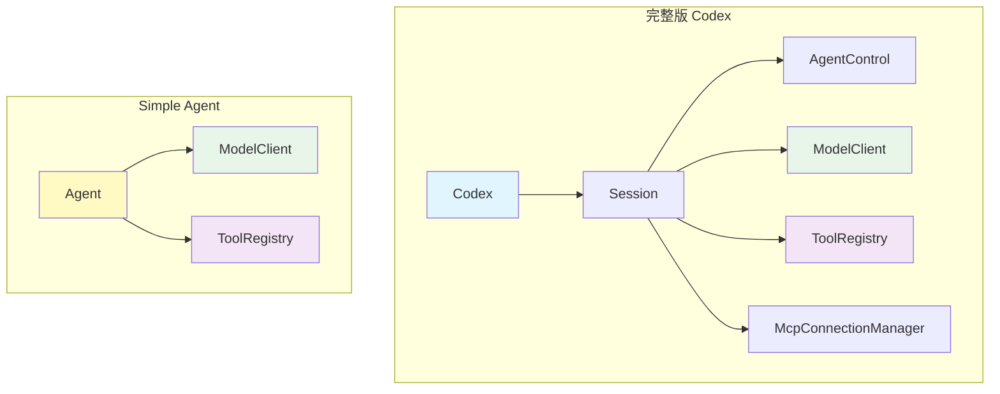

# Simple AI Agent

基于 Codex 架构的简易版 AI 智能体实现。

## 架构概览



## 核心模块

| 模块 | 文件 | 职责 | 对应 Codex 模块 |
|------|------|------|------------------|
| **主入口** | `main.rs` | 应用启动、用户交互 | - |
| **智能体** | `agent.rs` | 对话循环、状态管理 | `Codex` + `AgentControl` |
| **模型客户端** | `client.rs` | OpenAI API 调用 | `ModelClient` |
| **工具系统** | `tools.rs` | 工具注册和执行 | `ToolRegistry` + `ToolHandler` |
| **协议定义** | `protocol.rs` | 消息类型定义 | `protocol.rs` |

## 智能体工作流程



## 核心代码示例

### 1. 智能体循环

```rust:src/agent.rs
pub async fn run_agent_loop(&mut self, initial_input: &str) -> Result<String, anyhow::Error> {
    loop {
        // 获取工具定义
        let tools = self.tool_registry.list_definitions();
        let tools_json: Vec<Value> = tools
            .iter()
            .map(|t| json!({
                "type": "function",
                "function": {
                    "name": t.name,
                    "description": t.description,
                    "parameters": t.parameters
                }
            }))
            .collect();

        // 调用大模型
        let response = self
            .model_client
            .chat_completion(messages, Some(tools_json))
            .await?;

        // 检查是否需要执行工具
        if let Some(tool_calls) = response.tool_calls {
            for call in &tool_calls {
                self.execute_tool_call(call).await?;
            }
            continue;
        }

        return Ok(response.content);
    }
}
```

### 2. 工具注册

```rust:src/tools.rs
pub struct ToolRegistry {
    tools: HashMap<String, Box<dyn ToolExecutor>>,
}

impl ToolRegistry {
    pub fn register<T>(&mut self, tool: T)
    where
        T: ToolExecutor + 'static,
    {
        let name = ToolExecutor::name(&Tool);
        self.tools.insert(name.to_string(), Box::new(tool));
    }

    pub async fn execute(&self, call: &ToolCall) -> Result<ToolResult, String> {
        let executor = self.get(&call.name)?;
        let result = executor.execute(call.arguments.clone()).await?;
        Ok(ToolResult {
            tool_call_id: call.id.clone(),
            content: result,
        })
    }
}
```

### 3. 模型客户端

```rust:src/client.rs
pub async fn chat_completion(
    &self,
    messages: Vec<Value>,
    tools: Option<Vec<Value>>,
) -> Result<ChatResponse, anyhow::Error> {
    let request_body = json!({
        "model": self.model,
        "messages": messages,
        "stream": false
    });

    if let Some(tools) = tools {
        request_body["tools"] = json!(tools);
    }

    let response = self
        .client
        .post(format!("{}/chat/completions", self.base_url))
        .header("Authorization", format!("Bearer {}", self.api_key))
        .json(&request_body)
        .send()
        .await?;

    let response_json: Value = response.json().await?;
    self.parse_response(response_json)
}
```

## 内置工具

### 1. Shell 工具

执行 shell 命令。

```rust
pub struct ShellTool;

#[async_trait]
impl ToolExecutor for ShellTool {
    fn name(&self) -> &str { "shell" }
    
    fn description(&self) -> &str { "Execute a shell command" }
    
    async fn execute(&self, arguments: serde_json::Value) -> Result<String, Box<dyn std::error::Error + Send>> {
        let command = arguments["command"].as_str()?;
        
        let output = tokio::process::Command::new("sh")
            .arg("-c")
            .arg(command)
            .output()
            .await?;
        
        Ok(String::from_utf8_lossy(&output.stdout).to_string())
    }
}
```

### 2. ReadFile 工具

读取文本文件内容。

```rust
pub struct ReadFileTool;

#[async_trait]
impl ToolExecutor for ReadFileTool {
    fn name(&self) -> &str { "read_file" }
    
    fn description(&self) -> &str { "Read contents of a text file" }
    
    async fn execute(&self, arguments: serde_json::Value) -> Result<String, Box<dyn std::error::Error + Send>> {
        let path = arguments["path"].as_str()?;
        
        let content = tokio::fs::read_to_string(path).await?;
        Ok(content)
    }
}
```

## 运行方式

### 1. 设置 API Key

```bash
export OPENAI_API_KEY=" "
```

### 2. 编译运行

```bash
cd codex/code/example/ai-agent
cargo run
```

### 3. 使用示例

```
🤖 Simple AI Agent 启动中...

🔧 初始化工具系统...
  ✅ 注册工具: shell
  ✅ 注册工具: current_time
  ✅ 注册工具: read_file
  ✅ 注册工具: help
  ✅ 工具系统初始化完成

💡 智能体就绪，输入消息开始对话（输入 'quit' 退出）

─────────────────────────────────────────────
👤 You: 现在几点了？

🤖 Agent: 

🔧 调用工具: current_time (call_001)
  ✅ 工具结果: 2025-01-13 10:30:45

🤖 Agent: 现在是 2025年1月13日 10:30:45

─────────────────────────────────────────────

👤 You: 创建一个名为 test.txt 的文件，写入 hello
🤖 Agent: 

🔧 调用工具: shell (call_002)
  ✅ 命令执行成功
  ✅ 工具结果: 

🤖 Agent: 已成功创建 test.txt 文件并写入内容 'hello'

─────────────────────────────────────────────
```

## 设计特点

### 相比完整版 Codex 的简化

| 特性 | Codex | Simple Agent |
|------|--------|--------------|
| **异步事件队列** | ✅ `async-channel` | ❌ 简化 |
| **多智能体支持** | ✅ `ThreadManager` | ❌ 单智能体 |
| **WebSocket 流式** | ✅ Responses API | ❌ REST API |
| **MCP 集成** | ✅ 完整支持 | ❌ 无 |
| **沙箱执行** | ✅ 平台沙箱 | ❌ 直接执行 |
| **工具审批** | ✅ 用户审批 | ❌ 自动执行 |
| **对话压缩** | ✅ Compact API | ❌ 无 |
| **遥测支持** | ✅ OpenTelemetry | ❌ 无 |

### 保留的核心设计

1. **工具系统架构**：`ToolExecutor` trait + `ToolRegistry`
2. **智能体循环**：响应 → 工具调用 → 响应的迭代模式
3. **状态管理**：使用 `Arc<RwLock>` 共享状态
4. **模块化设计**：清晰分离 agent、client、tools 模块

## 扩展方式

### 添加新工具

1. 实现 `ToolExecutor` trait：

```rust
pub struct MyTool;

#[async_trait]
impl ToolExecutor for MyTool {
    fn name(&self) -> &str { "my_tool" }
    
    fn description(&self) -> &str { "My custom tool" }
    
    fn parameters(&self) -> serde_json::Value {
        json!({
            "type": "object",
            "properties": {},
            "required": []
        })
    }
    
    async fn execute(&self, arguments: serde_json::Value) -> Result<String, Box<dyn std::error::Error + Send>> {
        Ok("Tool executed!".to_string())
    }
}
```

2. 在 `Agent::new()` 中注册：

```rust
tool_registry.register(MyTool);
```

### 切换模型

```rust
let model_client = ModelClient::new(
    api_key,
    "gpt-4-turbo".to_string(),  // 改为其他模型
);
```

## 与 Codex 的对应关系



## 测试

```bash
# 运行测试
cargo test

# 运行特定测试
cargo test agent::tests::test_agent_creation
```

## 许可证

本代码仅用于学习和演示目的。
