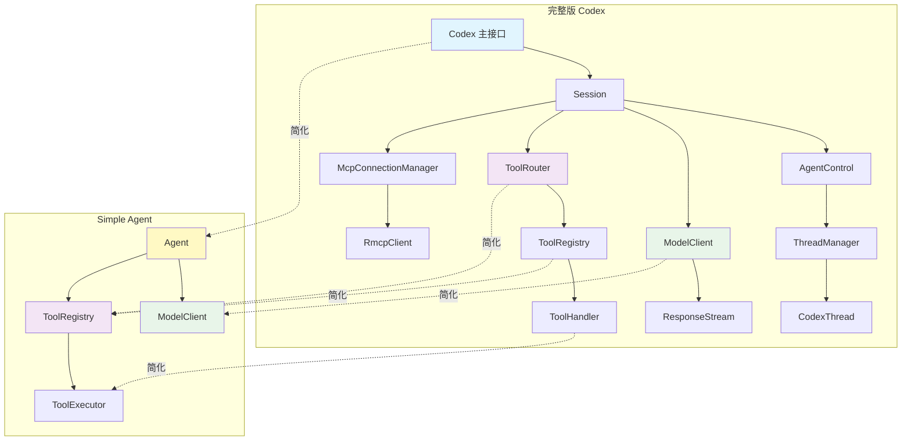
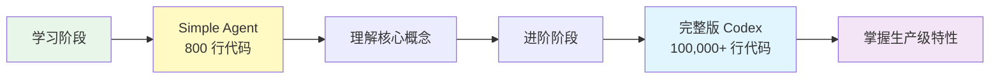

# Codex 智能体架构对比分析

## 目录
- [架构层次对比](#架构层次对比)
- [模块映射关系](#模块映射关系)
- [核心实现差异](#核心实现差异)
- [代码示例对比](#代码示例对比)

## 架构层次对比



## 模块映射关系

| 完整版 Codex | Simple Agent | 映射关系 | 说明 |
|--------------|--------------|----------|------|
| **Codex** | `Agent` | 高层接口 | Simplified 合并了主接口和控制功能 |
| **Session** | 内嵌在 `Agent` | 会话管理 | 简化版使用内部状态管理 |
| **AgentControl** | 内嵌在 `Agent` | 智能体控制 | 功能直接集成到 Agent 中 |
| **ThreadManager** | - | 线程管理 | 简化版仅支持单智能体 |
| **ModelClient** | `ModelClient` | 模型客户端 | 简化版移除 WebSocket 支持 |
| **ToolRegistry** | `ToolRegistry` | 工具注册表 | 简化版移除动态注册 |
| **ToolHandler** | `ToolExecutor` | 工具执行器 | 功能相同的 trait |
| **McpConnectionManager** | - | MCP 连接管理 | 简化版未实现 |
| **ToolOrchestrator** | - | 工具编排 | 简化版直接执行 |
| **CodexThread** | 内嵌在 `Agent` | 智能体线程 | 单线程同步执行 |

## 核心实现差异

### 1. 消息传递机制

#### Codex: 异步事件队列

```rust:codex-rs/core/src/codex.rs
pub struct Codex {
    pub(crate) tx_sub: Sender<Submission>,   // 提交通道
    pub(crate) rx_event: Receiver<Event>,    // 事件通道
}

// 通过队列异步通信
async fn submit(&self, op: Op) -> Result<String> {
    self.tx_sub.send(Submission { op }).await
}

async fn next_event(&self) -> Result<Event> {
    self.rx_event.recv().await
}
```

#### Simple Agent: 同步方法调用

```rust:codex/code/example/ai-agent/src/agent.rs
pub struct Agent {
    state: Arc<RwLock<AgentState>>,
}

// 直接方法调用
pub async fn process_message(&mut self, user_input: &str) -> Result<String> {
    // 同步执行，无需队列
    self.run_agent_loop(user_input).await
}
```

### 2. 大模型访问

#### Codex: 流式响应

```rust:codex-rs/core/src/client.rs
impl ModelClientSession {
    pub async fn stream(&mut self, prompt: &Prompt) -> Result<ResponseStream> {
        match self.state.provider.wire_api {
            WireApi::Responses => self.stream_responses_api(prompt).await,
            WireApi::ResponsesWebsocket => self.stream_responses_websocket(prompt).await,
            WireApi::Chat => {
                // 聚合或流式处理
                let stream = self.stream_chat_completions(prompt).await?;
                Ok(map_response_stream(stream.aggregate(), ...))
            }
        }
    }
}
```

#### Simple Agent: 单次请求

```rust:codex/code/example/ai-agent/src/client.rs
pub async fn chat_completion(
    &self,
    messages: Vec<Value>,
    tools: Option<Vec<Value>>,
) -> Result<ChatResponse, anyhow::Error> {
    let response = self.client.post(url).json(&body).send().await?;
    let response_json: Value = response.json().await?;
    self.parse_response(response_json)  // 单次解析
}
```

### 3. 工具系统

#### Codex: 完整工具注册表

```rust:codex-rs/core/src/tools/registry.rs
pub struct ToolRegistry {
    handlers: HashMap<String, Arc<dyn ToolHandler>>,
}

pub trait ToolHandler: Send + Sync {
    fn kind(&self) -> ToolKind;
    async fn handle(&self, invocation: ToolInvocation) 
        -> Result<ToolOutput, FunctionCallError>;
}

// 支持工具门控和类型检查
pub async fn dispatch(&self, invocation: ToolInvocation) -> Result<ResponseInputItem, FunctionCallError> {
    let handler = self.handler(tool_name.as_ref())?;
    
    if handler.is_mutating(&invocation).await {
        invocation.turn.tool_call_gate.wait_ready().await;
    }
    
    handler.handle(invocation).await
}
```

#### Simple Agent: 简化工具注册表

```rust:codex/code/example/ai-agent/src/tools.rs
pub struct ToolRegistry {
    tools: HashMap<String, Box<dyn ToolExecutor>>,
}

pub trait ToolExecutor: Send + Sync {
    async fn execute(&self, arguments: serde_json::Value) 
        -> Result<String, Box<dyn std::error::Error + Send>>;
}

// 直接执行，无门控
pub async fn execute(&self, call: &ToolCall) -> Result<ToolResult, String> {
    let executor = self.get(&call.name)?;
    let result = executor.execute(call.arguments.clone()).await?;
    Ok(ToolResult {
        tool_call_id: call.id.clone(),
        content: result,
    })
}
```

### 4. MCP 集成

#### Codex: 完整 MCP 支持

```rust:codex-rs/core/src/mcp_connection_manager.rs
pub struct McpConnectionManager {
    clients: Arc<Mutex<HashMap<String, RmcpClient>>>,
}

// 工具名限定符处理
fn qualify_tools<I>(tools: I) -> HashMap<String, ToolInfo> {
    let qualified_name = format!("mcp__{}__{}", server_name, tool_name);
    qualified_tools.insert(qualified_name, tool);
}

// OAuth 认证管理
struct ElicitationRequestManager {
    requests: Arc<Mutex<ResponderMap>>,
}
```

#### Simple Agent: 未实现 MCP

```rust
// 简化版完全移除 MCP 支持
// 工具系统仅支持本地工具
```

## 代码示例对比

### 智能体循环

#### Codex 版本

```rust
// 在 CodexThread 中
loop {
    // 从事件通道读取
    let event = self.next_event().await?;
    
    match event.msg {
        EventMsg::TurnStarted => {
            // 构建请求
            let prompt = self.build_prompt();
            
            // 流式处理
            let stream = self.client.stream(&prompt).await?;
            while let Some(event) = stream.next().await {
                match event {
                    ResponseEvent::ContentDelta { delta } => {
                        // 发送内容增量
                        self.emit_item(Item::Text { content: delta });
                    }
                    ResponseEvent::ToolCall { call_id, tool, args } => {
                        // 调度工具
                        let result = self.tool_router.dispatch(invocation).await?;
                        // 将结果反馈给模型
                        self.emit_item(result);
                    }
                    ResponseEvent::TurnComplete => {
                        break;
                    }
                }
            }
        }
    }
}
```

#### Simple Agent 版本

```rust
pub async fn run_agent_loop(&mut self, initial_input: &str) -> Result<String> {
    loop {
        // 获取工具定义
        let tools_json = self.tool_registry.list_definitions();
        
        // 单次请求
        let response = self.model_client
            .chat_completion(messages, Some(tools_json))
            .await?;
        
        // 检查工具调用
        if let Some(tool_calls) = response.tool_calls {
            for call in &tool_calls {
                self.execute_tool_call(call).await?;
            }
            continue;  // 继续循环
        }
        
        return Ok(response.content);  // 返回最终回复
    }
}
```

### 工具执行

#### Codex 版本（带沙箱和审批）

```rust:codex-rs/core/src/tools/orchestrator.rs
pub async fn run<Rq, Out, T>(
    &mut self,
    tool: &mut T,
    req: &Rq,
    tool_ctx: &ToolCtx<'_>,
    turn_ctx: &TurnContext,
    approval_policy: AskForApproval,
) -> Result<Out, ToolError>
{
    // 1) 审批
    let requirement = tool.exec_approval_requirement(req)?;
    match requirement {
        ExecApprovalRequirement::NeedsApproval { reason } => {
            let decision = tool.start_approval_async(req, approval_ctx).await?;
            if matches!(decision, ReviewDecision::Denied) {
                return Err(ToolError::Rejected(reason));
            }
        }
    }
    
    // 2) 沙箱执行
    let attempt = SandboxAttempt {
        sandbox: self.sandbox.select_initial(&policy),
        ...
    };
    
    match tool.run(req, &attempt, tool_ctx).await {
        Ok(out) => Ok(out),
        Err(ToolError::Codex(CodexErr::Sandbox(SandboxErr::Denied { output }))) => {
            // 3) 无沙箱重试
            let escalated = SandboxAttempt {
                sandbox: SandboxType::None,
                ...
            };
            tool.run(req, &escalated, tool_ctx).await
        }
    }
}
```

#### Simple Agent 版本（直接执行）

```rust:codex/code/example/ai-agent/src/tools.rs
pub async fn execute(&self, call: &ToolCall) -> Result<ToolResult, String> {
    let executor = self.get(&call.name)?;
    
    // 直接执行，无沙箱
    let result = executor.execute(call.arguments.clone()).await?;
    
    Ok(ToolResult {
        tool_call_id: call.id.clone(),
        content: result,
    })
}
```

## 复杂度对比

| 特性 | Codex 复杂度 | Simple Agent 复杂度 | 简化比例 |
|------|---------------|------------------|----------|
| **代码行数** | ~100,000+ | ~800 | ~99.2% |
| **依赖数量** | 50+ crates | 8 crates | 84% |
| **模块数量** | 20+ modules | 5 modules | 75% |
| **异步复杂度** | 高（多通道、任务） | 低（单任务） | 80% |
| **工具系统** | 完整（沙箱、审批、门控） | 简化（直接执行） | 85% |
| **MCP 支持** | 完整（OAuth、限定符） | 无 | 100% |
| **测试覆盖** | 高（单元+集成） | 低（基础测试） | 70% |

## 学习价值

### 从 Simple Agent 可以学到什么

1. **核心设计模式**：
   - 工具系统的 trait 设计
   - 智能体循环的基本结构
   - 状态管理的并发模式

2. **Rust 异步编程**：
   - `async/await` 的使用
   - `Arc<RwLock>` 共享状态
   - `tokio::spawn` 任务管理

3. **与大模型集成**：
   - 工具调用格式
   - 对话历史管理
   - 流式响应处理

### 从 Codex 可以学到什么

1. **生产级架构**：
   - 事件驱动设计
   - 多智能体管理
   - 可观测性（OpenTelemetry）

2. **高级特性**：
   - MCP 协议实现
   - 沙箱安全机制
   - WebSocket 流式处理

3. **工程质量**：
   - 完整的错误处理
   - 模块化设计
   - 测试驱动开发

## 总结

Simple Agent 是 Codex 架构的精简版本，保留了核心设计思想，但移除了生产环境的复杂特性。适合学习智能体的基本概念和工作原理。要构建生产级智能体系统，建议深入研究完整版 Codex 的实现。


