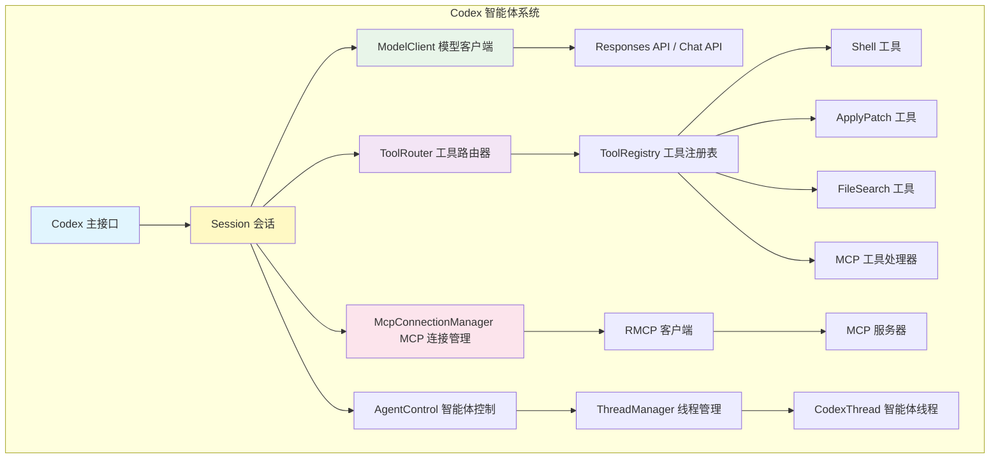
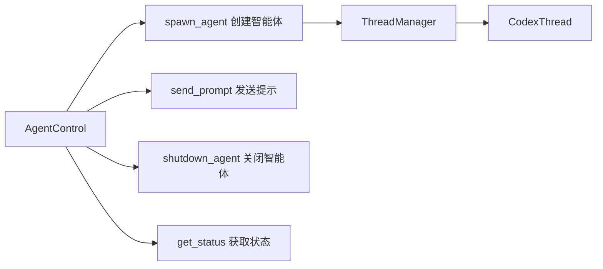
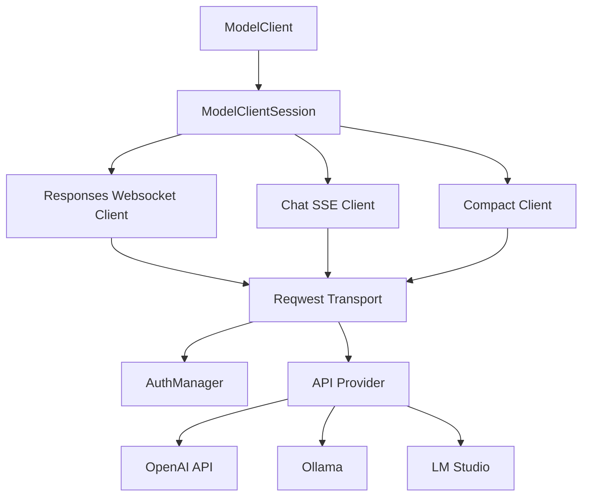
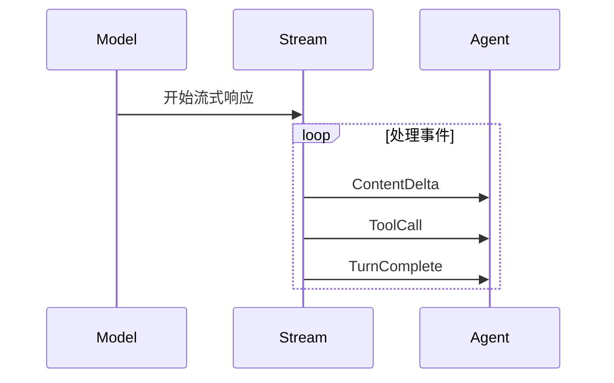
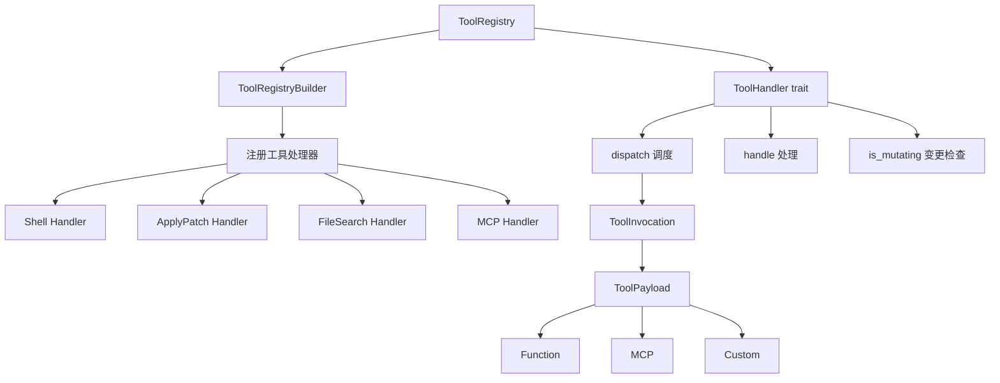
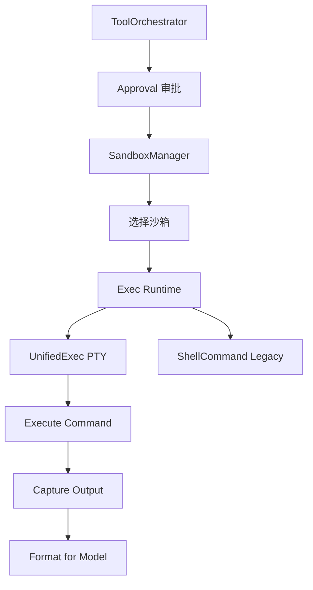
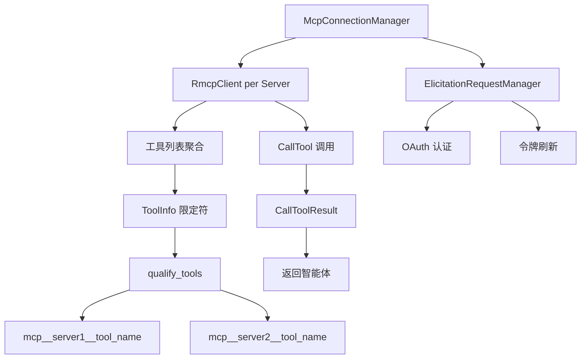
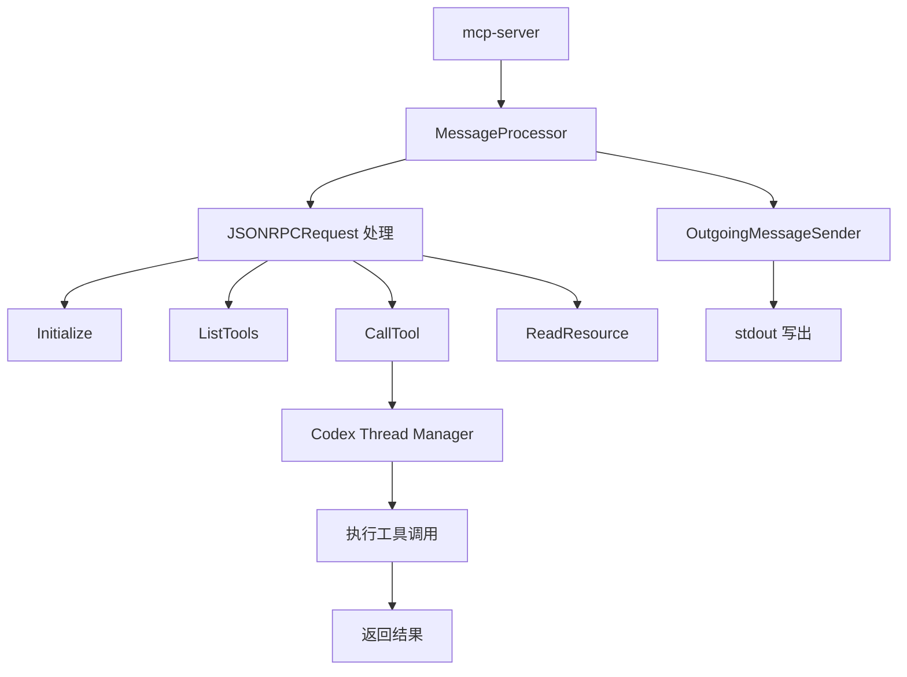
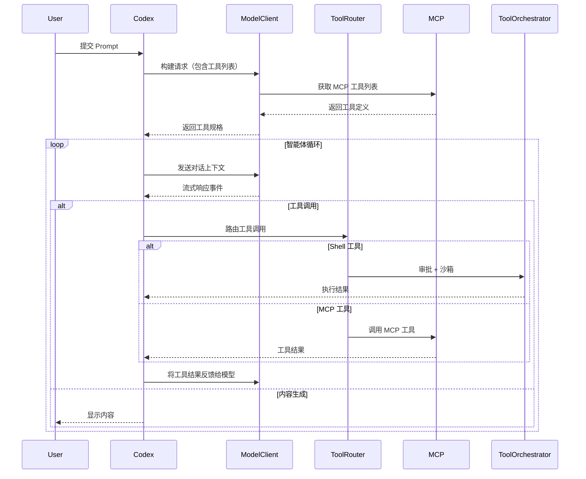
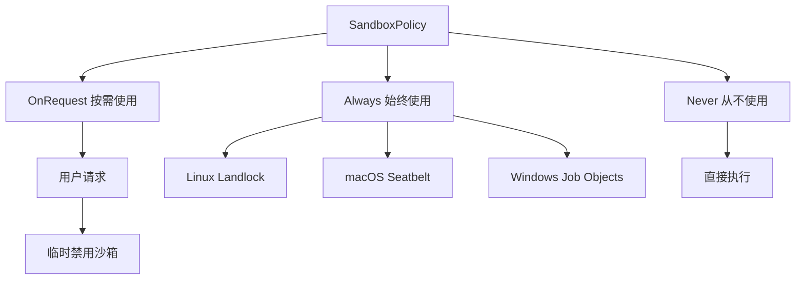

# Codex AI 智能体实现文档

## 目录
- [架构概览](#架构概览)
- [核心模块](#核心模块)
- [大模型访问](#大模型访问)
- [工具调用系统](#工具调用系统)
- [MCP 集成](#mcp-集成)
- [工作流程](#工作流程)

## 架构概览



## 核心模块

### 1. Codex 主接口

`Codex` 是智能体的高层接口，通过队列系统提交请求并接收事件。

**核心数据结构：**

```rust:codex-rs/core/src/codex.rs
pub struct Codex {
    pub(crate) next_id: AtomicU64,
    pub(crate) tx_sub: Sender<Submission>,  // 提交通道
    pub(crate) rx_event: Receiver<Event>,   // 事件通道
    pub(crate) agent_status: watch::Receiver<AgentStatus>,
}
```

**关键功能：**
- 异步消息队列机制：使用 `async-channel` 实现提交/事件队列
- 智能体状态追踪：通过 `AgentStatus` 追踪运行状态
- 会话生命周期管理：管理多个会话实例

### 2. 智能体控制 (AgentControl)



**核心代码：**

```rust:codex-rs/core/src/agent/control.rs
pub(crate) struct AgentControl {
    /// Weak handle back to the global thread registry/state
    manager: Weak<ThreadManagerState>,
}

impl AgentControl {
    pub(crate) async fn spawn_agent(
        &self,
        config: crate::config::Config,
        prompt: String,
        headless: bool,
    ) -> CodexResult<ThreadId> {
        let state = self.upgrade()?;
        let new_thread = state.spawn_new_thread(config, self.clone()).await?;
        
        if headless {
            spawn_headless_drain(Arc::clone(&new_thread.thread));
        }
        
        self.send_prompt(new_thread.thread_id, prompt).await?;
        Ok(new_thread.thread_id)
    }
}
```

**关键方法：**
- `spawn_agent`: 创建新的智能体实例并提交初始提示
- `send_prompt`: 向现有智能体发送用户消息
- `shutdown_agent`: 关闭指定智能体
- `get_status`: 获取智能体状态
- `subscribe_status`: 订阅状态变化

## 大模型访问

### 模型客户端架构



### 核心实现

**ModelClient 数据结构：**

```rust:codex-rs/core/src/client.rs
pub struct ModelClient {
    state: Arc<ModelClientState>,
}

pub struct ModelClientState {
    config: Arc<Config>,
    auth_manager: Option<Arc<AuthManager>>,
    model_info: ModelInfo,
    otel_manager: OtelManager,
    provider: ModelProviderInfo,
    conversation_id: ThreadId,
    effort: Option<ReasoningEffortConfig>,
    summary: ReasoningSummaryConfig,
    session_source: SessionSource,
}
```

**提示词构建：**

```rust:codex-rs/core/src/client_common.rs
pub struct Prompt {
    /// Conversation context input items
    pub input: Vec<ResponseItem>,
    
    /// Tools available to model, including external MCP tools
    pub(crate) tools: Vec<ToolSpec>,
    
    /// Whether parallel tool calls are permitted
    pub(crate) parallel_tool_calls: bool,
    
    /// Optional override for built-in BASE_INSTRUCTIONS
    pub base_instructions_override: Option<String>,
    
    /// Optional output schema for model's response
    pub output_schema: Option<Value>,
}
```

**流式响应处理：**

Codex 支持三种 API 传输方式：

1. **Responses API (WebSocket)** - 最新的 OpenAI API，支持流式响应
2. **Chat Completions API (SSE)** - 标准 OpenAI Chat API
3. **Compact API** - 用于对话历史压缩

```rust:codex-rs/core/src/client.rs
impl ModelClientSession {
    pub async fn stream(&mut self, prompt: &Prompt) -> Result<ResponseStream> {
        match self.state.provider.wire_api {
            WireApi::Responses => self.stream_responses_api(prompt).await,
            WireApi::ResponsesWebsocket => self.stream_responses_websocket(prompt).await,
            WireApi::Chat => {
                let api_stream = self.stream_chat_completions(prompt).await?;
                if self.state.config.show_raw_agent_reasoning {
                    Ok(map_response_stream(api_stream.streaming_mode(), ...))
                } else {
                    Ok(map_response_stream(api_stream.aggregate(), ...))
                }
            }
        }
    }
}
```

### 事件流处理



## 工具调用系统

### 工具注册表架构



### 核心实现

**ToolHandler trait：**

```rust:codex-rs/core/src/tools/registry.rs
#[async_trait]
pub trait ToolHandler: Send + Sync {
    fn kind(&self) -> ToolKind;
    
    fn matches_kind(&self, payload: &ToolPayload) -> bool {
        matches!(
            (self.kind(), payload),
            (ToolKind::Function, ToolPayload::Function { .. })
                | (ToolKind::Mcp, ToolPayload::Mcp { .. })
        )
    }
    
    async fn is_mutating(&self, _invocation: &ToolInvocation) -> bool {
        false
    }
    
    async fn handle(&self, invocation: ToolInvocation) 
        -> Result<ToolOutput, FunctionCallError>;
}
```

**工具调度：**

```rust:codex-rs/core/src/tools/registry.rs
impl ToolRegistry {
    pub async fn dispatch(
        &self,
        invocation: ToolInvocation,
    ) -> Result<ResponseInputItem, FunctionCallError> {
        let tool_name = invocation.tool_name.clone();
        let call_id_owned = invocation.call_id.clone();
        
        // 获取工具处理器
        let handler = match self.handler(tool_name.as_ref()) {
            Some(handler) => handler,
            None => {
                let message = unsupported_tool_call_message(&invocation.payload, tool_name.as_ref());
                return Err(FunctionCallError::RespondToModel(message));
            }
        };
        
        // 检查类型匹配
        if !handler.matches_kind(&invocation.payload) {
            return Err(FunctionCallError::Fatal("incompatible payload".to_string()));
        }
        
        // 等待工具门控（用于变更操作）
        if handler.is_mutating(&invocation).await {
            invocation.turn.tool_call_gate.wait_ready().await;
        }
        
        // 执行工具调用
        match handler.handle(invocation).await {
            Ok(output) => Ok(output.into_response(&call_id_owned, &invocation.payload)),
            Err(err) => Err(err),
        }
    }
}
```

### Shell 工具实现

**工具规范生成：**

```rust:codex-rs/core/src/tools/spec.rs
fn create_exec_command_tool() -> ToolSpec {
    let properties = BTreeMap::from([
        ("cmd".to_string(), JsonSchema::String {
            description: Some("Shell command to execute.".to_string()),
        }),
        ("workdir".to_string(), JsonSchema::String {
            description: Some(
                "Optional working directory to run command in; defaults to turn cwd."
                    .to_string(),
            ),
        }),
        // ... 更多参数
    ]);
    
    ToolSpec::Freeform(FreeformTool {
        name: "shell".to_string(),
        description: "Execute a shell command".to_string(),
        parameters: JsonSchema::Object {
            properties,
            required: vec!["cmd".to_string()],
            additional_properties: Some(AdditionalProperties::Boolean(false)),
        },
    })
}
```

### 工具编排器



**核心逻辑：**

```rust:codex-rs/core/src/tools/orchestrator.rs
pub(crate) struct ToolOrchestrator {
    sandbox: SandboxManager,
}

pub async fn run<Rq, Out, T>(
    &mut self,
    tool: &mut T,
    req: &Rq,
    tool_ctx: &ToolCtx<'_>,
    turn_ctx: &TurnContext,
    approval_policy: AskForApproval,
) -> Result<Out, ToolError>
where
    T: ToolRuntime<Rq, Out>,
{
    // 1) Approval - 审批流程
    let requirement = tool.exec_approval_requirement(req)
        .unwrap_or_else(|| default_exec_approval_requirement(
            approval_policy, 
            &turn_ctx.sandbox_policy
        ));
    
    match requirement {
        ExecApprovalRequirement::NeedsApproval { reason, .. } => {
            let approval_ctx = ApprovalCtx {
                session: tool_ctx.session,
                turn: turn_ctx,
                call_id: &tool_ctx.call_id,
                retry_reason: reason,
            };
            let decision = tool.start_approval_async(req, approval_ctx).await;
            
            match decision {
                ReviewDecision::Denied | ReviewDecision::Abort => {
                    return Err(ToolError::Rejected("rejected by user".to_string()));
                }
                ReviewDecision::Approved => { /* 继续 */ }
            }
        }
    }
    
    // 2) 尝试执行（带沙箱）
    let initial_attempt = SandboxAttempt {
        sandbox: initial_sandbox,
        policy: &turn_ctx.sandbox_policy,
        manager: &self.sandbox,
        sandbox_cwd: &turn_ctx.cwd,
    };
    
    match tool.run(req, &initial_attempt, tool_ctx).await {
        Ok(out) => Ok(out),
        Err(ToolError::Codex(CodexErr::Sandbox(SandboxErr::Denied { output }))) => {
            // 3) 沙箱拒绝，尝试无沙箱执行
            let escalated_attempt = SandboxAttempt {
                sandbox: crate::exec::SandboxType::None,
                ...
            };
            tool.run(req, &escalated_attempt, tool_ctx).await
        }
        other => other,
    }
}
```

## MCP 集成

### MCP 连接管理器



**核心实现：**

```rust:codex-rs/core/src/mcp_connection_manager.rs
pub struct McpConnectionManager {
    clients: Arc<Mutex<HashMap<String, RmcpClient>>>,
    startup_timeout: Duration,
    tool_timeout: Duration,
}
```

### 工具限定符处理

将 MCP 服务器的工具名转换为完全限定符，符合 Responses API 要求：

```rust:codex-rs/core/src/mcp_connection_manager.rs
fn qualify_tools<I>(tools: I) -> HashMap<String, ToolInfo>
where
    I: IntoIterator<Item = ToolInfo>,
{
    let mut qualified_tools = HashMap::new();
    
    for tool in tools {
        // 构建完全限定工具名: mcp__server__tool
        let qualified_name_raw = format!(
            "mcp{}{}{}{}",
            MCP_TOOL_NAME_DELIMITER, 
            tool.server_name, 
            MCP_TOOL_NAME_DELIMITER, 
            tool.tool_name
        );
        
        // 清理名称以符合 Responses API 要求
        let mut qualified_name = sanitize_responses_api_tool_name(&qualified_name_raw);
        
        // 长度限制处理（最大64字符）
        if qualified_name.len() > MAX_TOOL_NAME_LENGTH {
            let sha1_str = sha1_hex(&qualified_name_raw);
            let prefix_len = MAX_TOOL_NAME_LENGTH - sha1_str.len();
            qualified_name = format!("{}{}", &qualified_name[..prefix_len], sha1_str);
        }
        
        qualified_tools.insert(qualified_name, tool);
    }
    
    qualified_tools
}
```

### MCP 工具处理器

```rust:codex-rs/core/src/tools/handlers/mcp.rs
pub struct McpHandler;

#[async_trait]
impl ToolHandler for McpHandler {
    fn kind(&self) -> ToolKind {
        ToolKind::Mcp
    }
    
    async fn handle(&self, invocation: ToolInvocation) 
        -> Result<ToolOutput, FunctionCallError> {
        let (server, tool, raw_arguments) = match invocation.payload {
            ToolPayload::Mcp { server, tool, raw_arguments } => {
                (server, tool, raw_arguments)
            }
            _ => return Err(FunctionCallError::RespondToModel(
                "mcp handler received unsupported payload".to_string()
            )),
        };
        
        // 调用 MCP 工具
        let response = handle_mcp_tool_call(
            session.as_ref(),
            turn.as_ref(),
            call_id.clone(),
            server,
            tool,
            arguments_str,
        ).await;
        
        // 转换响应
        match response {
            codex_protocol::models::ResponseInputItem::McpToolCallOutput { result, .. } => {
                Ok(ToolOutput::Mcp { result })
            }
            _ => Err(FunctionCallError::RespondToModel(
                "mcp handler received unexpected response variant".to_string()
            )),
        }
    }
}
```

### MCP 服务器实现



**消息处理：**

```rust:codex-rs/mcp-server/src/message_processor.rs
pub(crate) struct MessageProcessor {
    outgoing: Arc<OutgoingMessageSender>,
    initialized: bool,
    codex_linux_sandbox_exe: Option<PathBuf>,
    thread_manager: Arc<ThreadManager>,
    running_requests_id_to_codex_uuid: Arc<Mutex<HashMap<RequestId, ThreadId>>>,
}

pub(crate) async fn process_request(&mut self, request: JSONRPCRequest) {
    let client_request = McpClientRequest::try_from(request)?;
    
    match client_request {
        McpClientRequest::InitializeRequest(params) => {
            self.handle_initialize(request_id, params).await;
        }
        McpClientRequest::ListToolsRequest(params) => {
            self.handle_list_tools(request_id, params).await;
        }
        McpClientRequest::CallToolRequest(params) => {
            self.handle_call_tool(request_id, params).await;
        }
        // ... 更多请求类型
    }
}
```

## 工作流程

### 智能体执行流程



### 数据流

**提交到智能体：**

```rust:codex-rs/protocol/src/protocol.rs
pub enum Op {
    ConfigureSession { ... },
    UserInput { 
        items: Vec<UserInput>,
        final_output_json_schema: Option<Value>,
    },
    UserTurn { ... },
    ApprovalResponse { ... },
    Shutdown { },
}
```

**智能体到用户事件：**

```rust:codex-rs/protocol/src/protocol.rs
pub enum EventMsg {
    SessionConfigured(SessionConfiguredEvent),
    TurnStarted(TurnStartedEvent),
    ItemStarted(ItemStartedEvent),
    ItemCompleted(ItemCompletedEvent),
    TurnComplete(TurnCompleteEvent),
    ExecApprovalRequest(ExecApprovalRequestEvent),
    ApplyPatchApprovalRequest(ApplyPatchApprovalRequestEvent),
    Error(ErrorEvent),
    // ... 更多事件类型
}
```

## 安全与沙箱

### 沙箱策略



### 审批策略

```rust:codex-rs/protocol/src/protocol.rs
pub enum AskForApproval {
    Always,
    Never,
    OnFirstUse,
}

pub enum ExecPolicy {
    AlwaysApprove,
    AlwaysDeny,
    Ask,
}
```

## 总结

### 核心模块对比

| 模块 | 职责 | 关键类型 |
|------|------|----------|
| **Codex** | 智能体主接口 | `Codex`, `CodexSpawnOk` |
| **AgentControl** | 智能体生命周期管理 | `AgentControl`, `ThreadManager` |
| **ModelClient** | 大模型访问 | `ModelClient`, `ModelClientSession` |
| **ToolRouter** | 工具路由分发 | `ToolRegistry`, `ToolHandler` |
| **McpConnectionManager** | MCP 连接管理 | `McpConnectionManager`, `RmcpClient` |
| **ToolOrchestrator** | 工具执行编排 | `ToolOrchestrator`, `SandboxManager` |

### 关键特性

1. **异步事件驱动**：使用 async-channel 实现提交/事件队列
2. **模块化工具系统**：通过 `ToolHandler` trait 实现可扩展的工具生态
3. **MCP 集成**：支持外部 MCP 服务器的工具和资源
4. **安全沙箱**：跨平台的沙箱执行机制
5. **流式处理**：支持大模型的流式响应和工具调用的实时反馈
6. **多智能体支持**：通过 `ThreadManager` 管理多个智能体实例

### 核心代码路径

```
codex-rs/
├── core/src/
│   ├── codex.rs              # 智能体主实现
│   ├── agent/
│   │   ├── control.rs        # 智能体控制
│   │   └── status.rs        # 状态管理
│   ├── client.rs            # 模型客户端
│   ├── mcp_connection_manager.rs  # MCP 连接
│   └── tools/
│       ├── registry.rs      # 工具注册
│       ├── orchestrator.rs  # 工具编排
│       ├── spec.rs         # 工具规范
│       └── handlers/       # 工具处理器
│           ├── mcp.rs       # MCP 处理器
│           ├── shell.rs     # Shell 处理器
│           └── apply_patch.rs  # 补丁处理
├── mcp-server/src/
│   ├── message_processor.rs # MCP 消息处理
│   └── codex_tool_runner.rs # 工具运行器
└── protocol/src/
    └── protocol.rs         # 协议定义
```

这个架构设计使得 Codex 能够灵活地集成各种大模型、工具和 MCP 服务，同时保持良好的可扩展性和安全性。
