# Codex CLI 架构分析文档


## 目录

- [1. 项目概述](#1-项目概述)
- [2. 整体架构](#2-整体架构)
- [3. 核心模块详解](#3-核心模块详解)
- [4. 关键组件分析](#4-关键组件分析)
- [5. 设计模式与最佳实践](#5-设计模式与最佳实践)
- [6. 安全机制](#6-安全机制)
- [7. 扩展机制](#7-扩展机制)
- [8. 数据流与通信](#8-数据流与通信)
- [9. 总结与思考](#9-总结与思考)

---

## 1. 项目概述

### 1.1 什么是 Codex CLI

Codex CLI 是 OpenAI 开发的本地运行的编码代理（coding agent），它结合了大语言模型的推理能力和实际执行代码的能力。用户可以通过自然语言与 Codex 交互，让它帮助完成各种编程任务。

**核心特性**：
- 本地运行，零依赖安装
- 支持多种 AI 模型提供商
- 沙箱执行环境，确保安全性
- 支持 Model Context Protocol (MCP)
- 多模态支持（文本、图像）
- 完整的 Git 集成

### 1.2 技术栈

**双语言实现**：
- **TypeScript** (Legacy): `codex-cli/` 目录，历史遗留实现
- **Rust** (Current): `codex-rs/` 目录，当前主要维护版本

**Rust 技术栈**：
- **UI**: Ratatui (终端用户界面)
- **异步运行时**: Tokio
- **HTTP 客户端**: Reqwest
- **配置**: TOML (serde)
- **沙箱**: Seatbelt (macOS), Landlock (Linux), Windows Sandbox
- **协议**: JSON-RPC, Server-Sent Events (SSE)
- **日志**: Tracing + OpenTelemetry

---

## 2. 整体架构

### 2.1 架构层次

Codex CLI 采用分层架构设计，从下到上包括：

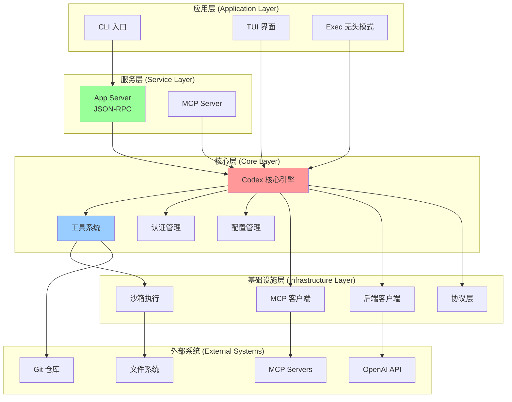

### 2.2 Cargo Workspace 结构

Codex Rust 实现采用 Cargo workspace 组织，包含 40+ 个 crate：

```
codex-rs/
├── core/              # 核心业务逻辑 (最重要)
├── tui/               # 终端 UI (Ratatui)
├── cli/               # CLI 多工具入口
├── exec/              # 无头执行模式
├── app-server/        # JSON-RPC 应用服务器
├── mcp-server/        # MCP 服务器实现
├── protocol/          # 内部协议定义
├── app-server-protocol/  # JSON-RPC 协议
├── backend-client/    # OpenAI API 客户端
├── rmcp-client/       # MCP 客户端封装
├── mcp-types/         # MCP 类型定义
├── process-hardening/ # 进程加固
├── linux-sandbox/     # Linux 沙箱
├── execpolicy/        # 执行策略
├── file-search/       # 文件搜索 (fuzzy)
├── git/               # Git 工具
├── keyring-store/     # 密钥环存储
├── login/             # 登录流程
├── feedback/          # 用户反馈
├── otel/              # OpenTelemetry
├── apply-patch/       # 补丁应用
├── ansi-escape/       # ANSI 转义处理
└── utils/             # 工具类
    ├── cache/
    ├── image/
    ├── pty/
    ├── string/
    └── ...
```

---

## 3. 核心模块详解

### 3.1 Core 模块 (`codex-core`)

Core 是整个系统的心脏，提供核心业务逻辑。

#### 3.1.1 Codex 结构

```rust
pub struct Codex {
    next_id: AtomicU64,
    tx_sub: Sender<Submission>,   // 提交通道
    rx_event: Receiver<Event>,     // 事件通道
}
```

**通信模型**：
- 使用 async-channel 实现双向通信
- **Submission** (输入): 用户的操作请求
- **Event** (输出): 系统的响应事件

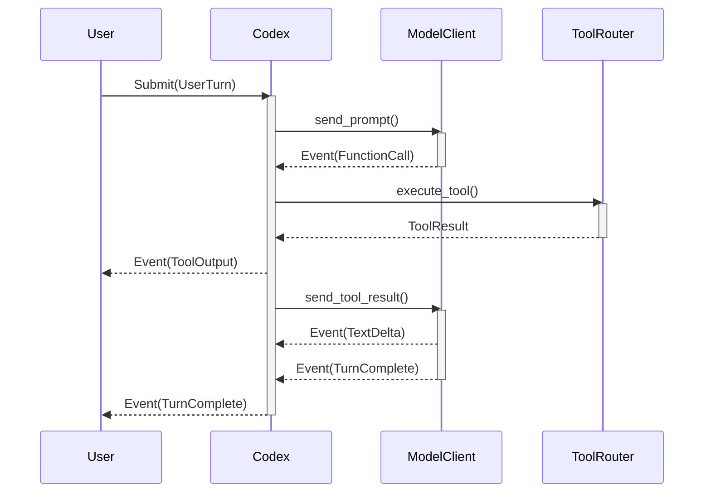

#### 3.1.2 Session 管理

每个 Codex 实例对应一个 Session，包含：

```rust
struct Session {
    configuration: SessionConfiguration,
    state: Arc<RwLock<SessionState>>,
    services: Arc<SessionServices>,
    // ...
}

struct SessionState {
    active_turn: Option<ActiveTurn>,
    conversation_history: Vec<Message>,
    context_manager: ContextManager,
    // ...
}

struct SessionServices {
    model_client: Arc<dyn ModelClient>,
    tool_router: Arc<ToolRouter>,
    mcp_manager: Arc<McpConnectionManager>,
    rollout_recorder: Arc<RolloutRecorder>,
    // ...
}
```

**生命周期**：
1. `Codex::spawn()` 创建新 Session
2. 初始化配置、加载用户指令
3. 启动事件循环处理 Submission
4. 维护对话历史和上下文
5. 优雅关闭和清理

### 3.2 App Server (`codex-app-server`)

App Server 是一个 JSON-RPC 服务器，用于 IDE 集成（VS Code、Cursor 等）。

#### 架构设计

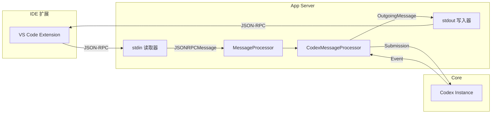

**特点**：
- 基于 stdio 的 JSON-RPC 通信
- 无状态协议，所有状态在 Core 中
- 支持多个并发对话
- 与 IDE 解耦，易于测试

### 3.3 TUI (`codex-tui`)

TUI 提供终端交互界面，基于 Ratatui 构建。

#### 组件结构

```
tui/src/
├── app.rs              # 主应用状态机
├── chatwidget.rs       # 聊天窗口部件
├── bottom_pane/        # 底部面板
│   ├── input.rs        # 用户输入
│   ├── approval.rs     # 审批界面
│   └── ...
├── exec_cell/          # 执行单元格
├── diff_render.rs      # Diff 渲染
├── custom_terminal.rs  # 终端定制
└── ...
```

**渲染流程**：

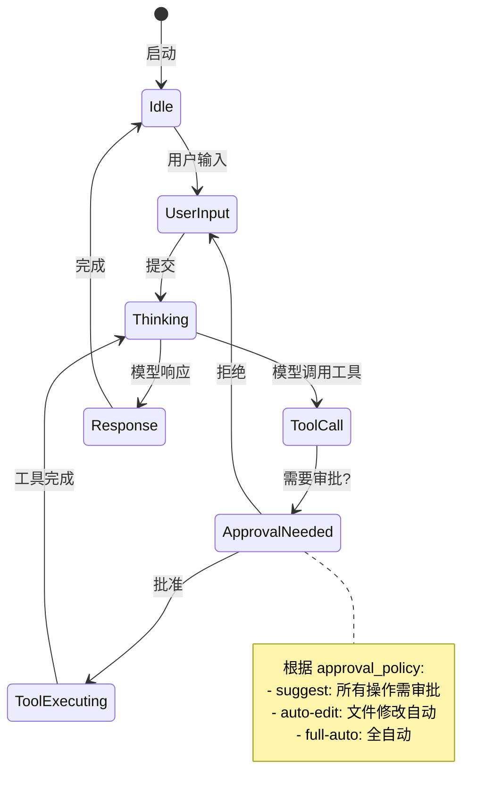

### 3.4 工具系统 (`core/src/tools/`)

工具系统是 Codex 与外部世界交互的桥梁。

#### 工具架构

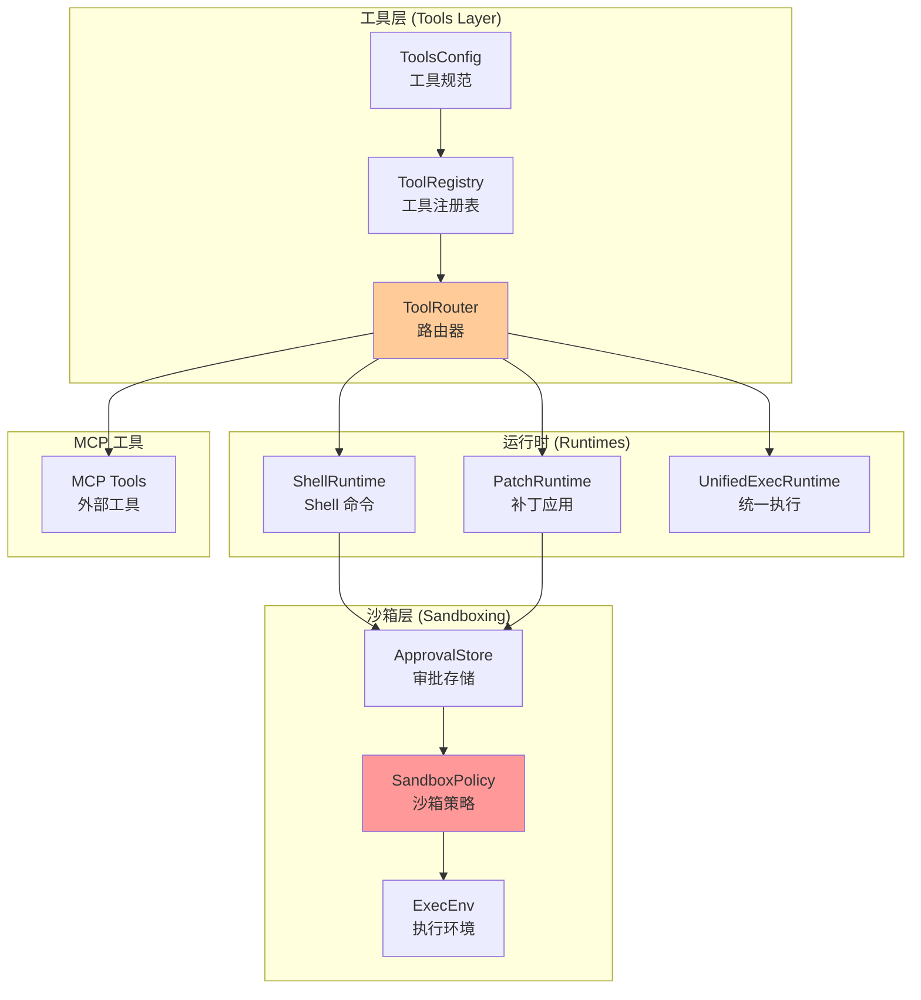

#### 内置工具

| 工具名称 | 描述 | 审批策略 |
|---------|------|---------|
| `shell` | 执行 shell 命令 | 默认需审批 |
| `apply_patch` | 应用文件补丁 | auto-edit 自动 |
| `read_file` | 读取文件 | 无需审批 |
| `list_files` | 列出文件 | 无需审批 |
| `mcp_*` | MCP 工具 | 根据配置 |

#### 工具执行流程

```rust
// 简化的工具执行流程
async fn execute_tool(
    router: &ToolRouter,
    call: FunctionCall,
    context: &ToolContext,
) -> Result<ToolOutput> {
    // 1. 查找工具
    let tool = router.find_tool(&call.name)?;

    // 2. 检查审批
    if needs_approval(&tool, &context) {
        request_approval(&call).await?;
    }

    // 3. 应用沙箱策略
    let sandbox = get_sandbox_policy(&context);

    // 4. 执行工具
    let result = tool.execute(call.args, sandbox).await?;

    // 5. 返回结果
    Ok(result)
}
```

---

## 4. 关键组件分析

### 4.1 认证系统 (`core/src/auth.rs`)

Codex 支持多种认证方式：

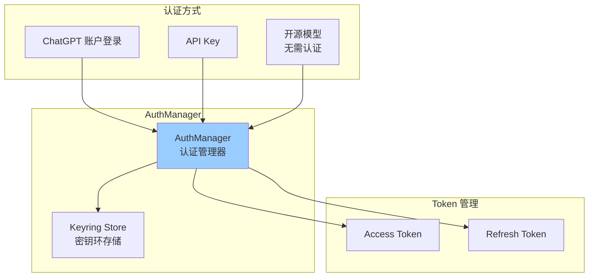

**认证流程**：
1. 首次运行：提示用户选择认证方式
2. ChatGPT 登录：打开浏览器授权，获取 token
3. Token 存储：使用系统 keyring 安全存储
4. 自动刷新：在 token 过期前自动刷新

### 4.2 配置系统 (`core/src/config/`)

#### 配置层次


#### 配置结构

```toml
# ~/.codex/config.toml 示例

# 模型配置
model = "o4-mini"
model_provider = "openai"

# 审批策略
approval_policy = "suggest"  # suggest | auto-edit | full-auto

# 沙箱策略
sandbox_policy = "read-only"  # read-only | workspace-write | danger-full-access

# MCP 服务器配置
[mcp_servers.filesystem]
command = "npx"
args = ["-y", "@modelcontextprotocol/server-filesystem", "/path/to/allowed/directory"]

[mcp_servers.github]
command = "npx"
args = ["-y", "@modelcontextprotocol/server-github"]
env = { GITHUB_TOKEN = "${GITHUB_TOKEN}" }

# 通知配置
[notify]
command = "osascript"
args = ["-e", "display notification \"${MESSAGE}\" with title \"Codex\""]
```

### 4.3 MCP 集成

#### MCP 客户端

Codex 作为 MCP 客户端，可以连接到 MCP 服务器并使用其提供的工具。

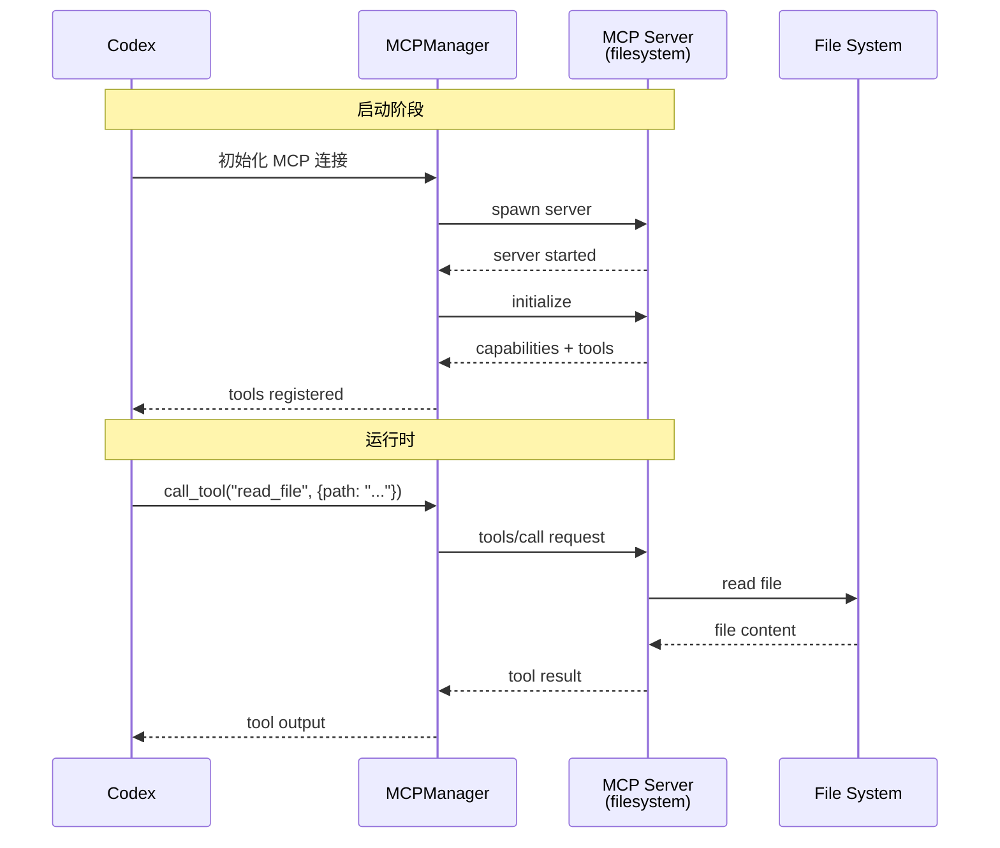

#### MCP 服务器

Codex 也可以作为 MCP 服务器运行：

```bash
# 启动 Codex 为 MCP 服务器
codex mcp-server

# 或在其他 MCP 客户端中使用
npx @modelcontextprotocol/inspector codex mcp-server
```

**提供的工具**：
- `codex_execute`: 让其他 Agent 使用 Codex 执行编程任务
- `codex_read_workspace`: 读取工作区信息
- `codex_write_file`: 写入文件（沙箱限制）

### 4.4 对话管理 (`ConversationManager`)

#### 对话持久化

```
~/.codex/sessions/
├── interactive/              # 交互式会话
│   ├── 2025-11-23/
│   │   ├── conv-uuid-1.jsonl
│   │   └── conv-uuid-2.jsonl
│   └── ...
└── archived/                 # 归档会话
    └── ...
```

**JSONL 格式**：每行一个 JSON 对象，记录：
- 用户输入
- 模型响应
- 工具调用
- 系统事件

#### 上下文管理

```rust
struct ContextManager {
    conversation_history: Vec<Message>,
    file_context: HashMap<PathBuf, FileContent>,
    mcp_resources: Vec<Resource>,
    truncation_policy: TruncationPolicy,
}
```

**上下文优化**：
- 自动截断过长历史
- 智能压缩（compact）旧消息
- 保留关键上下文（错误信息、最近修改）
- 使用 embedding 检索相关历史

---

## 5. 设计模式与最佳实践

### 5.1 Actor 模式

Codex 使用 Actor 模式实现并发和隔离：

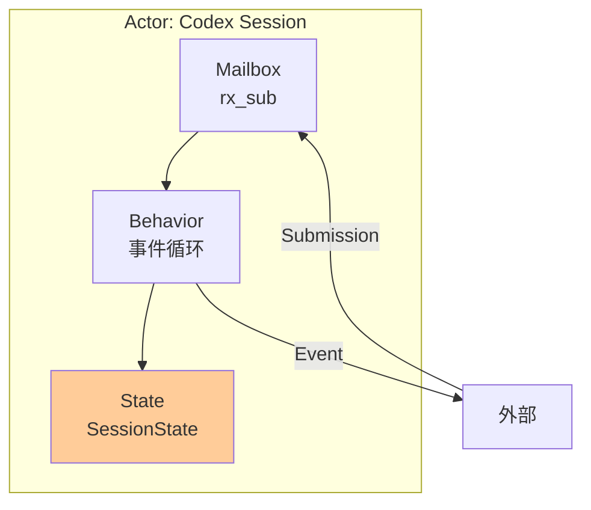

**优点**：
- 隔离可变状态，避免数据竞争
- 通过消息传递解耦组件
- 易于测试和调试

### 5.2 Event Sourcing

对话历史采用事件溯源模式：

```rust
// 所有状态变更都通过事件记录
enum Event {
    UserInput(String),
    ModelResponse(String),
    ToolCall { name: String, args: Value },
    ToolOutput { result: String },
    FileChanged { path: PathBuf, diff: String },
    // ...
}

// 可以重放事件重建状态
fn rebuild_state(events: &[Event]) -> SessionState {
    let mut state = SessionState::default();
    for event in events {
        state.apply(event);
    }
    state
}
```

**优点**：
- 完整的审计日志
- 可以回溯和重放
- 支持 undo/redo
- 易于调试

### 5.3 Builder 模式

配置和初始化使用 Builder 模式：

```rust
let config = Config::builder()
    .model("gpt-4")
    .approval_policy(ApprovalPolicy::AutoEdit)
    .sandbox_policy(SandboxPolicy::WorkspaceWrite)
    .build()?;
```

### 5.4 Strategy 模式

沙箱策略使用 Strategy 模式：

```rust
trait SandboxStrategy {
    fn should_allow(&self, operation: &Operation) -> bool;
}

struct ReadOnlySandbox;
impl SandboxStrategy for ReadOnlySandbox {
    fn should_allow(&self, op: &Operation) -> bool {
        matches!(op, Operation::Read(_))
    }
}

struct WorkspaceWriteSandbox;
impl SandboxStrategy for WorkspaceWriteSandbox {
    fn should_allow(&self, op: &Operation) -> bool {
        match op {
            Operation::Read(_) => true,
            Operation::Write(path) => path.starts_with(&workspace),
            _ => false,
        }
    }
}
```

---

## 6. 安全机制

### 6.1 多层安全防护

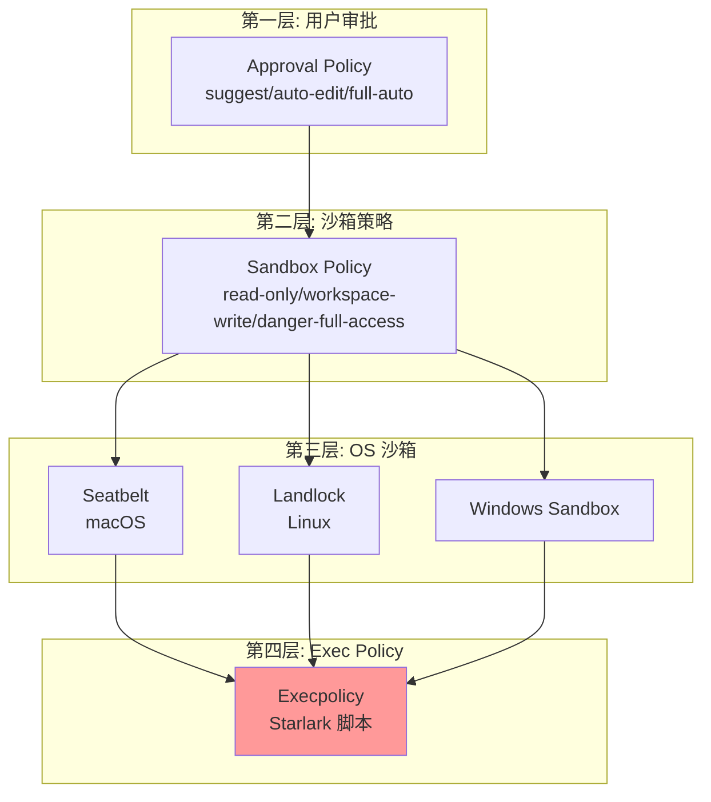

### 6.2 Seatbelt (macOS)

```scheme
;; 简化的 Seatbelt 配置
(version 1)
(deny default)

;; 允许读取
(allow file-read*)

;; 只允许写入特定目录
(allow file-write*
    (subpath "/path/to/workspace")
    (subpath (param "TMPDIR")))

;; 禁止网络访问
(deny network*)
```

### 6.3 Landlock (Linux)

```rust
// 简化的 Landlock 实现
use landlock::*;

let mut ruleset = Ruleset::new()
    .handle_access(AccessFs::ReadFile)?
    .handle_access(AccessFs::ReadDir)?;

// 添加允许写入的路径
ruleset = ruleset.add_rule(
    PathBeneath::new("/workspace", AccessFs::WriteFile)
)?;

// 应用规则集
ruleset.restrict_self()?;
```

### 6.4 Execpolicy

用户可以定义 Starlark 脚本来精细控制命令执行：

```python
# ~/.codex/execpolicy.star

def allow_command(ctx):
    # 总是允许安全的只读命令
    if ctx.command in ["ls", "cat", "grep", "find"]:
        return True

    # git 命令需要检查参数
    if ctx.command == "git":
        if ctx.args[0] in ["status", "diff", "log"]:
            return True
        if ctx.args[0] == "commit":
            # 只在工作区内允许 commit
            return ctx.cwd.startswith("/workspace")

    # 禁止危险命令
    if ctx.command in ["rm", "dd", "mkfs"]:
        return False

    # 其他命令请求用户审批
    return "ask"
```

---

## 7. 扩展机制

### 7.1 插件化工具

用户可以通过 MCP 服务器添加自定义工具：

```toml
# config.toml
[mcp_servers.my_custom_tool]
command = "node"
args = ["my-mcp-server.js"]
env = { API_KEY = "${MY_API_KEY}" }
```

```javascript
// my-mcp-server.js
import { Server } from '@modelcontextprotocol/sdk/server/index.js';

const server = new Server({
  name: 'my-custom-tool',
  version: '1.0.0',
});

server.setRequestHandler('tools/list', async () => ({
  tools: [
    {
      name: 'my_tool',
      description: 'Does something useful',
      inputSchema: {
        type: 'object',
        properties: {
          input: { type: 'string' }
        }
      }
    }
  ]
}));

server.setRequestHandler('tools/call', async (request) => {
  const { name, arguments: args } = request.params;
  if (name === 'my_tool') {
    const result = await doSomething(args.input);
    return { content: [{ type: 'text', text: result }] };
  }
});
```

### 7.2 自定义 Prompts

用户可以通过 `AGENTS.md` 定制 Agent 行为：

```markdown
<!-- ~/.codex/AGENTS.md -->

# Global Instructions

- Always use TypeScript instead of JavaScript
- Follow Airbnb style guide
- Write comprehensive tests for all new features
- Use descriptive variable names

# Code Review Guidelines

- Check for security vulnerabilities
- Ensure error handling is comprehensive
- Verify test coverage
```

### 7.3 Slash Commands

项目可以定义自定义命令：

```markdown
<!-- .codex/commands/test.md -->

Run the full test suite with coverage:

```bash
npm test -- --coverage
```

Then analyze the coverage report and suggest improvements.
```

使用：`/test` 即可触发此命令。

---

## 8. 数据流与通信

### 8.1 完整数据流

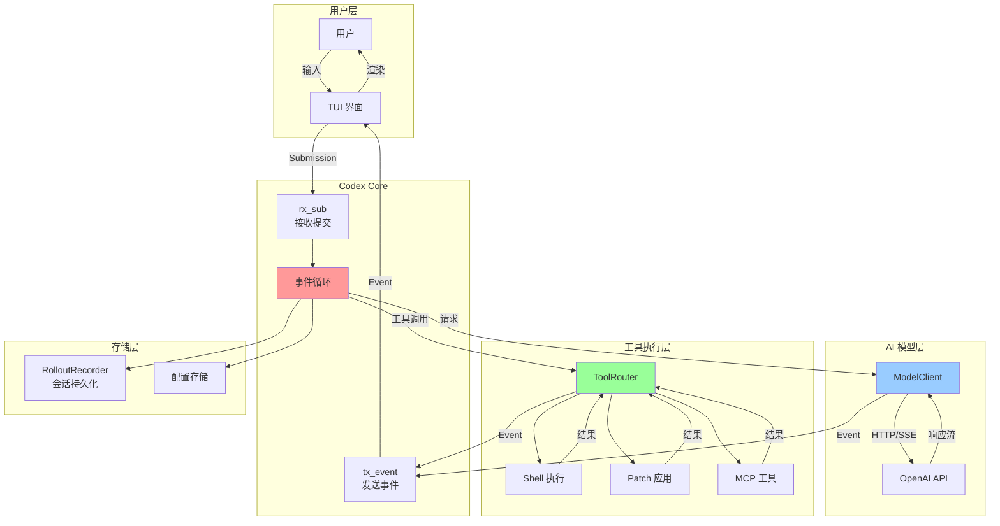

### 8.2 SSE 流式响应

OpenAI API 使用 Server-Sent Events (SSE) 进行流式响应：

```
data: {"type":"response.created","response":{"id":"resp-1",...}}

data: {"type":"response.output_item.added","item":{"id":"item-1",...}}

data: {"type":"response.function_call_arguments.delta","delta":"{\"command\":"}

data: {"type":"response.function_call_arguments.delta","delta":"\"ls -la\"}"}

data: {"type":"response.function_call_arguments.done"}

data: {"type":"response.done"}
```

**处理流程**：

```rust
async fn handle_sse_stream(stream: ResponseStream) {
    while let Some(event) = stream.next().await {
        match event.event_type.as_str() {
            "response.text.delta" => {
                // 增量文本
                emit_event(Event::TextDelta(event.delta));
            }
            "response.function_call_arguments.delta" => {
                // 增量函数参数
                accumulate_args(&event.delta);
            }
            "response.function_call_arguments.done" => {
                // 函数调用完成
                let call = parse_function_call(&accumulated_args)?;
                emit_event(Event::FunctionCall(call));
            }
            "response.done" => {
                emit_event(Event::TurnComplete);
            }
            _ => {}
        }
    }
}
```

### 8.3 工具调用流程

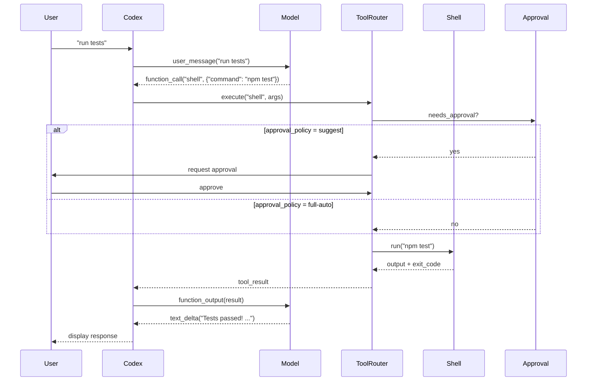

---

## 9. 总结与思考

### 9.1 架构优势

1. **模块化设计**
   - Cargo workspace 清晰分离职责
   - 每个 crate 可独立测试和复用
   - 便于团队协作和维护

2. **安全优先**
   - 多层防护机制
   - OS 级别沙箱
   - 用户可控的审批策略
   - 细粒度的 execpolicy

3. **扩展性强**
   - MCP 协议支持外部工具
   - 可插拔的认证方式
   - 灵活的配置系统
   - 自定义 prompts 和命令

4. **用户体验**
   - 流式响应，实时反馈
   - 丰富的 TUI 界面
   - Git 集成，版本控制安全网
   - 多模态支持

### 9.2 技术亮点

1. **异步并发**
   - Tokio 运行时高性能
   - Actor 模式避免锁竞争
   - 流式处理降低延迟

2. **协议设计**
   - JSON-RPC 标准化通信
   - SSE 流式传输
   - MCP 扩展生态

3. **跨平台**
   - 针对 macOS/Linux/Windows 优化
   - 平台特定的沙箱实现
   - 统一的上层接口

4. **可观测性**
   - OpenTelemetry 集成
   - 完整的事件日志
   - Tracing 诊断支持

### 9.3 可能的改进方向

1. **性能优化**
   - 上下文压缩算法优化
   - 缓存频繁访问的文件
   - 并行化工具执行

2. **功能增强**
   - 更丰富的内置工具
   - 支持更多 AI 模型
   - 团队协作功能

3. **开发体验**
   - 更好的错误提示
   - 调试工具增强
   - 性能分析工具

4. **生态建设**
   - MCP 服务器市场
   - 社区插件仓库
   - 最佳实践文档

### 9.4 学习价值

对于开发者而言，Codex 代码库展示了：

- **Rust 异步编程最佳实践**
  - Tokio 使用模式
  - Channel 通信
  - Error handling

- **复杂系统架构设计**
  - 分层架构
  - 事件驱动
  - 插件化

- **安全工程**
  - 沙箱设计
  - 权限控制
  - 安全审计

- **用户体验设计**
  - TUI 开发
  - 流式交互
  - 渐进式审批

---

## 附录

### A. 关键文件导航

| 文件路径 | 功能说明 |
|---------|---------|
| `codex-rs/core/src/lib.rs` | Core 库入口 |
| `codex-rs/core/src/codex.rs` | Codex 主结构 |
| `codex-rs/core/src/tools/mod.rs` | 工具系统 |
| `codex-rs/core/src/auth.rs` | 认证管理 |
| `codex-rs/core/src/config/` | 配置系统 |
| `codex-rs/tui/src/app.rs` | TUI 应用主逻辑 |
| `codex-rs/app-server/src/lib.rs` | App Server 入口 |
| `codex-rs/protocol/src/lib.rs` | 协议定义 |

### B. 重要常量

```rust
// 提交通道容量
const SUBMISSION_CHANNEL_CAPACITY: usize = 64;

// 默认模型
const DEFAULT_MODEL: &str = "o4-mini";

// 默认审批策略
const DEFAULT_APPROVAL: ApprovalPolicy = ApprovalPolicy::Suggest;

// Session 目录
const SESSIONS_SUBDIR: &str = "sessions/interactive";
```

### C. 依赖关系图

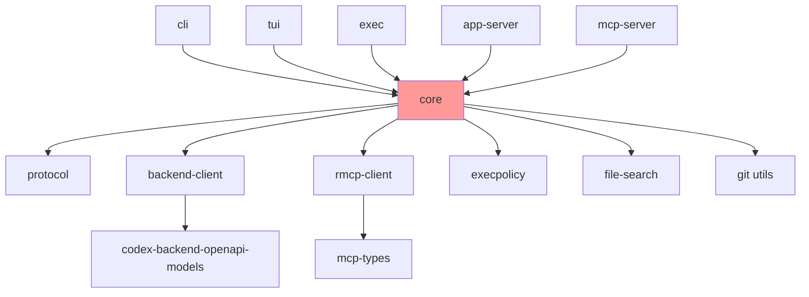

---

**文档结束**

本文档详细分析了 Codex CLI 的架构设计、核心模块、关键组件和设计模式。通过阅读源代码和理解架构，我们可以看到 Codex 是一个设计精良、安全可靠、扩展性强的 AI 编程助手。它的模块化设计、安全机制和插件化架构为构建类似系统提供了宝贵的参考。
