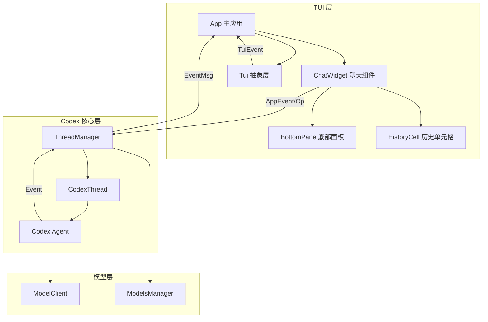
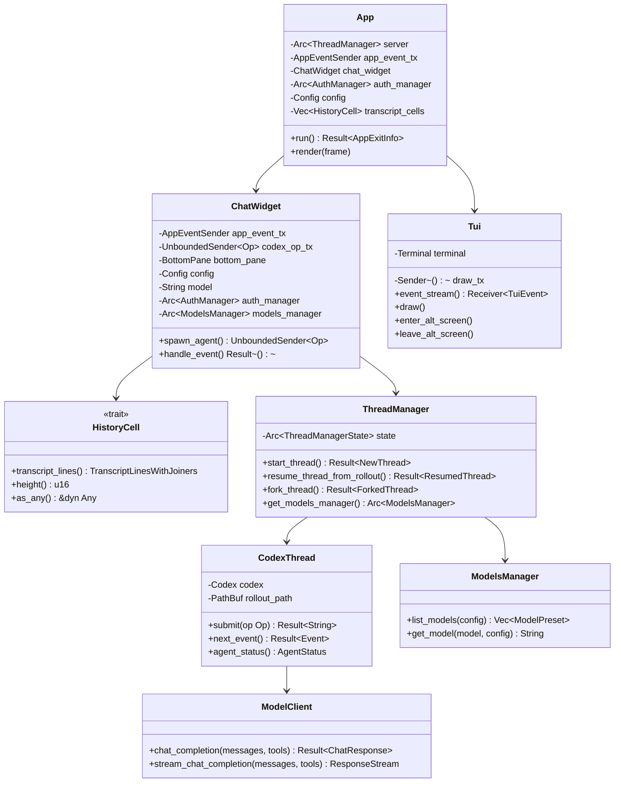
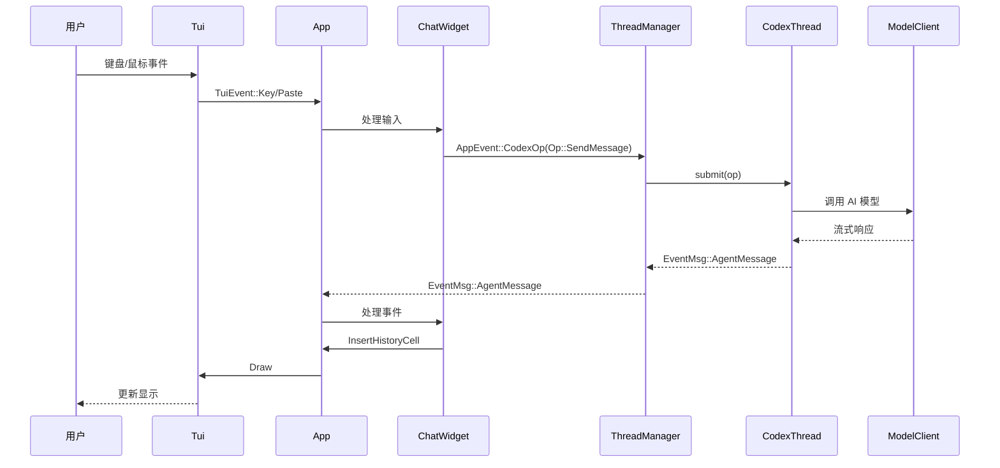
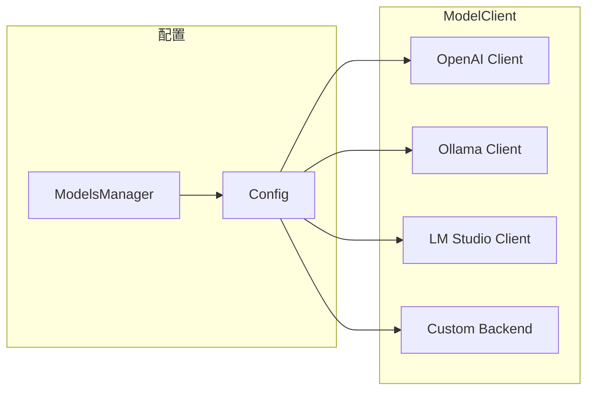
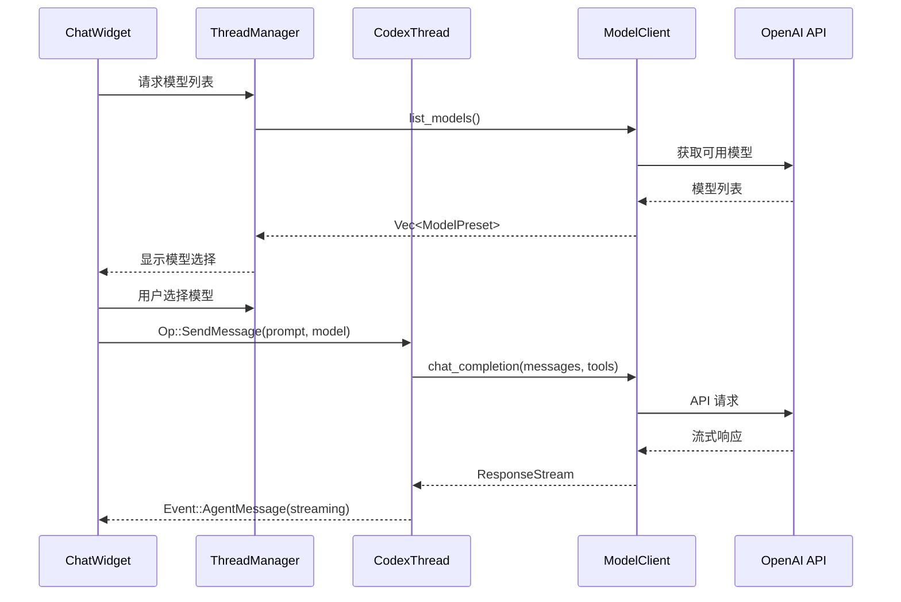
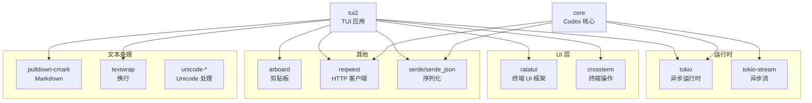

# Codex TUI 终端用户界面设计文档

## 1. 概述

Codex TUI（Terminal User Interface）是一个基于 Rust 开发的全屏终端用户界面，为 Codex AI 助手提供交互式终端体验。该项目包含两个主要版本：
- **tui**: 原始实现（已废弃）
- **tui2**: 重新设计的新版本（推荐使用，本文档主要描述）

TUI 提供了丰富的交互功能，包括实时聊天、命令执行、历史记录管理、差异显示等，是一个功能完善的 AI 助手终端应用。

---

## 2. 核心功能

### 2.1 聊天界面

- **全屏聊天**: 提供沉浸式的对话体验
- **多轮对话**: 支持连续的多轮对话交互
- **实时流式响应**: AI 响应以流式方式实时显示
- **消息区分**: 视觉上清晰区分用户消息和 AI 响应

### 2.2 命令系统

- **斜杠命令**: 使用 `/` 前缀的特殊命令
  - `/status`: 查看当前状态
  - `/diff`: 查看代码差异
  - `/clear`: 清空对话
- **文件搜索**: 使用 `@` 前缀搜索并引用文件
- **Shell 命令**: 使用 `!` 前缀执行本地命令
- **自定义快捷方式**: 支持用户自定义的命令快捷键

### 2.3 历史记录管理

- **会话恢复**: 使用 `codex resume` 恢复之前的会话
- **会话分支**: 使用 `codex fork` 创建会话分支
- **滚动浏览**: 使用 `PgUp/PgDn` 滚动查看历史记录
- **历史分页器**: `Ctrl+T` 打开完整历史记录的分页视图
- **会话持久化**: 自动保存和加载会话状态

### 2.4 工具调用显示

- **文件操作**: 显示文件读取、写入、应用补丁等操作
- **命令执行**: 实时显示命令执行状态和输出
- **MCP 工具**: 显示 MCP（Model Context Protocol）工具调用
- **工具结果**: 清晰展示工具执行的结果

### 2.5 差异显示

- **Git 风格视图**: 使用统一的差异格式
- **代码变更可视化**: 高亮显示修改、添加和删除的代码
- **补丁应用**: 提供补丁应用的交互界面

### 2.6 模型管理

- **模型选择器**: 弹窗选择不同的 AI 模型
- **推理强度配置**: 调整模型的推理参数
- **模型迁移提示**: 当模型配置变更时提供迁移建议

### 2.7 输入组件

- **多行输入**: 支持输入多行文本
- **自动完成**: 提供命令和文件名的自动补全
- **语法高亮**: 对特殊命令进行语法高亮
- **剪贴板支持**: 支持粘贴内容（包括多行文本）

---

## 3. 交互方式

### 3.1 键盘交互

| 快捷键 | 功能 |
|--------|------|
| `Enter` | 提交消息 |
| `Esc` | 中断/取消当前操作 |
| `Ctrl+C` | 退出应用 |
| `Ctrl+T` | 打开历史记录分页器 |
| `Ctrl+Shift+C` | 复制选中的文本 |
| `PgUp` | 向上滚动历史记录 |
| `PgDn` | 向下滚动历史记录 |
| `Home` | 跳转到对话开始 |
| `End` | 跳转到对话结束 |

### 3.2 鼠标交互

- **滚轮滚动**: 使用鼠标滚轮滚动历史记录
- **点击选择**: 点击并拖拽选择文本
- **多行选择**: 支持跨行选择文本内容

### 3.3 特殊输入

- **命令输入**: `/` 后接命令名称
- **文件引用**: `@` 后接文件路径进行搜索
- **Shell 执行**: `!` 后接系统命令

---

## 4. 技术栈

### 4.1 核心 UI 框架

#### ratatui
```toml
ratatui = { workspace = true, features = [
    "scrolling-regions",        # 滚动区域支持
    "unstable-backend-writer",   # 后端写入器
    "unstable-rendered-line-info", # 渲染行信息
    "unstable-widget-ref",      # Widget 引用
] }
```
- 功能：提供 Widget、布局、样式等 UI 抽象
- 特性：支持自定义后端、滚动区域、动态渲染

#### crossterm
```toml
crossterm = { workspace = true, features = [
    "bracketed-paste",  # 括号粘贴模式
    "event-stream"      # 事件流
] }
```
- 功能：跨平台终端操作
- 处理键盘、鼠标、剪贴板事件
- 终端模式切换（原始模式/正常模式）

### 4.2 异步运行时

```toml
tokio = { workspace = true, features = [
    "io-std",          # 标准 IO
    "macros",          # 异步宏
    "process",         # 进程管理
    "rt-multi-thread",  # 多线程运行时
    "signal",         # 信号处理
    "test-util",      # 测试工具
    "time",           # 时间处理
] }

tokio-stream = { workspace = true, features = ["sync"] }
```

### 4.3 文本处理

```toml
pulldown-cmark      # Markdown 解析和渲染
regex-lite         # 正则表达式
unicode-width      # Unicode 字符宽度计算
unicode-segmentation # Unicode 分段
textwrap           # 文本自动换行
```

### 4.4 其他重要依赖

```toml
arboard                # 剪贴板操作
tree-sitter-highlight   # 语法高亮
image                 # 图片处理
reqwest               # HTTP 客户端
serde/serde_json      # 序列化和反序列化
```

---

## 5. 架构设计

### 5.1 整体架构



### 5.2 模块关系



---

## 6. TUI 与 Codex 核心交互

### 6.1 事件流架构

TUI 与 Codex 核心通过**事件流**进行双向通信：

#### Op（操作）- TUI → Codex

```rust
pub enum Op {
    SendMessage(Prompt),
    Interrupt,
    Shutdown,
    ListCustomPrompts,
    ListSkills { cwds: Vec<PathBuf>, force_reload: bool },
    // ... 更多操作类型
}
```

#### Event（事件）- Codex → TUI

```rust
pub enum EventMsg {
    SessionConfigured(SessionConfiguredEvent),
    AgentMessage(AgentMessageEvent),
    AgentReasoning(AgentReasoningEvent),
    ExecCommandBegin(ExecCommandBeginEvent),
    ExecCommandEnd(ExecCommandEndEvent),
    McpToolCallBegin(McpToolCallBeginEvent),
    McpToolCallEnd(McpToolCallEndEvent),
    TurnComplete(TurnCompleteEvent),
    Error(ErrorEvent),
    // ... 更多事件类型
}
```

### 6.2 主事件循环



### 6.3 核心代码实现

#### 6.3.1 TUI 主循环

**文件**: `tui2/src/app.rs`

```rust
pub async fn run(
    tui: &mut tui::Tui,
    auth_manager: Arc<AuthManager>,
    mut config: Config,
    active_profile: Option<String>,
    initial_prompt: Option<String>,
    initial_images: Vec<PathBuf>,
    session_selection: SessionSelection,
    feedback: codex_feedback::CodexFeedback,
    is_first_run: bool,
) -> Result<AppExitInfo>
{
    // 初始化
    let server = Arc::new(ThreadManager::new());
    let (app_event_tx, app_event_rx) = unbounded_channel();
    let (tui_event_tx, tui_event_rx) = unbounded_channel();

    let mut app = App::new(
        server.clone(),
        app_event_tx.clone(),
        auth_manager,
        config.clone(),
        active_profile,
        feedback,
    )?;

    // 启动事件处理
    let event_loop = async {
        loop {
            tokio::select! {
                // 处理 Codex 事件
                event = app_event_rx.recv() => {
                    match event {
                        AppEvent::CodexEvent(event) => {
                            app.handle_codex_event(event)?;
                        }
                        AppEvent::InsertHistoryCell(cell) => {
                            app.insert_history_cell(cell);
                        }
                        AppEvent::CodexOp(op) => {
                            app.forward_op_to_agent(op)?;
                        }
                        // ... 处理其他事件
                    }
                }

                // 处理终端事件
                event = tui_event_rx.recv() => {
                    match event {
                        TuiEvent::Key(key_event) => {
                            app.handle_key_event(key_event)?;
                        }
                        TuiEvent::Paste(content) => {
                            app.handle_paste(content)?;
                        }
                        TuiEvent::Draw => {
                            app.render(tui)?;
                        }
                        TuiEvent::Mouse(mouse_event) => {
                            app.handle_mouse_event(mouse_event)?;
                        }
                    }
                }
            }
        }
    };

    event_loop.await
}
```

#### 6.3.2 Agent 启动

**文件**: `tui2/src/chatwidget/agent.rs`

```rust
pub(crate) fn spawn_agent(
    config: Config,
    app_event_tx: AppEventSender,
    server: Arc<ThreadManager>,
) -> UnboundedSender<Op> {
    let (codex_op_tx, mut codex_op_rx) = unbounded_channel();

    // 启动 Agent 任务
    tokio::spawn(async move {
        // 1. 创建新线程
        let NewThread {
            thread_id,
            thread,
            session_configured,
        } = match server.start_thread(config.clone()).await {
            Ok(new_thread) => new_thread,
            Err(e) => {
                // 发送错误事件
                app_event_tx.send(AppEvent::CodexEvent(
                    EventMsg::Error(ErrorEvent {
                        error: e.to_string(),
                    })
                )).await.ok();
                return;
            }
        };

        // 2. 发送会话配置事件
        app_event_tx.send(AppEvent::CodexEvent(
            EventMsg::SessionConfigured(session_configured)
        )).await.ok();

        // 3. 启动事件循环
        loop {
            tokio::select! {
                // 接收来自 TUI 的操作
                Some(op) = codex_op_rx.recv() => {
                    match op {
                        Op::Shutdown => break,
                        _ => {
                            // 提交操作到线程
                            if let Err(e) = thread.submit(op).await {
                                app_event_tx.send(AppEvent::CodexEvent(
                                    EventMsg::Error(ErrorEvent {
                                        error: e.to_string(),
                                    })
                                )).await.ok();
                            }
                        }
                    }
                }

                // 接收来自 Codex 的事件
                event = thread.next_event() => {
                    match event {
                        Ok(event) => {
                            app_event_tx.send(AppEvent::CodexEvent(event)).await.ok();
                        }
                        Err(e) => {
                            app_event_tx.send(AppEvent::CodexEvent(
                                EventMsg::Error(ErrorEvent {
                                    error: e.to_string(),
                                })
                            )).await.ok();
                            break;
                        }
                    }
                }
            }
        }
    });

    codex_op_tx
}
```

#### 6.3.3 ThreadManager 交互

**文件**: `core/src/thread_manager.rs`

```rust
pub struct ThreadManager {
    state: Arc<ThreadManagerState>,
}

impl ThreadManager {
    pub async fn start_thread(&self, config: Config) -> Result<NewThread> {
        let thread_id = ThreadId::new();
        let rollout_path = self.get_rollout_path(&thread_id)?;

        // 创建 CodexThread
        let thread = Arc::new(CodexThread::new(
            config,
            rollout_path.clone(),
        )?);

        // 生成会话配置事件
        let session_configured = SessionConfiguredEvent {
            thread_id: thread_id.clone(),
            model: thread.agent_status().await.model_name(),
            capabilities: thread.capabilities(),
        };

        // 保存到状态
        self.state.threads.write().await.insert(
            thread_id.clone(),
            thread.clone(),
        );

        Ok(NewThread {
            thread_id,
            thread,
            session_configured,
        })
    }

    pub fn get_models_manager(&self) -> Arc<ModelsManager> {
        Arc::clone(&self.state.models_manager)
    }
}
```

---

## 7. TUI 与 ModelClient 交互

### 7.1 ModelClient 架构



**文件**: `core/src/client/mod.rs`

```rust
pub struct ModelClient {
    backend: BackendClient,
    model: String,
    api_key: Option<String>,
    base_url: Option<String>,
}

impl ModelClient {
    pub async fn chat_completion(
        &self,
        messages: Vec<ChatMessage>,
        tools: Option<Vec<ToolDefinition>>,
    ) -> Result<ChatResponse> {
        self.backend.chat_completion(messages, tools).await
    }

    pub async fn stream_chat_completion(
        &self,
        messages: Vec<ChatMessage>,
        tools: Option<Vec<ToolDefinition>>,
    ) -> Result<ResponseStream> {
        self.backend.stream_chat_completion(messages, tools).await
    }
}
```

### 7.2 ModelsManager 交互

**文件**: `core/src/models_manager/mod.rs`

```rust
pub struct ModelsManager {
    presets: HashMap<String, ModelPreset>,
    providers: HashMap<String, Box<dyn ModelProvider>>,
}

impl ModelsManager {
    pub async fn list_models(&self, config: &Config) -> Vec<ModelPreset> {
        let mut models = Vec::new();

        // 从所有提供者获取模型
        for provider in self.providers.values() {
            if let Ok(provider_models) = provider.list_models(config).await {
                models.extend(provider_models);
            }
        }

        models
    }

    pub fn get_model(&self, model: &str, config: &Config) -> String {
        // 解析模型预设
        if let Some(preset) = self.presets.get(model) {
            return preset.id.clone();
        }

        // 返回原始模型名
        model.to_string()
    }
}
```

### 7.3 模型调用流程



---

## 8. 核心组件详解

### 8.1 Tui 抽象层

**文件**: `tui2/src/tui.rs`

```rust
pub struct Tui {
    terminal: Terminal,
    draw_tx: broadcast::Sender<()>,
    pending_history_lines: Vec<Line<'static>>,
    alt_screen_nesting: AltScreenNesting,
    alt_screen_active: Arc<AtomicBool>,
    terminal_focused: Arc<AtomicBool>,
}

pub enum TuiEvent {
    Key(KeyEvent),
    Paste(String),
    Draw,
    Mouse(MouseEvent),
}

impl Tui {
    pub fn event_stream(&self) -> Receiver<TuiEvent> {
        // 创建事件流，监听键盘、鼠标、粘贴
    }

    pub fn draw<F, R>(&mut self, height: u16, f: F) -> io::Result<R>
    where
        F: FnOnce(&mut Frame) -> R,
    {
        self.terminal.draw(|frame| f(frame))
    }

    pub fn enter_alt_screen(&mut self) -> io::Result<()> {
        enable_raw_mode()?;
        execute!(io::stdout(), EnterAlternateScreen)?;
        self.alt_screen_active.store(true, Ordering::SeqCst);
        Ok(())
    }

    pub fn leave_alt_screen(&mut self) -> io::Result<()> {
        execute!(io::stdout(), LeaveAlternateScreen)?;
        disable_raw_mode()?;
        self.alt_screen_active.store(false, Ordering::SeqCst);
        Ok(())
    }
}
```

### 8.2 HistoryCell

**文件**: `tui2/src/history_cell.rs`

```rust
pub trait HistoryCell: Renderable {
    fn transcript_lines(&self) -> TranscriptLinesWithJoiners;
    fn height(&self) -> u16;
    fn as_any(&self) -> &dyn Any;
}

// AI 消息单元格
pub struct AgentMessageCell {
    pub id: CellId,
    pub content: String,
    pub streaming: bool,
    pub role: MessageRole,
}

// 用户消息单元格
pub struct UserHistoryCell {
    pub id: CellId,
    pub content: String,
}

// 命令执行单元格
pub struct ExecCell {
    pub id: CellId,
    pub command: String,
    pub output: String,
    pub exit_code: Option<i32>,
}

// MCP 工具调用单元格
pub struct McpToolCallCell {
    pub id: CellId,
    pub tool_name: String,
    pub arguments: serde_json::Value,
    pub result: Option<String>,
}
```

### 8.3 BottomPane

**文件**: `tui2/src/bottom_pane/mod.rs`

```rust
pub(crate) struct BottomPane {
    composer: ChatComposer,
    view_stack: Vec<Box<dyn BottomPaneView>>,
    status: Option<StatusIndicatorWidget>,
    queued_user_messages: QueuedUserMessages,
}

impl BottomPane {
    pub fn handle_key_event(&mut self, key: KeyEvent) -> Result<()> {
        // 处理输入事件
        self.composer.handle_key_event(key)?;

        // 检查命令前缀
        if self.composer.is_command_start() {
            self.push_view(Box::new(CommandPopup::new()));
        }

        Ok(())
    }

    pub fn render(&mut self, frame: &mut Frame, area: Rect) {
        // 渲染底部面板
        self.composer.render(frame, area);

        // 渲染视图栈
        if let Some(view) = self.view_stack.last_mut() {
            view.render(frame, area);
        }
    }
}
```

---

## 9. 设计亮点

### 9.1 视口和历史管理

TUI2 采用了全新的视口和历史管理模型，核心原则：

1. **Codex 拥有视口**，而不是终端
2. **历史记录必须是正确、有序且永不丢失**
3. **避免不必要的重复渲染**
4. **在调整大小时行为合理**
5. **暂停/交替屏幕交互可预测**

### 9.2 交替屏幕处理

支持三种模式（`config.tui_alternate_screen`）：

- `auto`: 自动检测终端多路复用器（默认）
- `always`: 总是使用交替屏幕
- `never`: 从不使用交替屏幕

特殊处理 Zellij 多路复用器，支持滚动历史记录。

### 9.3 文本选择和复制

- 基于内容的选择（而非屏幕坐标）
- 支持软换行逻辑行复制
- 保留代码块缩进
- 复制 Markdown 源代码（包括反引号）

---

## 10. 关键文件路径

### 10.1 TUI 核心

```
vendors/codex/codex-rs/tui2/
├── src/main.rs                    # 二进制入口
├── src/lib.rs                     # 库入口和初始化
├── src/app.rs                     # 主应用（116KB）
├── src/tui.rs                     # TUI 抽象
├── src/chatwidget.rs              # 聊天组件（152KB）
├── src/history_cell.rs             # 历史单元格（99KB）
├── src/app_event.rs               # 应用事件
├── src/bottom_pane/               # 底部面板
│   ├── mod.rs
│   ├── chat_composer.rs          # 输入编辑器
│   ├── footer.rs                # 页脚状态
│   └── ...
└── docs/
    ├── tui_viewport_and_history.md      # 视口和历史设计
    ├── scroll_input_model.md           # 滚动输入模型
    └── streaming_wrapping_design.md    # 流式换行设计
```

### 10.2 Codex 核心

```
vendors/codex/codex-rs/core/
├── src/lib.rs                        # 核心库
├── src/thread_manager.rs              # 线程管理器
├── src/codex_thread.rs              # Codex 线程
├── src/codex.rs                    # Codex 核心
├── src/agent/                      # Agent 逻辑
│   ├── mod.rs
│   ├── agent.rs                   # 主 Agent
│   ├── controller.rs              # 控制器
│   └── ...
├── src/client/mod.rs                # ModelClient
│   ├── mod.rs
│   ├── client.rs                 # 客户端
│   └── ...
├── src/models_manager/              # 模型管理器
│   ├── mod.rs
│   ├── manager.rs                # 管理器
│   └── ...
└── src/protocol.rs                 # 协议定义
```

---

## 11. 依赖关系图



---

## 12. 总结

Codex TUI 是一个高度模块化、功能丰富的终端用户界面实现，具有以下特点：

### 优点

1. **清晰的架构分层**: TUI → App → ChatWidget → Core
2. **完善的事件驱动系统**: 通过事件流实现组件间通信
3. **丰富的交互功能**: 支持键盘、鼠标、命令系统
4. **灵活的模型管理**: 支持多种 AI 模型提供者
5. **健壮的历史记录**: 完整的会话管理和恢复
6. **优秀的用户体验**: 流式响应、差异显示、代码高亮

### 技术栈总结

- **语言**: Rust
- **异步运行时**: tokio
- **UI 框架**: ratatui + crossterm
- **文本处理**: pulldown-cmark, textwrap, unicode-*
- **HTTP 客户端**: reqwest
- **序列化**: serde/serde_json

### 核心交互流程

```
用户输入 → TUI 事件 → App 处理 → Codex Op
  ↓
Codex 核心 → ModelClient → AI 模型 API
  ↓
流式响应 → Event 消息 → App 更新 → TUI 渲染
  ↓
用户看到实时更新
```

---

## 附录 A: 术语表

- **TUI**: Terminal User Interface，终端用户界面
- **Codex**: AI 助手核心逻辑
- **ThreadManager**: 线程管理器，管理会话和线程
- **CodexThread**: Codex 线程，表示单个对话会话
- **ModelClient**: 模型客户端，负责与 AI 模型通信
- **HistoryCell**: 历史单元格，存储对话历史
- **Viewport**: 视口，显示内容的一块区域
- **Alternate Screen**: 交替屏幕，终端的一种显示模式
- **MCP**: Model Context Protocol，模型上下文协议
