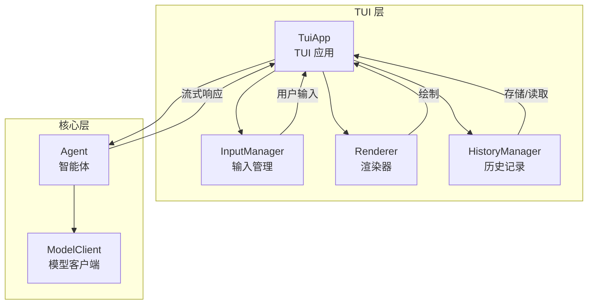
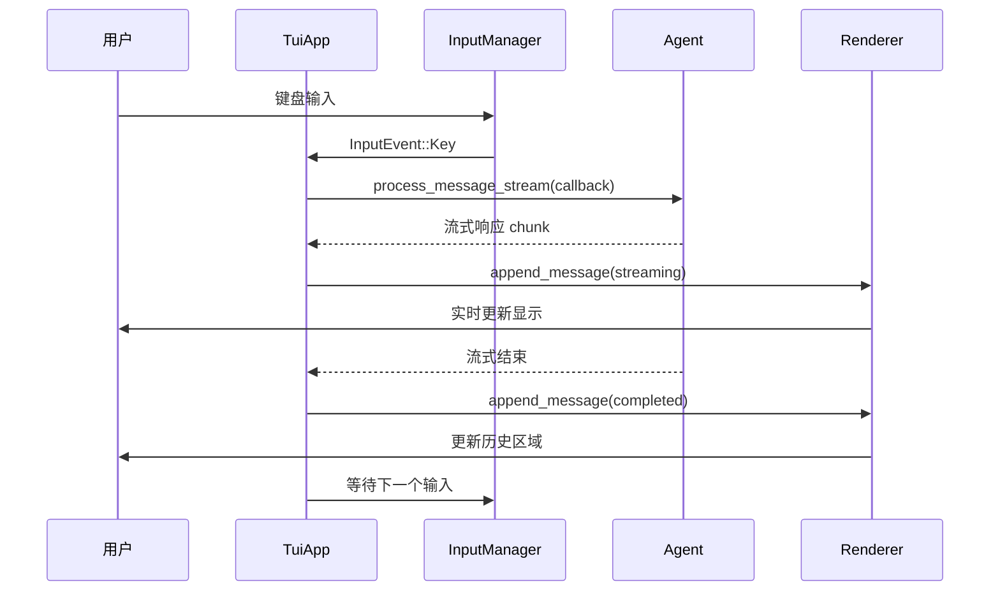
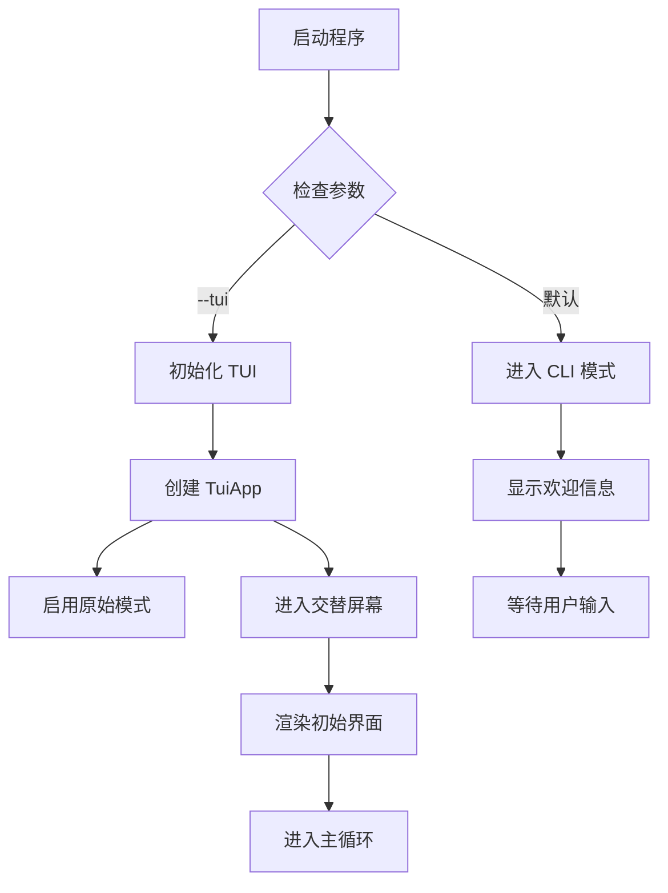
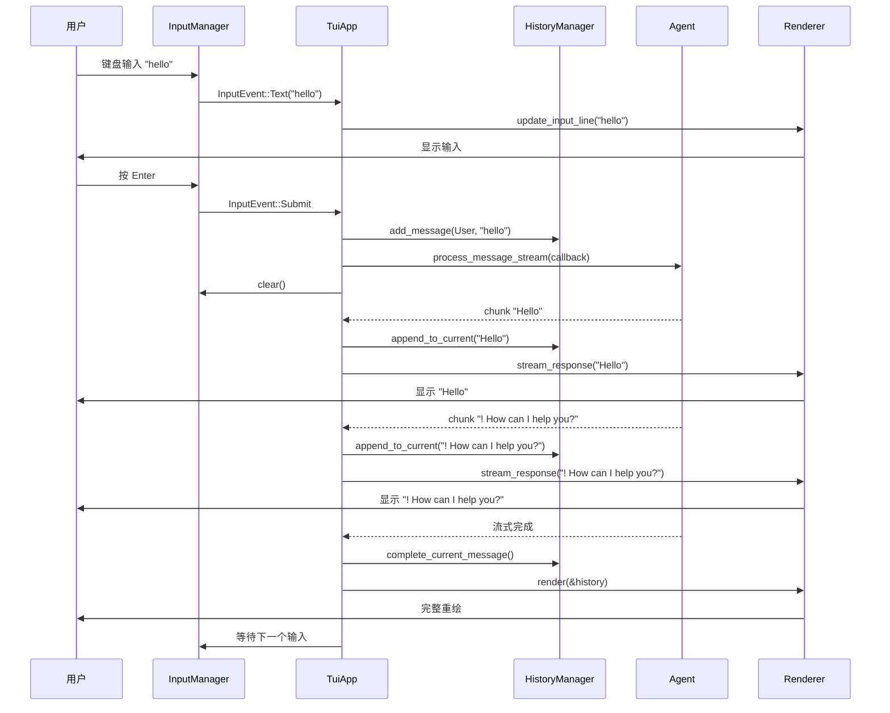

# AI Agent TUI 简化版设计方案

## 1. 项目概述

本文档为 `codex/code/example/ai-agent-v2` 项目设计一个简化版的 TUI（终端用户界面），实现以下核心功能：

1. **全屏聊天**: 提供沉浸式的对话体验
2. **多轮对话**: 支持连续的多轮对话交互
3. **实时流式响应**: AI 响应以流式方式实时显示
4. **消息区分**: 视觉上清晰区分用户消息和 AI 响应

设计目标是在保持代码简洁性的同时，提供接近 Codex TUI 的交互体验。

---

## 2. 设计原则

### 2.1 简化策略

- **最小依赖**: 仅添加必要的 TUI 库，避免复杂的技术栈
- **渐进增强**: 基于现有 CLI 架构，逐步增加 UI 功能
- **代码复用**: 最大化复用现有的 `Agent`、`ModelClient` 等核心组件
- **易于维护**: 保持代码结构清晰，便于理解和扩展

### 2.2 技术选型

#### 选项对比

| TUI 框架 | 优点 | 缺点 | 推荐度 |
|-----------|------|--------|--------|
| crossterm | 轻量、功能完整 | 需要自己构建组件 | ⭐⭐⭐⭐⭐ |
| ratatui | 功能强大、组件丰富 | 学习曲线较陡 | ⭐⭐⭐⭐ |
| termion | 简单、轻量 | 功能较少 | ⭐⭐⭐ |

**最终选择**: `crossterm` + 自定义渲染

**理由**:
- 轻量级，易于理解和定制
- 原生支持异步流式输出
- 可以完全控制渲染逻辑

### 2.3 依赖添加

```toml
# Cargo.toml 新增依赖
[dependencies]
# ... 现有依赖 ...

crossterm = "0.27"          # TUI 框架
chrono = "0.4"              # 时间戳（已存在）
textwrap = "0.16"           # 文本换行
```

---

## 3. 架构设计

### 3.1 整体架构



### 3.2 模块结构

```
codex/code/example/ai-agent-v2/
├── src/
│   ├── main.rs              # 主入口（CLI 模式）
│   ├── lib.rs              # 库入口（TUI 共享）
│   ├── agent.rs            # Agent 核心逻辑
│   ├── client.rs           # ModelClient
│   ├── tools.rs           # 工具系统
│   ├── protocol.rs         # 协议定义
│   └── tui/              # TUI 模块（新增）
│       ├── mod.rs          # TUI 模块入口
│       ├── app.rs         # TUI 应用
│       ├── renderer.rs     # 渲染器
│       ├── input.rs       # 输入管理
│       ├── history.rs     # 历史记录
│       └── style.rs       # 样式定义
└── Cargo.toml
```

### 3.3 数据流



---

## 4. 核心组件设计

### 4.1 TuiApp - 主应用

```rust
// src/tui/app.rs

use crate::agent::Agent;
use crate::tui::{Renderer, InputManager, HistoryManager};
use crossterm::{
    terminal::{enable_raw_mode, disable_raw_mode, EnterAlternateScreen, LeaveAlternateScreen},
    event::{DisableMouseCapture, EnableMouseCapture},
};
use std::io::{self, Write};

/// TUI 应用主结构
pub struct TuiApp {
    agent: Agent,
    renderer: Renderer,
    input: InputManager,
    history: HistoryManager,
    is_running: bool,
}

impl TuiApp {
    pub fn new(agent: Agent) -> io::Result<Self> {
        let renderer = Renderer::new()?;
        let input = InputManager::new()?;
        let history = HistoryManager::new();

        Ok(Self {
            agent,
            renderer,
            input,
            history,
            is_running: true,
        })
    }

    /// 运行 TUI 主循环
    pub async fn run(&mut self) -> io::Result<()> {
        // 初始化终端
        enable_raw_mode()?;
        crossterm::execute!(io::stdout(), EnterAlternateScreen, EnableMouseCapture)?;

        // 初始渲染
        self.renderer.render(&self.history)?;

        // 主循环
        while self.is_running {
            // 1. 读取用户输入
            if let Some(input) = self.input.read_input().await? {
                match input {
                    InputEvent::Text(text) => {
                        self.handle_text_input(text)?;
                    }
                    InputEvent::Submit => {
                        self.handle_submit().await?;
                    }
                    InputEvent::Interrupt => {
                        self.handle_interrupt();
                    }
                    InputEvent::Quit => {
                        self.is_running = false;
                    }
                }
            }

            // 2. 渲染界面
            self.renderer.render(&self.history)?;
        }

        // 清理
        disable_raw_mode()?;
        crossterm::execute!(io::stdout(), LeaveAlternateScreen, DisableMouseCapture)?;
        println!("👋 再见！");

        Ok(())
    }

    /// 处理文本输入（实时更新输入框）
    fn handle_text_input(&mut self, text: String) -> io::Result<()> {
        self.input.update_buffer(text);
        self.renderer.update_input_line(&self.input.buffer());
        Ok(())
    }

    /// 处理提交（发送消息给 Agent）
    async fn handle_submit(&mut self) -> io::Result<()> {
        let user_input = self.input.buffer().trim().to_string();

        if user_input.is_empty() {
            return Ok(());
        }

        // 退出命令
        if user_input.eq_ignore_ascii_case("quit") {
            self.is_running = false;
            return Ok(());
        }

        // 添加用户消息到历史
        self.history.add_message(Message {
            role: Role::User,
            content: user_input.clone(),
            timestamp: chrono::Local::now(),
            is_streaming: false,
        });

        // 清空输入
        self.input.clear();

        // 调用 Agent（流式）
        let response = self.agent
            .process_message_stream_with_result(&user_input, |chunk| {
                // 实时显示流式响应
                self.renderer.stream_response(chunk);
            })
            .await;

        match response {
            Ok(content) => {
                // 流式结束，完成消息
                self.history.complete_current_message();
                self.renderer.render(&self.history)?;
            }
            Err(e) => {
                self.renderer.show_error(&format!("错误: {}", e));
            }
        }

        Ok(())
    }

    /// 处理中断（Ctrl+C）
    fn handle_interrupt(&mut self) {
        // TODO: 实现流式响应的中断
        self.is_running = false;
    }
}
```

### 4.2 Renderer - 渲染器

```rust
// src/tui/renderer.rs

use crate::tui::{HistoryManager, Message, Role};
use crate::tui::style::{Color, Style};
use crossterm::{
    cursor::{MoveTo, Show, Hide},
    style::{SetForegroundColor, ResetColor, SetAttribute, Attribute},
    terminal::{Clear, ClearType, size},
};
use std::io::{self, Write};

/// 渲染器
pub struct Renderer {
    stdout: io::Stdout,
    terminal_width: u16,
    terminal_height: u16,
    input_line_start: u16,
}

impl Renderer {
    pub fn new() -> io::Result<Self> {
        let (width, height) = size()?;
        let input_line_start = height.saturating_sub(3); // 输入框在底部 3 行

        Ok(Self {
            stdout: io::stdout(),
            terminal_width: width,
            terminal_height: height,
            input_line_start,
        })
    }

    /// 渲染整个界面
    pub fn render(&mut self, history: &HistoryManager) -> io::Result<()> {
        // 隐藏光标
        crossterm::execute!(self.stdout, Hide)?;

        // 清屏
        crossterm::execute!(self.stdout, Clear(ClearType::All))?;

        // 渲染历史记录
        let history_height = self.render_history(history)?;

        // 渲染分隔线
        crossterm::execute!(
            self.stdout,
            MoveTo(0, self.input_line_start - 1),
            SetForegroundColor(Color::DarkGrey),
        )?;
        write!(self.stdout, "─")?;
        crossterm::execute!(self.stdout, ResetColor)?;

        // 渲染提示符和输入框
        self.render_input_prompt()?;

        // 显示光标
        crossterm::execute!(self.stdout, Show)?;
        self.stdout.flush()?;

        Ok(())
    }

    /// 渲染历史记录
    fn render_history(&mut self, history: &HistoryManager) -> io::Result<u16> {
        let mut y = 0;
        let available_height = self.input_line_start - 1;

        // 从最新消息开始渲染（倒序）
        let messages: Vec<_> = history.messages().iter().rev().collect();

        for msg in messages {
            let msg_height = self.render_message(msg, y)?;

            y += msg_height;

            if y >= available_height {
                break;
            }
        }

        Ok(y)
    }

    /// 渲染单条消息
    fn render_message(&mut self, msg: &Message, y: u16) -> io::Result<u16> {
        let prefix = match msg.role {
            Role::User => "👤 You",
            Role::Assistant => "🤖 AI",
        };

        let role_color = match msg.role {
            Role::User => Color::Cyan,
            Role::Assistant => Color::Green,
        };

        // 渲染角色和 时间戳
        crossterm::execute!(
            self.stdout,
            MoveTo(0, y),
            SetForegroundColor(role_color),
            SetAttribute(Attribute::Bold),
        )?;
        write!(self.stdout, "{} ", prefix)?;

        crossterm::execute!(
            self.stdout,
            ResetColor,
            SetForegroundColor(Color::DarkGrey),
        )?;
        let time_str = msg.timestamp.format("%H:%M:%S").to_string();
        write!(self.stdout, "{}", time_str)?;

        // 渲染消息内容（自动换行）
        crossterm::execute!(
            self.stdout,
            ResetColor,
        )?;

        let content_height = self.render_wrapped_text(
            &msg.content,
            0,
            y + 1,
            self.terminal_width as usize,
        )?;

        // 如果是流式响应，显示加载指示器
        if msg.is_streaming {
            crossterm::execute!(
                self.stdout,
                MoveTo(self.terminal_width - 2, y),
                SetForegroundColor(Color::Yellow),
            )?;
            write!(self.stdout, "●")?;
            crossterm::execute!(self.stdout, ResetColor)?;
        }

        Ok(content_height + 1)
    }

    /// 渲染自动换行的文本
    fn render_wrapped_text(
        &mut self,
        text: &str,
        x: u16,
        mut y: u16,
        width: usize,
    ) -> io::Result<u16> {
        use textwrap::wrap;

        let wrapped_lines = wrap(text, width);

        for (i, line) in wrapped_lines.iter().enumerate() {
            crossterm::execute!(
                self.stdout,
                MoveTo(x, y + i as u16),
            )?;
            write!(self.stdout, "{}", line)?;
        }

        Ok(wrapped_lines.len() as u16)
    }

    /// 渲染输入提示符
    fn render_input_prompt(&mut self) -> io::Result<()> {
        crossterm::execute!(
            self.stdout,
            MoveTo(0, self.input_line_start),
            SetForegroundColor(Color::Cyan),
            SetAttribute(Attribute::Bold),
        )?;
        write!(self.stdout, "👤 You: ")?;

        crossterm::execute!(self.stdout, ResetColor)?;
        Ok(())
    }

    /// 更新输入行（实时）
    pub fn update_input_line(&mut self, text: &str) {
        use crossterm::cursor::MoveToColumn;

        let _ = crossterm::execute!(
            self.stdout,
            MoveToColumn(8),
            Clear(ClearType::UntilNewLine),
        );
        let _ = write!(self.stdout, "{}", text);
        let _ = self.stdout.flush();
    }

    /// 流式渲染响应（不重绘整个界面）
    pub fn stream_response(&mut self, chunk: &str) {
        // 直接输出到当前位置
        let _ = write!(self.stdout, "{}", chunk);
        let _ = self.stdout.flush();
    }

    /// 显示错误消息
    pub fn show_error(&mut self, msg: &str) -> io::Result<()> {
        crossterm::execute!(
            self.stdout,
            MoveTo(0, self.terminal_height - 1),
            SetForegroundColor(Color::Red),
            SetAttribute(Attribute::Bold),
        )?;
        write!(self.stdout, "❌ {}", msg)?;
        crossterm::execute!(self.stdout, ResetColor)?;
        Ok(())
    }

    /// 处理终端大小变化
    pub fn handle_resize(&mut self) -> io::Result<()> {
        let (width, height) = size()?;
        self.terminal_width = width;
        self.terminal_height = height;
        self.input_line_start = height.saturating_sub(3);
        Ok(())
    }
}
```

### 4.3 InputManager - 输入管理

```rust
// src/tui/input.rs

use crossterm::event::{self, Event, KeyCode, KeyEvent, KeyModifiers};

/// 输入事件
pub enum InputEvent {
    Text(String),
    Submit,
    Interrupt,
    Quit,
}

/// 输入管理器
pub struct InputManager {
    buffer: String,
    cursor_position: usize,
}

impl InputManager {
    pub fn new() -> io::Result<Self> {
        Ok(Self {
            buffer: String::new(),
            cursor_position: 0,
        })
    }

    /// 读取输入（非阻塞）
    pub async fn read_input(&self) -> io::Result<Option<InputEvent>> {
        // 使用轮询方式读取事件
        // 注意：这需要改进为使用 crossterm 的异步事件流
        if event::poll(std::time::Duration::from_millis(100))? {
            match event::read()? {
                Event::Key(key_event) => {
                    return Ok(Some(self.handle_key_event(key_event)));
                }
                Event::Resize(_, _) => {
                    // 触发重绘
                    return Ok(None);
                }
                _ => {}
            }
        }
        }

        Ok(None)
    }

    /// 处理键盘事件
    fn handle_key_event(&self, key: KeyEvent) -> InputEvent {
        match key.code {
            KeyCode::Enter => InputEvent::Submit,

            KeyCode::Char(c) => {
                // 处理 Ctrl+C
                if key.modifiers.contains(KeyModifiers::CONTROL) && c == 'c' {
                    return InputEvent::Interrupt;
                }

                // 处理 Ctrl+Q
                if key.modifiers.contains(KeyModifiers::CONTROL) && c == 'q' {
                    return InputEvent::Quit;
                }

                // 普通字符输入
                InputEvent::Text(c.to_string())
            }

            KeyCode::Backspace => {
                // TODO: 实现退格删除
                InputEvent::Text("".to_string())
            }

            KeyCode::Left => {
                // TODO: 实现光标左移
                InputEvent::Text("".to_string())
            }

            KeyCode::Right => {
                // TODO: 实现光标右移
                InputEvent::Text("".to_string())
            }

            _ => InputEvent::Text("".to_string()),
        }
    }

    /// 更新缓冲区
    pub fn update_buffer(&mut self, text: String) {
        // 简化版：直接替换
        self.buffer = text;
        self.cursor_position = self.buffer.len();
    }

    /// 清空缓冲区
    pub fn clear(&mut self) {
        self.buffer.clear();
        self.cursor_position = 0;
    }

    /// 获取当前缓冲区内容
    pub fn buffer(&self) -> &str {
        &self.buffer
    }
}
```

### 4.4 HistoryManager - 历史记录

```rust
// src/tui/history.rs

use chrono::{DateTime, Local};

/// 消息角色
#[derive(Debug, Clone, Copy, PartialEq, Eq)]
pub enum Role {
    User,
    Assistant,
}

/// 消息
#[derive(Debug, Clone)]
pub struct Message {
    pub role: Role,
    pub content: String,
    pub timestamp: DateTime<Local>,
    pub is_streaming: bool,
}

/// 历史记录管理器
pub struct HistoryManager {
    messages: Vec<Message>,
    max_messages: usize,
}

impl HistoryManager {
    pub fn new() -> Self {
        Self {
            messages: Vec::new(),
            max_messages: 1000, // 最多保留 1000 条消息
        }
    }

    /// 添加消息到历史
    pub fn add_message(&mut self, message: Message) {
        self.messages.push(message);

        // 限制历史记录大小
        if self.messages.len() > self.max_messages {
            self.messages.remove(0);
        }
    }

    /// 获取当前消息（用于流式更新）
    pub fn current_message(&self) -> Option<&Message> {
        self.messages.last()
    }

    /// 获取当前消息的可变引用
    pub fn current_message_mut(&mut self) -> Option<&mut Message> {
        self.messages.last_mut()
    }

    /// 追加流式内容
    pub fn append_to_current(&mut self, chunk: &str) {
        if let Some(msg) = self.current_message_mut() {
            msg.content.push_str(chunk);
        }
    }

    /// 完成当前消息（标记流式结束）
    pub fn complete_current_message(&mut self) {
        if let Some(msg) = self.current_message_mut() {
            msg.is_streaming = false;
        }
    }

    /// 获取所有消息
    pub fn messages(&self) -> &[Message] {
        &self.messages
    }

    /// 清空历史
    pub fn clear(&mut self) {
        self.messages.clear();
    }

    /// 获取消息数量
    pub fn len(&self) -> usize {
        self.messages.len()
    }

    /// 判断是否为空
    pub fn is_empty(&self) -> bool {
        self.messages.is_empty()
    }
}
```

### 4.5 Style - 样式定义

```rust
// src/tui/style.rs

/// 颜色
#[derive(Debug, Clone, Copy, PartialEq, Eq)]
pub enum Color {
    Black,
    Red,
    Green,
    Yellow,
    Blue,
    Magenta,
    Cyan,
    White,
    DarkGrey,
    LightGrey,
}

/// 样式
#[derive(Debug, Clone, Copy, PartialEq, Eq)]
pub enum Attribute {
    Bold,
    Dim,
    Italic,
    Underlined,
    // ... 更多属性
}

/// 样式组合
pub struct Style {
    pub foreground: Option<Color>,
    pub background: Option<Color>,
    pub attributes: Vec<Attribute>,
}

impl Style {
    pub fn new() -> Self {
        Self {
            foreground: None,
            background: None,
            attributes: Vec::new(),
        }
    }

    pub fn foreground(mut self, color: Color) -> Self {
        self.foreground = Some(color);
        self
    }

    pub fn background(mut self, color: Color) -> Self {
        self.background = Some(color);
        self
    }

    pub fn bold(mut self) -> Self {
        self.attributes.push(Attribute::Bold);
        self
    }
}

impl Default for Style {
    fn default() -> Self {
        Self::new()
    }
}
```

### 4.6 TUI 模块入口

```rust
// src/tui/mod.rs

mod app;
mod renderer;
mod input;
mod history;
mod style;

pub use app::TuiApp;
pub use history::{Message, Role, HistoryManager};
pub use style::{Color, Style, Attribute};
```

---

## 5. 集成到主程序

### 5.1 新增 TUI 入口点

```rust
// src/main.rs

mod agent;
mod client;
mod tools;
mod protocol;
mod tui; // 新增 TUI 模块

use agent::Agent;
use client::ModelClient;
use std::env;

#[tokio::main]
async fn main() -> anyhow::Result<()> {
    // 初始化日志
    tracing_subscriber::fmt()
        .with_max_level(tracing::Level::INFO)
        .init();

    println!("🤖 Simple AI Agent 启动中...\n");

    // 从环境变量获取 API Key
    let api_key = env::var("OPENAI_API_KEY")
        .unwrap_or_else(|_| {
            eprintln!("⚠️  警告: 未设置 OPENAI_API_KEY 环境变量");
            "sk-dummy-key-for-testing".to_string()
        });

    // 创建模型客户端
    let model_client = ModelClient::new(
        api_key,
        "glm-4.7".to_string(),
    );

    // 创建智能体
    let agent = Agent::new(model_client);

    // 检查命令行参数，选择模式
    let args: Vec<String> = env::args().collect();

    if args.len() > 1 && args[1] == "--tui" {
        // TUI 模式
        println!("🎨 启动 TUI 模式...\n");
        let mut tui_app = tui::TuiApp::new(agent)?;
        tui_app.run().await?;
    } else {
        // CLI 模式（默认）
        println!("💡 CLI 模式启动，输入 'quit' 退出");
        println!("提示: 使用 --tui 参数启动 TUI 模式\n");
        println!("─────────────────────────────────────────────\n");

        run_cli_mode(agent).await?;
    }

    Ok(())
}

/// CLI 模式运行
async fn run_cli_mode(mut agent: Agent) -> anyhow::Result<()> {
    use std::io::Write;

    loop {
        print!("👤 You: ");
        std::io::stdout().flush()?;

        let mut input = String::new();
        std::io::stdin().read_line(&mut input)?;
        let input = input.trim();

        if input.eq_ignore_ascii_case("quit") {
            println!("\n👋 再见！");
            break;
        }

        if input.is_empty() {
            continue;
        }

        print!("\n🤖 Agent: ");
        io::stdout().flush()?;

        match agent.process_message_stream_with_result(input, |chunk| {
            print!("{}", chunk);
            io::stdout().flush().ok();
        }).await {
            Ok(_) => {
                println!("\n");
                println!("─────────────────────────────────────────────\n");
            }
            Err(e) => {
                eprintln!("\n❌ 错误: {}", e);
                println!("─────────────────────────────────────────────\n");
            }
        }
    }

    Ok(())
}
```

### 5.2 更新 Cargo.toml

```toml
[package]
name = "simple-ai-agent-v2"
version = "0.1.0"
edition = "2021"

[[bin]]
name = "simple-ai-agent-v2"
path = "src/main.rs"

[lib]
name = "simple_ai_agent"
path = "src/lib.rs"

[dependencies]
tokio = { version = "1.35", features = ["full"] }
serde = { version = "1.0", features = ["derive"] }
serde_json = "1.0"
async-trait = "0.1"
reqwest = { version = "0.11", features = ["json", "stream"] }
futures = "0.3"
async-stream = "0.3"
tracing = "0.1"
tracing-subscriber = "0.3"
anyhow = "1.0"
thiserror = "1.0"
dashmap = "5.5"
uuid = { version = "1.6", features = ["v4", "serde"] }
tokio-util = "0.7"
chrono = "0.4"

# TUI 新增依赖
crossterm = "0.27"
textwrap = "0.16"

[dev-dependencies]
tokio-test = "0.4"
```

---

## 6. 实现步骤

### 第一阶段：基础架构（1-2天）

**目标**: 搭建 TUI 基础框架

1. 创建 `src/tui/` 目录结构
2. 实现 `HistoryManager` - 消息存储和管理
3. 实现 `style.rs` - 颜色和样式定义
4. 实现 `Renderer` - 基础渲染功能（清屏、移动光标）
5. 实现 `InputManager` - 基础输入读取（Enter、Quit）
6. 实现主循环框架

**验收标准**:
- 能够进入和退出 TUI 模式
- 能够清屏和显示提示符
- 能够读取输入并显示

### 第二阶段：消息显示（2-3天）

**目标**: 实现消息渲染和历史记录显示

1. 完善 `Renderer::render_message()` - 消息格式化和颜色区分
2. 实现 `Renderer::render_wrapped_text()` - 文本自动换行
3. 完善 `HistoryManager` - 消息添加和管理
4. 实现消息区分（用户 vs AI，颜色和图标）
5. 添加时间戳显示

**验收标准**:
- 用户消息显示为青色，带 "👤 You" 前缀
- AI 消息显示为绿色，带 "🤖 AI" 前缀
- 消息内容自动换行，适应终端宽度
- 显示时间戳

### 第三阶段：流式响应（2-3天）

**目标**: 实现实时流式响应显示

1. 改进 `InputManager` - 支持更完整的键盘事件
2. 在 `TuiApp::handle_submit()` 中集成 `process_message_stream_with_result()`
3. 实现 `Renderer::stream_response()` - 实时输出流式内容
4. 添加流式状态指示器（"●" 加载图标）
5. 处理流式完成的时机

**验收标准**:
- AI 响应逐字显示（流式）
- 显示流式状态指示器
- 流式完成后，状态指示器消失
- 消息添加到历史记录

### 第四阶段：输入增强（1-2天）

**目标**: 完善输入功能

1. 实现 `InputManager` 的退格功能
2. 实现光标移动（左/右箭头）
3. 添加多行输入支持（可选）
4. 添加 Ctrl+C 中断处理
5. 实现历史命令浏览（上/下箭头）

**验收标准**:
- 支持退格删除字符
- 支持左右光标移动
- Ctrl+C 可以中断流式响应
- 上/下箭头可以浏览历史命令

### 第五阶段：优化和完善（1-2天）

**目标**: 优化用户体验和边界情况

1. 处理终端大小变化（resize）
2. 实现历史记录滚动（超过屏幕高度时）
3. 优化渲染性能（避免不必要的重绘）
4. 添加错误处理和友好提示
5. 支持特殊字符和 Unicode

**验收标准**:
- 调整终端大小时界面正常
- 超长历史记录可滚动查看
- 响应流畅，无明显闪烁
- 错误信息清晰显示

---

## 7. 关键交互流程

### 7.1 启动流程



### 7.2 消息发送流程



---

## 8. UI 设计规范

### 8.1 布局

```
┌────────────────────────────────────────────────────┐
│                                            │
│  [历史消息区域 - 可滚动]                     │
│                                            │
│  🤖 AI 14:30:25                           │
│  Hello! How can I help you today?            │
│                                            │
│  👤 You 14:30:30                           │
│  I need help with Rust programming.             │
│                                            │
│  🤖 AI 14:30:32                           │
│  Sure! I'd be happy to help... ●            │
│                                            │
└────────────────────────────────────────────────────┘
│  ──────────────────────────────────────────── │  ← 分隔线
│  👤 You: [用户输入框___________________]      │  ← 输入区
└────────────────────────────────────────────────────┘
```

### 8.2 颜色方案

| 角色 | 图标 | 前景色 | 说明 |
|------|------|---------|------|
| 用户 | 👤 | 青色 (Cyan) | 区分用户输入 |
| AI | 🤖 | 绿色 (Green) | 区分 AI 响应 |
| 时间戳 | - | 深灰色 (DarkGrey) | 辅助信息 |
| 分隔线 | ─ | 深灰色 (DarkGrey) | 视觉分割 |
| 流式状态 | ● | 黄色 (Yellow) | 表示正在流式输出 |
| 错误 | ❌ | 红色 (Red) | 错误提示 |

### 8.3 字体样式

- **角色标签**: 粗体 (Bold)
- **消息内容**: 正常 (Normal)
- **时间戳**: 正常 + 深灰色 (Normal + DarkGrey)
- **输入框**: 正常 + 青色提示符

---

## 9. 边界情况处理

### 9.1 终端大小变化

```rust
// 在 Renderer::handle_resize() 中处理
pub fn handle_resize(&mut self) -> io::Result<()> {
    let (width, height) = size()?;
    self.terminal_width = width;
    self.terminal_height = height;
    self.input_line_start = height.saturating_sub(3);

    // 触发重绘
    Ok(())
}
```

### 9.2 超长消息

- **自动换行**: 使用 `textwrap` 库
- **历史滚动**: 超过屏幕高度时，只显示最近的 N 条消息
- **限制历史大小**: 最多保留 1000 条消息

### 9.3 特殊字符

- **Unicode 支持**: 使用 `crossterm` 的 Unicode 模式
- **颜色代码**: 正确处理 ANSI 颜色代码
- **零宽字符**: 正确处理组合字符

### 9.4 错误处理

- **网络错误**: 显示红色错误消息，继续运行
- **API 错误**: 显示详细错误信息
- **终端错误**: 优雅降级到 CLI 模式

---

## 10. 性能优化

### 10.1 渲染优化

1. **增量渲染**: 流式响应时只输出新内容，不重绘整个界面
2. **双缓冲**: 避免闪烁（可选）
3. **批量更新**: 积累多个事件后统一渲染

### 10.2 内存优化

1. **限制历史大小**: 最多 1000 条消息
2. **字符串重用**: 使用 `Cow<str>` 减少分配
3. **惰性渲染**: 只渲染可见区域

### 10.3 异步优化

1. **非阻塞输入**: 使用 `poll()` 而不是阻塞读取
2. **事件驱动**: 使用 `tokio` 的 `select!` 处理多个事件源
3. **流式处理**: 利用已有的流式响应 API

---

## 11. 测试计划

### 11.1 单元测试

```rust
#[cfg(test)]
mod tests {
    use super::*;

    #[test]
    fn test_history_manager_add_message() {
        let mut history = HistoryManager::new();
        let msg = Message {
            role: Role::User,
            content: "test".to_string(),
            timestamp: Local::now(),
            is_streaming: false,
        };

        history.add_message(msg);
        assert_eq!(history.len(), 1);
    }

    #[test]
    fn test_history_manager_max_messages() {
        let mut history = HistoryManager::new();

        // 添加超过最大数量
        for i in 0..1010 {
            history.add_message(Message {
                role: Role::User,
                content: format!("msg{}", i),
                timestamp: Local::now(),
                is_streaming: false,
            });
        }

        assert_eq!(history.len(), 1000);
    }
}
```

### 11.2 集成测试

1. **启动和退出**: 能够正常启动 TUI 并退出
2. **消息发送**: 发送消息并获得响应
3. **流式响应**: 验证流式输出的正确性
4. **历史记录**: 验证历史记录的保存和显示
5. **边界情况**: 测试空输入、超长消息等

### 11.3 手动测试

- 在不同终端尺寸下测试（80x24, 132x43, 全屏）
- 测试不同终端（iTerm2, Terminal.app, Linux Console）
- 测试 Unicode 和 Emoji 显示
- 测试长时间运行的稳定性

---

## 12. 未来扩展

### 12.1 功能增强

1. **命令系统**: 支持 `/status`, `/clear` 等命令
2. **历史搜索**: `/` 或 `Ctrl+R` 搜索历史命令
3. **多行输入**: 支持 `Shift+Enter` 输入多行
4. **主题切换**: 支持亮色/暗色主题
5. **会话保存**: 保存和恢复会话

### 12.2 技术升级

1. **迁移到 ratatui**: 如果功能需要升级，可迁移到更强大的框架
2. **异步事件流**: 使用 `crossterm::event::EventStream` 替代轮询
3. **MCP 支持**: 集成 MCP 工具调用
4. **多模态支持**: 添加弹窗、侧边栏等复杂 UI

### 12.3 文档和示例

1. **用户手册**: 详细的使用说明
2. **快捷键参考**: 快捷键列表
3. **故障排除**: 常见问题和解决方案
4. **示例会话**: 演示各种功能

---

## 13. 总结

本设计方案为 `codex/code/example/ai-agent-v2` 项目提供了一个简化但功能完整的 TUI 实现，具备以下特点：

### 核心功能
- ✅ 全屏聊天界面
- ✅ 多轮对话支持
- ✅ 实时流式响应
- ✅ 消息视觉区分

### 技术特点
- 🎨 使用 `crossterm` 轻量级框架
- 🔧 最小依赖，易于理解
- 🚀 复用现有核心组件
- 📦 模块化设计，便于扩展

### 实施计划
- **第一阶段**: 基础架构（1-2天）
- **第二阶段**: 消息显示（2-3天）
- **第三阶段**: 流式响应（2-3天）
- **第四阶段**: 输入增强（1-2天）
- **第五阶段**: 优化完善（1-2天）

**总计**: 约 7-12 天完成完整实现

### 后续扩展
- 命令系统
- 历史搜索
- 多行输入
- 主题切换
- 会话管理

本设计为后续功能扩展预留了空间，可以根据需求逐步增强。
